```{r setup, include=FALSE}
knitr::opts_chunk$set(echo = TRUE, comment = NA)
```

# Razones trigonométricas

$$\sin(x) = \frac{\text{cateto opuesto}}{\text{hipotenusa}}$$

<div class = "center">
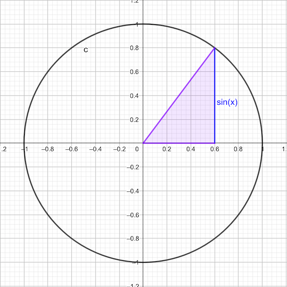
</div>

$$\cos(x) = \frac{\text{cateto contiguo}}{\text{hipotenusa}}$$

<div class = "center">
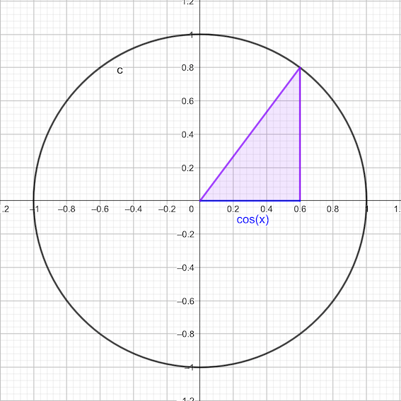
</div>


$$\tan(x) = \frac{\text{cateto opuesto}}{\text{cateto contiguo}} = \frac{\sin(x)}{\cos(x)}$$

<div class = "center">
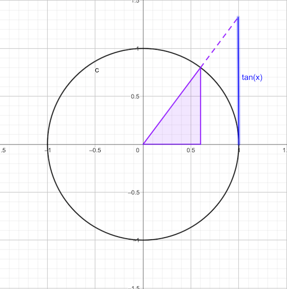
</div>

$$\csc(x) = \frac{1}{\sin(x)}$$

<div class = "center">
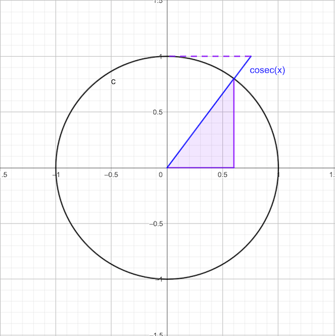
</div>

$$\sec(x) = \frac{1}{\cos(x)}$$

<div class = "center">
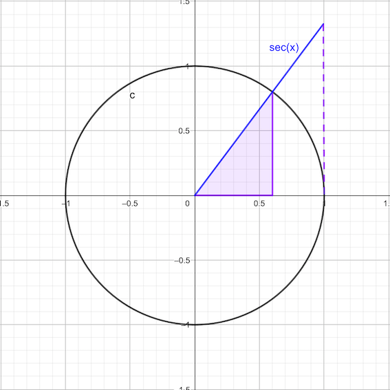
</div>

$$\cot(x) = \frac{1}{\tan(x)}$$

<div class = "center">
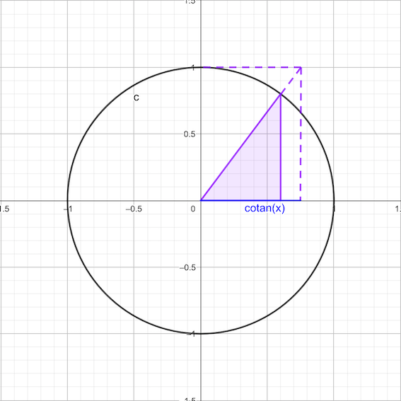
</div>

# Relaciones fundamentales

$$\sin^2(\alpha)+\cos^2(\alpha) = 1$$
$$1+\tan^2(\alpha)= \frac{1}{\cos^2(\alpha)}$$


# Relaciones pitagóricas

$$1+\cot^2(\alpha) = \csc^2(\alpha)$$
$$1+\tan^2(\alpha) = \sec^2(\alpha)$$


# Relaciones entre las razones trigonométricas

## Ángulos opuestos

$$\begin{matrix}
\sin(-\alpha) = -\sin(\alpha) && \cos(-\alpha) = \cos(\alpha)&&\tan(-\alpha) = -\tan(\alpha)\\
\sin(2\pi-\alpha) = -\sin(\alpha) &&\cos(2\pi-\alpha) = \cos(\alpha) && \tan(2\pi-\alpha) = -\tan(\alpha)
\end{matrix}$$

<div class = "center">
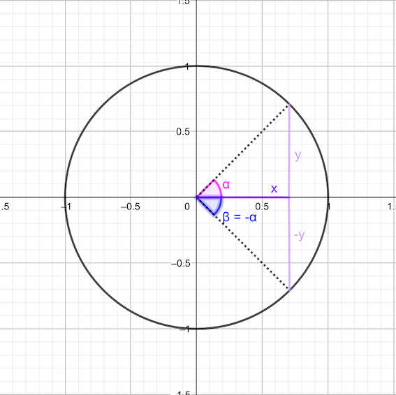
</div>


## Ángulos suplementarios

$$\sin(\pi\pm \alpha) = \mp\sin(\alpha)$$
$$\cos(\pi\pm \alpha) = -\cos(\alpha)$$
$$\tan(\pi\pm \alpha) = \mp\tan(\alpha)$$

<div class = "center">
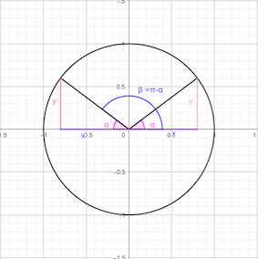 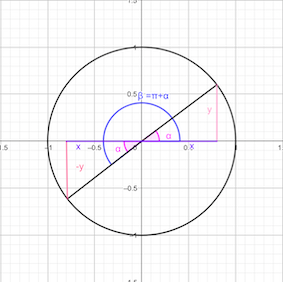
</div>

## Ángulos complementarios

$$\sin\left(\frac{\pi}{2}\pm \alpha\right) = \cos(\alpha)$$
$$\cos\left(\frac{\pi}{2}\pm \alpha\right) = \mp\sin(\alpha)$$
$$\tan\left(\frac{\pi}{2}\pm \alpha\right) = \mp\frac{1}{\tan(\alpha)}$$

<div class = "center">
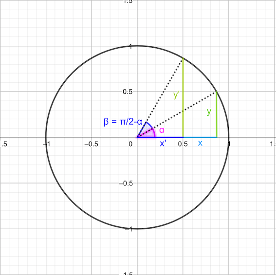
</div>


## Suma o resta de ángulos

$$\sin(\alpha\pm \beta) = \sin(\alpha)\cos(\beta)\pm \cos(\alpha)\sin(\beta)$$
$$\cos(\alpha\pm \beta) = \cos(\alpha)\cos(\beta)\mp \sin(\alpha)\sin(\beta)$$

$$\tan(\alpha\pm \beta) = \frac{\tan(\alpha)\pm\tan(\beta)}{1\mp\tan(\alpha)\tan(\beta)}$$

## Ángulo doble

$$\sin(2\alpha) = 2\sin(\alpha)\cos(\alpha)$$
$$\cos(2\alpha) = \cos^2(\alpha)-\sin^2(\alpha)$$

$$\tan(2\alpha) = \frac{2\tan(\alpha)}{1-\tan^2(\alpha)}$$

## Ángulo mitad

$$\sin\left(\frac{\alpha}{2}\right) =\pm\sqrt{\frac{1-\cos(\alpha)}{2}} $$
$$\cos\left(\frac{\alpha}{2}\right) =\pm\sqrt{\frac{1+\cos(\alpha)}{2}} $$

$$\tan\left(\frac{\alpha}{2}\right) =\pm\sqrt{\frac{1-\cos(\alpha)}{1+\cos(\alpha)}} $$

# Sumas y Restas de senos y cosenos

$$\begin{matrix}
\sin(\alpha)+\sin(\beta) = 2\sin\left(\frac{\alpha+\beta}{2}\right)\cos\left(\frac{\alpha-\beta}{2}\right)&&\sin(\alpha)-\sin(\beta) = 2\cos\left(\frac{\alpha+\beta}{2}\right)\sin\left(\frac{\alpha-\beta}{2}\right)\\
\cos(\alpha)+\cos(\beta) = 2\cos\left(\frac{\alpha+\beta}{2}\right)\cos\left(\frac{\alpha-\beta}{2}\right)&&\cos(\alpha)-\cos(\beta) = -2\sin\left(\frac{\alpha+\beta}{2}\right)\sin\left(\frac{\alpha-\beta}{2}\right)
\end{matrix}$$

# Valores del seno, coseno y tangente usuales

Radianes | $0$ | $\frac{\pi}{6}$ | $\frac{\pi}{4}$ | $\frac{\pi}{3}$ | $\frac{\pi}{2}$ |
--- | ---  | ---  | ---  | ---  | ---  |
**Grados** | $0º$ | $30º$ | $45º$ | $60º$ | $90º$ |
**sin** | $0$ | $\frac{1}{2}$ | $\frac{\sqrt{2}}{2}$ | $\frac{\sqrt{3}}{2}$ | $1$ |
**cos** | $1$ | $\frac{\sqrt{3}}{2}$ | $\frac{\sqrt{2}}{2}$ | $\frac{1}{2}$ | $0$ |
**tan** | $0$ | $\frac{\sqrt{3}}{3}$ | $1$ | $\frac{3}{\sqrt{3}}$ | $\infty$ |


# Proyección del segmento $\bar{AB}$ sobre una recta $r$

$$\bar{A'B'} = \bar{AB}\cos(\alpha)$$

<div class = "center">
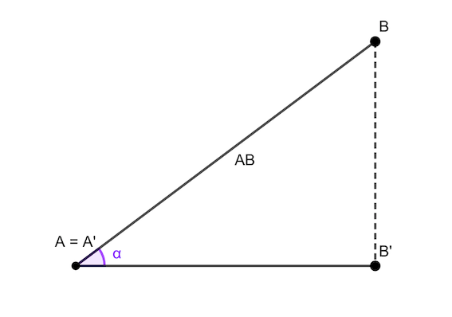
</div>

# Área de un triángulo

$$A = \frac{1}{2}ab\sin(\alpha) = \frac{bh}{2}$$

<div class = "center">
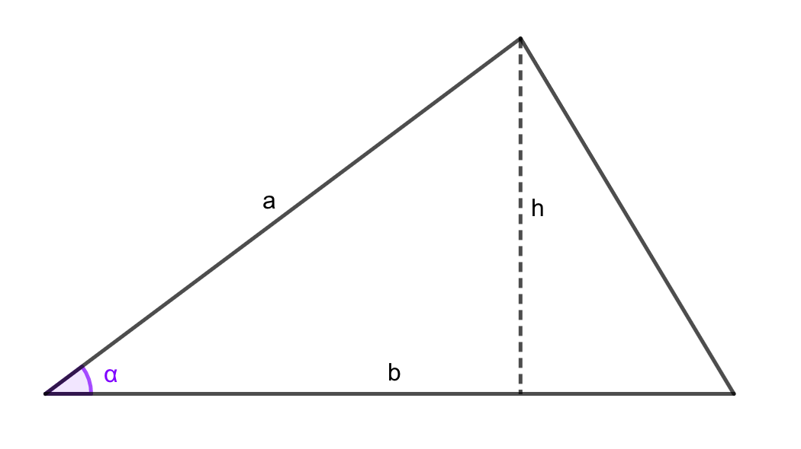
</div>

# Teorema de los senos

$$\frac{a}{\sin(\alpha)} = \frac{b}{\sin(\beta)} = \frac{c}{\sin(\gamma)}$$

<div class = "center">
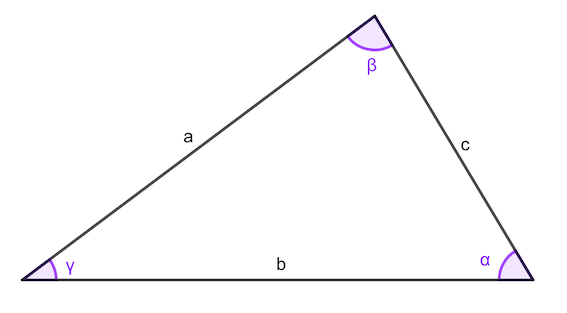
</div>

# Teorema del coseno

$$a^2 = b^2+c^2-2bc\cos(\alpha)$$
$$b^2 = a^2+c^2-abc\cos(\beta)$$
$$c^2 = a^2+b^2-2ab\cos(\gamma)$$

<div class = "center">

</div>

# Más sobre seno, coseno y tangente

<div class = "center">
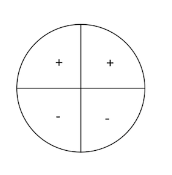
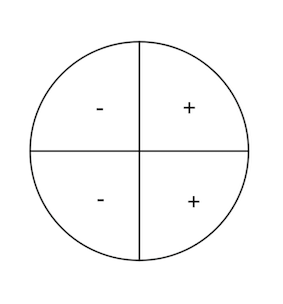
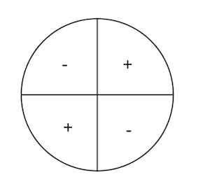
$$\sin\quad\qquad\qquad\qquad\qquad\qquad\qquad\qquad \cos\qquad\qquad\qquad\qquad\qquad\qquad\qquad\qquad \tan$$
</div>


<div class = "center">
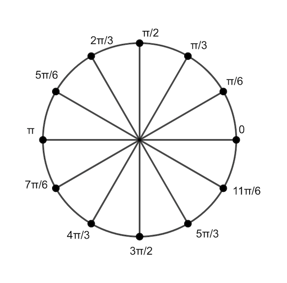
</div>


