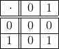
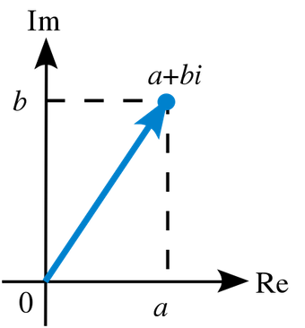
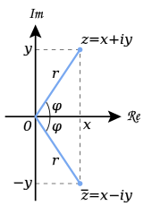

```{r setup, include=FALSE}
knitr::opts_chunk$set(echo = TRUE, comment = NA, engine.path = list(
  octave = '/Applications/Octave-4.4.1.app/Contents/Resources/usr/bin/octave'
))
library(polynom)
library(pracma)
library(knitr)
library(reticulate)
use_python("/anaconda3/bin/python3")
```

# Cuerpos

## La estructura de cuerpo

<l class="definition">
Cuerpo.
</l> Sea $\mathbb{K}$ un conjunto dotado de dos operaciones, adición ($+$) y multiplicación ($\cdot$). Diremos que $\mathbb{K}$ es un cuerpo si para todo $a,b\in\mathbb{K}$ se cumplen las condiciones siguientes:

- $+$ y $\cdot$ son operaciones internas sobre $\mathbb{K}$: $a+b\in\mathbb{K}$ y $a\cdot b\in\mathbb{K}$
- $+$ y $\cdot$ son operaciones conmutativas: $a+b=b+a$ y $a\cdot b=b\cdot a$
- $+$ y $\cdot$ son operaciones asociativas: $(a+b)+c=a+(b+c)$ y $(a\cdot b)\cdot c=a\cdot(b\cdot c)$
- Hay un elemento neutro para la adición: $a+0=0+a=a\quad \forall a\in\mathbb{K}$
- Hay un elemento neutro para la multiplicación (distinto del neutro de la adición): $a\cdot 1=1\cdot a=a\quad \forall a\in\mathbb{K}$

## La estructura de cuerpo

- Elemento opuesto: $\forall a\in\mathbb{K}$ hay otro elemento $-a\in\mathbb{K}$ tal que $a+(-a)=(-a)+a=0$
- Elemento inverso: $\forall a\in\mathbb{K},\ a\ne 0$ hay otro elemento $a^{-1}\in\mathbb{K}$ tal que $a\cdot a^{-1}=a^{-1}\cdot a=1$
- La operación $\cdot$ es distributiva respecto $+$: $a\cdot(b+c)=a\cdot b+a\cdot c$

<l class = "observ">Observación. </l>Cuando no pueda haber confusión quitaremos el signo $\cdot$ para denotar la operación de multiplicación. Es decir, denotaremos $a\cdot b$ como $ab$.

## Propiedades de los cuerpos

<l class="prop">
Propiedades de los cuerpos.
</l> En un cuerpo $\mathbb{K}$ se verifican las siguientes propiedades:

- Propiedad de simplificación para la suma: $a+b=a+c\Rightarrow\ b=c$
- Los neutros (0 y 1) son únicos
- Cada elemento tienen un único opuesto
- Cada elemento diferente de 0 tiene un único inverso
- 0 es absorbente para la multiplicación: $a\cdot 0 = 0\quad \forall a\in\mathbb{K}$
- $\mathbb{K}$ no tiene divisores de 0: $ab=0\Rightarrow a=0$ o $b=0$

<l class = "important">¡Atención!</l> La demostración de esta proposición se encuentra en pdf. Este pdf lo podréis encontrar en el Github, en la carpeta demostraciones, o bien como material de esta clase.

## Cuerpos conocidos 

<div class = "example">
**Ejemplo 1**

Algunos de los cuerpos más conocidos son:

- $\mathbb{Z}_2=\{0,1\}$: Cuerpo finito de dos elementos
- $\mathbb{Q}$: Los números racionales
    - suma: $\frac{a}{b}+\frac{c}{d} = \frac{ad+bc}{bd}$ $\qquad a,b,c,d\in\mathbb{Z}$
    - producto: $\frac{a}{b}\cdot\frac{c}{d} = \frac{ac}{bd}$ $\qquad a,b,c,d\in\mathbb{Z}$
- $\mathbb{R}$: Los números reales
- $\mathbb{C}$: Los números complejos
    - suma: $(a+bi)+(c+di) = (a+c)+(b+d)i$ $\qquad a,b,c,d\in\mathbb{R}$
    - producto: $(a+bi)\cdot(c+di) = (ac-bd)+(ad+bc)i$ $\qquad a,b,c,d\in\mathbb{R}$
</div>

<div class = "example">
**Ejemplo 2**

Los números naturales, $\mathbb{N}:=\{0,1,2,...\}$, no son un cuerpo. No hay elementos opuestos para ningún elemento del conjunto.
</div>

## El cuerpo $\mathbb{Z}_2$

Entremos un poquito más en detalle en este cuerpo tan interesante:

- Consta de 2 elementos: el 0 y el 1
- Sus tablas de suma y producto son las siguientes 

<div class = "center">

</div>

<div class = "center">

</div>
    
# Números complejos

## Números complejos

<l class = "definition">Conjunto de Números Complejos.</l> $\mathbb{C}=\{(a,b):a,b\in\mathbb{R}\}$ dotado de las operaciones:

  - suma: $(a,b)+(c,d) = (a+c,b+d)$ $\qquad a,b,c,d\in\mathbb{R}$
  - producto: $(a,b)\cdot(c,d) = (ac-bd,ad+bc)$ $\qquad a,b,c,d\in\mathbb{R}$
  
## Números complejos

<l class = "definition">Forma Binómica</l>. Si $z\in\mathbb{C}$ tal que $z=(a,b)$, su forma binómica es $z=a+bi$

La forma binómica aparece al definir la unidad imaginaria, $i$:

<l class = "definition">Unidad Imaginaria</l>. $i=(0,1)$

Entonces, si $z=(a,b)$, tenemos que 
$$z=(a,b)=(a,0)+(0,b)=(a,0)+(b,0)\cdot(0,1)=a+bi$$

## Números complejos

<l class = "definition">Parte Real.</l> Si $z=a+bi$, Re$(z)=a$

<l class = "definition">Parte Imaginaria.</l> Si $z=a+bi$, Im$(z)=b$

<l class = "definition">Conjugado de z.</l> Si $z=a+bi$, $\bar{z}=a-bi$

<l class = "definition">Módulo.</l> $|z|=\sqrt{z\cdot\bar{z}}$

<l class = "definition">Argumento.</l> Si $z=a+bi$,  $\text{arg}(z)=\arctan\left(\frac{b}{a}\right)$. Se da en radianes.

<l class = "definition">Argumento principal.</l> $\text{Arg}(z)\in(-\pi,\pi]$

## Plano Complejo

Los números complejos se suelen representar en un plano, denominado <l class = "definition">plano complejo</l>, donde el eje de las abcisas es el <l class = "definition">eje Real</l> y, el de las ordenadas, el <l class = "definition">eje Imaginario</l>

<div class = "center">

</div>

## Forma polar

<l class = "definition">Fórmula de Euler.</l> $e^{i\theta}=\cos(\theta)+i\sin(\theta)$

<l class = "definition">Forma polar.</l> $z=re^{i\varphi}$ donde $r = |z|$ y $\varphi = \text{arg}(z)$

<div class = "center">

</div>

# Números complejos con `R`
    
## Números complejos con `R`

Podemos definir números complejos de diferentes formas:

```{r}
z1 = 2+1i #Definimos el complejo en forma binómica
z1
z2 = complex(real = 2, imaginary = -1) #Definimos mediante parte real e imaginaria
z2
z3 = complex(modulus = 2, argument = pi) #Definimos mediante módulo y argumento
z3
```

## Números complejos con `R`

<l class = "observ">¡Observación!</l> Si queremos escribir los números complejos $a+i$ o $a-i$ en `R`, donde $a$ puede ser cualquier número real, lo tenemos que hacer del siguiente modo: `a+1i` o `a-1i`, ya que si no la consola nos devolverá error.


## Números complejos con `R`

La función `typeof()` es útil a la hora de comprobar el tipo de dato con el que estamos trabajando:

```{r}
typeof(z1)
typeof(z2)
typeof(z3)
```

## Números complejos con `R`

Para obtener la parte real y la parte imaginaria de cualquier número complejo, utilizamos, respectivamente, las funciones `Re()` e `Im()`:

```{r}
#Parte Real
Re(z1)

#Parte Imaginaria
Im(z3)
```

## Números complejos con `R`

El conjugado de un número complejo se obtiene mediante la función `Conj()`:

```{r}
Conj(z1)
Conj(z2)
Conj(z3)
```

## Números complejos con `R`

Para obtener el módulo y el argumento (principal) de cualquier número complejo, utilizamos, respectivamente, las funciones `Mod()` y `Arg()`:

```{r}
#Módulo
Mod(z2)

#Argumento principal
Arg(z3)
```

## Números complejos con `R`

Las operaciones básicas con números complejos se realizan del siguiente modo:

```{r}
z1+z2 #Suma de números complejos

3*z3 #Producto por un escalar

z2*z3 #Producto de números complejos
```

# Trabajando con `Python` en Markdown

## Trabajando con `Python` en Markdown

En primer lugar, tendréis que instalar el paquete de `R` llamado `reticulate` del siguiente modo: 

<div class = "center">
`install.packages("reticulate")`
</div>

Si en algúm momento necesitáis instalar una librería de `Python` en `Rstudio`, se debe ejecutar la siguiente función:

<div class = "center">
`py_install("NombreDelPaquete")`
</div>

## Trabajando con `Python` en Markdown

Para poder utilizar `Python` en un Markdown, en el chunk de ajustes deberéis añadir las instrucciones que se muestran a continuación

- `library(reticulate)`
- `use_python("/anaconda3/bin/python3")`

La primera para cargar la librería `reticulate` y la segunda para ubicar donde está `Python` en nuestro ordenador

# Números complejos con `Python`

## Números complejos con `Python`

Podemos definir números complejos de diferentes formas:

```{python}
z1 = 4+3j
z1
z2 = complex(1,7)
z2
```

## Números complejos con `Python`

<l class = "observ">¡Observación!</l> Si queremos escribir los números complejos $a+i$ o $a-i$ en `Python`, donde $a$ puede ser cualquier número real, lo tenemos que hacer del siguiente modo: `a+ji` o `a-ji`, ya que si no la consola nos devolverá error.

## Números complejos con `Python`

La función `type()` es útil a la hora de comprobar el tipo de dato con el que estamos trabajando:

```{python}
type(z1)
type(z2)
```

## Números complejos con `Python`

Para obtener la parte real y la parte imaginaria de cualquier número complejo, utilizamos, `.real` y `.imag`

```{python}
z1.real #Parte real
z2.imag #Parte imaginaria
```

## Números complejos con `Python`

El conjugado de un número complejo se obtiene mediante `.conjugate()`:

```{python}
z1.conjugate()
z2.conjugate()
```

## Números complejos con `Python`

Para obtener el módulo y el argumento (principal) de cualquier número complejo, utilizamos, respectivamente, las funciones `abs()` y `cmath.phase()`:

```{python}
import cmath
abs(z1)
cmath.phase(z2)
```

## Números complejos con `Python`

Las operaciones básicas con números complejos se realizan del siguiente modo:

```{python}
z1+z2 #Suma de numeros complejos
5*z2 #Producto por un escalar
z1*z2 #Producto de numeros complejos
```

# Trabajando con `Octave` en Markdown

## Trabajando con `Octave` en Markdown

Para poder utilizar `Octave` en Markdown deberéis introducir en el chunk de ajustes el siguiente código:

`knitr::opts_chunk$set(echo = TRUE, engine.path = list( octave = '/Applications/Octave-4.4.1.app/Contents/Resources/usr/bin/octave'))`

Lo que está entre comillas es la dirección donde se encuentra el lenguaje `Octave` en nuestro ordenador

<l class = "important">¡Ojo!</l> A la hora de utilizar chunks de `Octave`, tendréis que introducir las variables cada vez. Es decir, no se guarda la información de un chunk a otro

# Números complejos con `Octave` 

## Números complejos con `Octave` 

Podemos definir números complejos de diferentes formas:

```{octave}
z1 = complex(1,2)
z2 = 2-i
tipoDato1 = class(z1)
tipoDato2 = class(z2)
```

La función `class()` es útil a la hora de comprobar el tipo de dato con el que estamos trabajando.

## Números complejos con `Octave` 

Para obtener la parte real y la parte imaginaria de cualquier número complejo, utilizamos, respectivamente, las funciones `real()` e `imag()`

```{octave}
z1 = complex(1,2);
z2 = 2-i;

real(z1)
imag(z2)
```

<l class = "observ">Observación.</l> Para trabajar con los números complejos anteriormente definidos, hemos tenido que crearlos de nuevo porque `Octave` trata cada chunk por separado.

## Números complejos con `Octave` 

El conjugado de un número complejo se obtiene mediante la función `conj()`:

```{octave}
z1 = complex(1,2);
z2 = 2-i;

conj(z1)
abs(z2)
arg(z1)
angle(z2)
```

Para obtener el módulo y el argumento (principal) de cualquier número complejo, utilizamos, respectivamente, las funciones `abs()` y `arg()` o `angle()`.

## Números complejos con `Octave` 

Las operaciones básicas con números complejos se realizan del siguiente modo:

```{octave}
z1 = complex(1,2);
z2 = 2-i;

#Suma de numeros complejos
z1+z2
# Producto por un escalar
8*z2
# Producto de numeros complejos
z1*z2
```

# Polinomios

## Polinomios
Sea $\mathbb{K}$ un cuerpo cualquiera

<l class="definition">
Polinomio en una variable.
</l> Objeto de la forma $p(x)=a_0+a_1x+\cdots+a_nx^n$ donde $a_i\in\mathbb{K}\quad \forall i=0,\dots,n$ 


<l class="definition">
Polinomio iguales.
</l> Dos polinomios son iguales si tienen el mismo grado y los mismos coeficientes. Es decir, dados $p(x) = a_0+a_1x+\cdots+a_nx^n$ y $q(x) = b_0+b_1x+\cdots+b_mx^m$, $p$ y $q$ son iguales si, y solo si, $n = m$ y $a_i=b_i\quad \forall i=0,1,\dots,n$


## Polinomios

<l class="definition">
Grado de un polinomio.
</l> Si $a_n\ne 0$ y $a_j = 0\ \forall j=n+1,n+2,\dots$, se dice que el grado del polinomio es $n$.

<div class="example">
**Ejemplo 3**

- $p(x)=x^2+5x+1$ es un polinomio de segundo grado (grado 2)
- $q(x)=x^4-5$ es un polinomio de grado 4
</div>

<l class="definition">
Polinomio 0.
</l> $p(x)=0$. Es decir, $a_i=0$ para todo $i=0,\dots,n$

<l class="definition">
Polinomio constante.
</l> Polinomio de grado 0 

<div class="example">
**Ejemplo 4**

$p(x)=5$ es un polinomio constante
</div>

## Polinomios

<l class="definition">
Conjunto de polinomios en una variable.
</l> Indicaremos por $\mathbb{K}[x]$ el conjunto de polinomios en una determinada variable $x$ y con coeficientes en $\mathbb{K}$. Sobre $\mathbb{K}[x]$ se pueden considerar la adición y la multiplicación definidas a partir de las operaciones de $\mathbb{K}$ de la manera siguiente

- $p(x)+q(x)$ es el polinomio que tiene por coeficientes la suma (en $\mathbb{K}$) de los coeficientes de $p(x)$ y $q(x)$. Más claramente, si $p(x)=a_0+a_1x+\cdots+a_nx^n$ y $q(x)=b_0+b_1x+\cdots+b_mx^m$, entonces $p(x)+q(x)=(a_0+b_0)+(a_1+b_1)x+\cdots$
- $p(x)q(x)$ es el polinomio $c_0+c_1(x)+\cdots+c_{nm}x^{n+m}$ donde $c_j=a_0b_j+a_1b_{j-1}+\cdots+a_jb_0$ $\quad j=0,1,\dots,n+m$

## Polinomios

<div class = "example">
**Ejemplo 5**

Sean $p(x) = x+1$ y $q(x) = x-1$. Entonces,

  - Su suma es $p(x)+q(x)=(x+1)+(x-1) = (1+1)x+(1-1) = 2x+0=2x$
  - Su producto es $p(x)\cdot q(x)=(x+1)\cdot(x-1)=x^2+x-x-1=x^2-1$
</div>

Con estas operaciones el conjunto $\mathbb{K}[x]$ presenta una serie de propiedades importantes que no permiten decir que es un cuerpo. La condición de cuerpo que nos falla aquí es únicamente que no existe elemento inverso para todo elemento de $\mathbb{K}[x]$. De hecho, los únicos elementos que tienen inverso son los polinomios constantes y diferentes de 0.

## Polinomios

<l class = "definition">División de polinomios.</l> Dado un polinomio $p(x)\in\mathbb{K}[x]$, la división de $p(x)$ entre otro polinomio $s(x)\in\mathbb{K}[x]$ de grado menor o igual al de  $p(x)$, consiste en hallar 2 polinomios $q(x),r(x)\in\mathbb{K}[x]$ tales que $$p(x) = s(x)q(x)+r(x)$$

donde el grado de $r(x)$ es siempre menor que el del divisor $s(x)$ 


## Polinomios
<l class="definition">
Polinomio irreducible.
</l>Si es un polinomio con coeficientes en un cuerpo, no es constante y no se puede descomponer en producto de otros polinomios sin que esta descomposición sea trivial.

<div class="example">
**Ejemplo 6**

$p(x) = 1+x^2\in\mathbb{R}[x]$ es irreducible ya que no puede escribirse de forma $r(x)s(x)$ con $r(x),s(x)\in\mathbb{R}[x]$, $r(x),s(x)\ne p(x)$ y $r(x),s(x)\ne 1$.

En cambio, $q(x)=1-x^2$ no es irreducible, ya que $q(x)=(1-x)(1+x)$
</div>

## Polinomios

Dado un polinomio $p(x)\in\mathbb{K}[x]$, podemos asociar a $p(x)$ una aplicación o función $\mathbb{K}\longrightarrow\mathbb{K}$ definida de la manera siguiente: a cada elemento $\alpha\in\mathbb{K}$ le hacemos corresponder $p(\alpha)=a_0+a_1\alpha+\cdots+a_n\alpha^n$. Esta función es conocida como <l class = "definition">función evaluadora</l> y el proceso de sustituir la variable $x$ por cualquier elemento $\alpha$ del cuerpo se lo conoce como <l class = "definition">evaluar un polinomio</l> en $\alpha$.

En el caso en que $\mathbb{K}$ sea un cuerpo infinito, podemos identificar polinomio con función asociada.

## Polinomios

<l class="definition">
Raíz de un polinomio.
</l> Sean $p(x)\in\mathbb{K}[x]$ y $\alpha\in\mathbb{K}$, diremos que $\alpha$ es raíz de $p(x)$ si $p(\alpha)=0$.


<l class="prop">
Proposición.
</l> $\alpha\in\mathbb{K}$ es raíz de $p(x)$ $\Leftrightarrow$ $p(x)=(x-\alpha)q(x)$ con $q(x)\in\mathbb{K}[x]$.

De aquí deducimos que si un polinomio de $\mathbb{K}[x]$ de grado mayor que 1 tiene una raíz (en $\mathbb{K}$) entonces no es irreducible. El recíproco no es cierto.

## Polinomios{.dem}

**Demostración**

Primero probaremos la implicación hacia la izquierda, $p(x)=(x-\alpha)q(x)$ con $q(x)\in\mathbb{K}[x]\Rightarrow$$\alpha\in\mathbb{K}$ es raíz de $p(x)$ 

Evaluando $p(x)$ en $\alpha$ tenemos que $$p(\alpha)=(\alpha-\alpha)q(\alpha) = 0$$ lo que, por definición, implica que $\alpha$ es raíz de $p(x)$

Ahora nos queda demostrar la implicación a la derecha $\alpha\in\mathbb{K}$ es raíz de $p(x)$ $\Rightarrow$ $p(x)=(x-\alpha)q(x)$ con $q(x)\in\mathbb{K}[x]$

Si dividimos $p(x)$ entre $x-\alpha$, obtenemos $$p(x) = (x-\alpha)q(x)+r(x)$$

Ahora, por hipótesis tenemos que $$p(\alpha) = (\alpha-\alpha)q(\alpha)+r(\alpha) = 0 +r(\alpha) = 0$$

## Polinomios{.dem}


Con lo cual $r(\alpha) = 0$

Ahora bien, el grado de $r(x)$ debe ser estrictamente menor al del divisor, $x-\alpha$, que es 1. Por tanto, $r(x)$ es un polinomio constante. Además, como $r(\alpha) =0$, tenemos que $$r(x)\equiv 0$$

Así pues, acabamos de demostrar que $p(x) = (x-\alpha)q(x)$

# Polinomios con `R`

## Polinomios con `R`

Necesitaremos instalar y cargar los paquetes `polynom` y `pracma` para poder utilizar las siguientes funciones.

Para definir un polinomio en `R`, lo haremos mediante la función `polynomial(coef=...)` e igualaremos el parámetro `coef` al vector de coeficientes en orden ascendente.

```{r}
p = polynomial(coef = c(1,2,3,4,5))
p
q = polynomial(coef = c(1,2,1))
q
```

## Polinomios con `R`

Para comprobar si dos polinomios son iguales, utilizamos el operador lógico `==`

```{r}
p == q
```

Claramente son diferentes, porque, tal y como los hemos definido anteriormente, ni siquiera tienen el mismo grado

## Polinomios con `R`

Una forma de calcular el grado de un polinomio en `R` es mediante la función `length()` aplicada al polinomio. Eso sí, teniendo en cuenta que, tal y como hemos definido los polinomios, $p(x)=a_0+\cdots+a_nx^n$, estos empiezan en 0. Con lo cual, para obtener el grado exacto del polinomio, habrá que restar una unidad al resultado que nos devuelva `length()`:

```{r}
gradoP = length(p)-1
gradoQ = length(q)-1
gradoP
gradoQ
```


## Polinomios con `R`

Las operaciones suma y producto de polinomios, se llevan a cabo del siguiente modo:

```{r}
#Suma
p+q

#Producto de polinomios
p*q
```


## Polinomios con `R`

La divisióin de polinomios se realiza mediante `/`, pero con ello solo obtenemos el cociente. Para obtener el resto hay que utlizar `%%`:

```{r}
cociente = p / q
resto = p%%q
cociente
resto
q*cociente + resto == p
```

## Polinomios con `R`

Para evaluar polinomios, utilizaremos la función `predict(polinomio,x0)`

```{r}
predict(p,1)
predict(q,0)
```

## Polinomios con `R`

Para hallar las raíces de un polinomio, podemos utilizar la función `polyroot` introduciendo por parámetro el vector de coeficientes en orden creciente.

```{r}
#Las raíces del polinomio x^2+2x+1
polyroot(c(1,2,1))

#Las raíces del polinomio x^2-4
polyroot(c(-4,0,1))
```

Fijaos que `R` nos devuelve un vector de números complejos a pesar de que las soluciones en ambos casos son dos números reales

# Polinomios con `Python`

## Polinomios con `Python`

Para definir un polinomio en `Python`, lo haremos mediante las funciones `sympy.symbols()` para indicar con qué variable trabajamos y `sympy.Poly()` introduciendo el polinomio por parámetro:

```{python}
import sympy 
x = sympy.symbols('x') 
p = sympy.Poly(x**2) 
p
q = sympy.Poly(1+x+x**3) 
q
```

## Polinomios con `Python`

O bien, otra forma de definir polinomios es mediante la librería `numpy`, introduciendo como parámetro el vector de coeficientes en orden descendente

```{python}
import numpy
r = numpy.poly1d([1,2,1]) 
print(r)
s = numpy.poly1d([1,2,3,4,5])
print(s)
```


## Polinomios con `Python`

Para comprobar si dos polinomios son iguales, utilizamos el operador lógico `==`

```{python}
p == q  
r == s
```

Claramente son diferentes, porque, tal y como los hemos definido anteriormente, ni siquiera tienen el mismo grado. 

## Polinomios con `Python`

<l class = "observ">Observación. </l>Fijaos que no podemos comparar los polinomios creados con librerías diferentes, ya que da error al ser diferentes tipos de objeto. 

## Polinomios con `Python`

Para calcular el grado de cualquier polinomio en `Python`, lo haremos utilizando `Polynomial.degree()`

```{python}
p.degree()
q.degree()
```

## Polinomios con `Python`

o, si estamos trabajando con la librería `numpy`, lo hacemos mediante la función `Polynomial.order`

```{python}
r = numpy.poly1d([1,2,1]) 
s = numpy.poly1d([1,2,3,4,5])
r.order
s.order
```

<l class = "important">¡Ojo!</l> Fijaos que hemos tenido que volver a definir los polinomios. De no estar, la consola nos devolvería error.

## Polinomios con `Python`

Las operaciones suma y producto de polinomios, se llevan a cabo del siguiente modo:

```{python}
p+q 
p*q 
```

## Polinomios con `Python`

y, con la librería `numpy`, la suma y el producto de polinomios se realizan del siguiente modo:

```{python}
r = numpy.poly1d([1,2,1]) 
s = numpy.poly1d([1,2,3,4,5])
r+s
r*s
```

## Polinomios con `Python`

La división de polinomios la obtenemos tal y como se muestra a continuación (solo utilizando la librería `numpy`):

```{python}
r = numpy.poly1d([1,2,1]) 
s = numpy.poly1d([1,2,3,4,5])
s/r
r*numpy.poly1d([1,0,2])+3 == s
```

Observad que primero se devuelve el cociente y, a continuación, el resto de la división

## Polinomios con `Python`

Para evaluar polinomios, haciendo uso de la librería `numpy`, lo hacemos del siguiente modo:

```{python}
r = numpy.poly1d([1,2,1]) 
s = numpy.poly1d([1,2,3,4,5])
r(0)
s(2)
```

## Polinomios con `Python`

Para encontrar las raíces de polinomios, haciendo uso de la librería `numpy`, lo hacemos utilizando `Polynomial.r`:

```{python}
r = numpy.poly1d([1,2,1]) 
s = numpy.poly1d([1,2,3,4,5])
r.r
s.r
```

# Polinomios con `Octave` 

## Polinomios con `Octave` 

Para definir un polinomio en `Octave`, lo haremos mediante vectores. Para mostrarlos simbólicamente, utilizaremos la función `polyout(vector,'variable')`, donde las entradas del vector son los coeficientes en orden descendente.

```{octave}
p = [1,2,3,4,5]; 
polyout(p,'x') 
q = [1,0,0,1];
polyout(q,'x')
```

## Polinomios con `Octave` 

Una forma de calcular el grado de un polinomio en `Octave` es mediante la función `length()` aplicada al vector de coeficientes. Eso sí, teniendo en cuenta que, tal y como hemos definido los polinomios, $p(x)=a_0+\cdots+a_nx^n$, estos empiezan en 0. Con lo cual, para obtener el grado exacto del polinomio, habrá que restar una unidad al resultado que nos devuelva `length()`:

```{octave}
p = [1,2,3,4,5]; 
q = [1,0,0,1];
gradoP = length(p)-1
gradoQ = length(q)-1
```


## Polinomios con `Octave` 

Como, en `Octave`, los polinomios vienen representados por vectores, sumar polinomios no es una operación directa en `Octave`, ya que la mayoría de veces nos encontraremos con vectores de diferente longitud. En esos casos, se nos devolverá error por consola.

Lo mismo ocurre si quisiésemos comprobar que dos polinomios de diferente grado son iguales

## Polinomios con `Octave` 

Una solución a este problema es rellenar con 0 el vector de coeficientes hasta alcanzar la máxima longitud de los vectores que tengamos. Esto lo podemos conseguir mediante la función `zeros()`:

```{octave}
p = [1,2,3,4,5]; q = [1,0,0,1]; gradoP = length(p)-1; gradoQ = length(q)-1;
p = [zeros(1, gradoQ-gradoP), p], q = [zeros(1, gradoP-gradoQ), q], suma = p+q
```

## Polinomios con `Octave` 

Lo que sí podemos hacer es multiplicar polinomios mediante la función `conv`

```{octave}
p = [1,2,3,4,5];
q = [1,0,0,1];
producto = conv(p,q);
polyout(producto,'x')
```

## Polinomios con `Octave` 

La división de polinomios se consigue mediante la función `deconv(numerador,denominador)`. Esta función devuelve los vecotres de coeficientes del cociente y el resto de la división polinómica, en orden descendente:

```{octave}
p = [1,2,3,4,5];
q = [1,0,0,1];
[cociente, resto] = deconv(p,q)
```

## Polinomios con `Octave` 

Fijaos que el vector de coeficientes del resto tiene la misma longitud que el dividendo, con lo cual podemos realizar la comprobación de la división:

```{octave}
p = [1,2,3,4,5];
q = [1,0,0,1];
[cociente, resto] = deconv(p,q);
length(resto) == length(p)
p == conv(q,cociente) + resto
```

donde los unos representan el valor lógico `True`

## Polinomios con `Octave` 

Para evaluar polinomios, utilizamos la función `polyval(polinomio,x0)`:

```{octave}
p = [1,2,3,4,5];
q = [1,0,0,1];
polyval(p,0) 
polyval(q,3)
```

## Polinomios con `Octave` 

Para hallar las raíces de un polinomio, hacemos uso de la función `roots()`:

```{octave}
p = [1,2,3,4,5];
q = [1,0,1];
roots(p)
roots(q)
```

# El principio de inducción

## El principio de inducción

<l class = "prop">Principio de Inducción.</l> El principio de inducción afirma que si $P(n)$ es una propiedad sobre $n\in\mathbb{N}$ y se cumple que 

- $P(1)$ es cierta (Caso base)
- Si $P(n)$ es cierta, entonces $P(n+1)$ es cierta (Caso inductivo)

entonces $P(n)$ es cierta para todo $n\in\mathbb{N}$

## El principio de inducción

El principio de Inducción también es válido si $n\in\mathbb{Z}$ del siguiente modo:

Si $P(n)$ es una propiedad sobre $n\in\mathbb{Z}$, con $n_0\in\mathbb{Z}$ y se cumple que 

- $P(n_0)$ es cierta
- Si $P(n)$ es cierta, entonces $P(n+1)$ es cierta

entonces $P(n)$ es cierta para todo $n\in\mathbb{Z},\ n\ge n_0$

## El principio de inducción

<l class = "prop">Principio de Inducción completa.</l> Si $P(n)$ es una propiedad sobre $n\in\mathbb{N}$ y se cumple que 

- $P(1)$ es cierta (Caso base)
- Si $P(n)$ es cierta para $1,2,\dots, n$, entonces $P(n+1)$ es cierta (Caso inductivo)

entonces $P(n)$ es cierta para todo $n\in\mathbb{N}$

## El principio de inducción

El principio de Inducción completa también es válido si $n\in\mathbb{Z}$ del siguiente modo: 

Si $P(n)$ es una propiedad sobre $n\in\mathbb{Z}$, $n_0\in\mathbb{Z}$ y se cumple que 

- $P(n_0)$ es cierta
- Si $P(n)$ es cierta para $n_0\le n$, entonces $P(n+1)$ es cierta

entonces $P(n)$ es cierta para todo $n\in\mathbb{Z}\ n\ge n_0$

