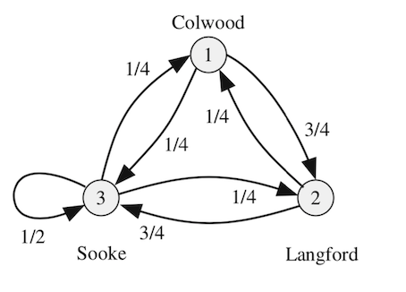
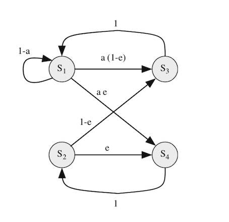
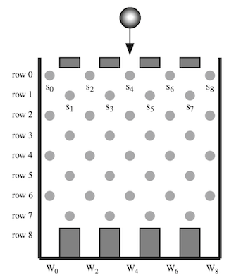
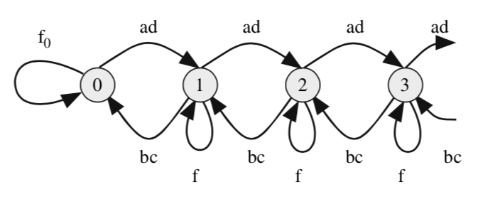
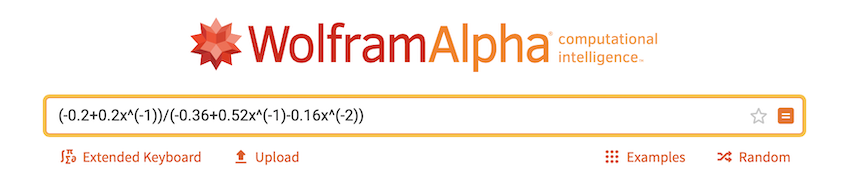
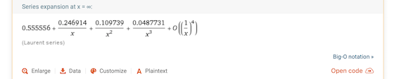

```{r setup, include=FALSE}
knitr::opts_chunk$set(echo = TRUE, comment = NA, engine.path = list(
  octave = '/Applications/Octave-4.4.1.app/Contents/Resources/usr/bin/octave'
))
library(matlib)
library(Biodem)
library(expm)
```

# Introducción

## Introducción

En este capítulo estudiaremos sistemas estocásticos que serán modelados haciendo uso de Cadenas de Markov

<l class = "definition">Proceso de Markov.</l> Proceso aleatorio donde el valor de la variable aleatoria en el instante $n$ depende solamente de su valor pasado inmediato en el instante $n-1$

En un proceso de Markov, la variable aleatoria representa el estado del sistema en un instante dado $n$

## Introducción

Los procesos de Markov son ejemplos de procesos que salen en situaciones de la vida real:

- Protocolos de telecomunicación y sistemas de maquinaria
- Llegadas y salidas de clientes en bancos
- Pasar por caja en los supermercados
- Mutación de un virus o molécula de ADN
- Paseo aleatorio como por ejemplo el movimiento Browniano
- Llegada de coches a una intersección
- El estado del tiempo diario

# Cadenas de Markov
## Cadenas de Markov


Si el espacio de estados (espacio muestral) de un proceso de Markov es discreto, el proceso de Markov se denomina <l class = "definition">Cadena de Markov</l>.

En este caso, los estados se etiquetan con los números $0,1,2,\dots$

En este tema, estudiaremos cadenas de Markov de tiempo discreto, ya que son las que salen en la mayoría de sistemas de comunicación.

# Selección del paso de tiempo
## Selección del paso de tiempo

<l class = "definition">Tiempo de espera.</l> En una cadena de Markov, es el tiempo que estamos en un estado determinado

Dependiendo de como midamos este tiempo de espera, tenemos dos tipos de cadenas de Markov:

- <l class = "definition">Cadenas de Markov de tiempo discreto.</l> Los tiempos de espera toman valores enteros. Por tanto, los cambios de estados pasan en tiempos discretos $t = T_0,T_1,T_2,\dots$. Si estos tiempos están equiespaciados, tenemos $T_n = nT$, con $n=0,1,2,\dots$
- <l class = "definition">Cadenas de Markov de tiempo continuo.</l> En este caso, los cambios de estados pueden tener lugar en cualquier instante de tiempo

## Ejemplo 1{.example}

**Ejemplo 1**

Consideramos un buffer donde los paquetes llegan en cada paso de tiempo con probabilidad $a$ y se van con probabilidad $c$.

Se trata de una cadena de Markov de tiempo discreto. El paso del tiempo sería el tiempo que se necesita para recibir o transmitir un paquete.

Suponiendo que el buffer tiene tamaño $B$, la tabla de estados sería la siguiente


## Ejemplo 1

Estado | Significado |
--- | --- |
0 | Buffer vacío |
1 | Hay un paquete en el buffer |
2 | Hay 2 paquetes en el buffer |
$\vdots$ | $\vdots$ |
$B$ | El buffer está lleno |

# Falta de memoria de las cadenas de Markov

## Falta de memoria de las cadenas de Markov

En una cadena de Markov de tiempo discreto el valor de la variable aleatoria $S(n)$ representa el estado en el tiempo $n$

La variable aleatoria $S(n)$ solo depende de la variable aleatoria $S(n-1)$. Esta propiedad se denomina <l class = "definition">falta de memoria de las cadenas de Markov</l>.

La probabilidad de que $S(n)$ tome el valor $s_i$ solo depende de los valores $s_j$ que toma $S(n-1)$. Matemáticamente

$$p\{S(n) = s_i\} = f(s_j)$$ para todos $s_i,s_j\in S$ donde $S$ es el conjunto de estados del sistema (el espacio muestral)

## Ejemplo 2

<div class = "example">

**Ejemplo 2**

Consideremos el buffer de un cierto dispositivo de comunicaciones. Supongamos que este dispositivo tiene una capacidad máxima de $B = 4$ paquetes. Los estados de este buffer y las posibles transiciones entre ellos se pueden ver en el siguiente gráfico
</div>

<div class = "center">

</div>

# Matriz de transición

## Matriz de transición

Definimos $p_{ij}(n)$ la probabilidad de que en el tiempo actual $n$, nuestro sistema se encuentre en el estado $i$ suponiendo que en el tiempo anterior estábamos en el estado $j$ (tiempo $n-1$).

Matemáticamente

$$p_{ij}(n) = p\{S(n) = i\ |\ S(n-1) = j\}$$

En el caso de que la probabilidad anterior $p_{ij}(n)$ sea independiente del tiempo $n$, diremos que la cadena de Markov es <l class = "definition">homogénea</l>.

En este caso, podemos escribir

$$p_{ij} = p\{S(n) = i\ |\ S(n-1) = j\}$$

## Matriz de transición

Definimos $s_i(n)$ la probabilidad de que en el tiempo $n$ estemos en el estado $i$

$$s_i(n) = p\{S(n) = i\}$$

Haciendo uso del `Teorema de las probabilidades totales` y suponiendo que la cadena de Markov es homogénea, podemos escribir

$$s_i(n) = \sum_{j = 1}^mp_{ij}s_j(n-1)$$
suponiendo que los estados de nuestra cadena de Markov son $\{1,2,\dots,m\}$

## Matriz de transición

Matricialmente, podemos escribir la expresión anterior como 
$$s(n) = P\cdot s(n-1)$$

donde $P$ es la llamada <l class = "definition">matriz de transición</l> de la cadena de Markov homogénea:

$$P = \begin{pmatrix}
p_{11} & p_{12} & \cdots & p_{1m}\\
p_{21} & p_{22} & \cdots & p_{2m}\\
\vdots & \vdots & \ddots & \vdots\\
p_{m1} & p_{m2} & \cdots & p_{mm}
\end{pmatrix}$$

## Matriz de transición

Definiremos $s(n)$ el vector de probabilidades de la cadena de markov en el tiempo $n$:

$$s(n) = (s_n(1), s_n(2),\dots,s_n(m))^t$$

Como que $s(n)$ es un vector de probabilidades, se debe verificar

$$\sum_{i = 1}^ms_n(i) = 1$$

El estudio de la matriz de transición $P$ y más concretamente sus valores y vectores propios, nos determinará el comportamiento de nuestra cadena de Markov

## Matriz de transición

Cada columna $j-$ésima de la matriz de transición $P$ representa las probabilidades de ir hacia cada uno de los estados $i$ desde el estado $j$, para $i = 1,\dots, m$. Por tanto, $$\sum_{i = 1}^mp_{ij} = 1$$

Las matrices que cumplen que la suma de sus columnas valen 1, se llaman <l class = "definition">matrices estocásticas</l>

## Ejemplo 3{.example}

**Ejemplo 3**

Una fuente «on-off» se utiliza frecuentemente en sistemas de comunicación para simular el tráfico de voz. Supongamos que esta fuente tiene dos estados: silencio ($s_1$), donde no se envía ningún dato; y activo ($s_2$), donde el sistema envía un paquete de datos por unidad de tiempo.

Si la fuente está en el estado $s_1$, hay una probabilidad $s$ de que continúe en este estado y, si está en el estado $s_2$, hay una probabilidad $a$ de que continúe en este estado.

Se trata de una cadena de Markov con dos estados: $s_1$ y $s_2$ con matriz de transción

$$P = \begin{pmatrix}
s & 1-a\\
1-s & a
\end{pmatrix}$$

El <l class = "definition">diagrama de transición</l> de la cadena de Markov es el siguiente

## Ejemplo 3

<div class = "center">

</div>

## Ejemplo 4

<div class = "example">
**Ejemplo 4**


Supongamos que la probabilidad de que un camión de reparto se mueva de una ciudad a otra al principio de cada día se muestra en la figura siguiente
</div>

<div class = "center">

</div>

## Ejemplo 4{.example}

Vayamos a simular el movimiento diario del camión con una cadena de Markov.

Esta cadena de Markov tendrá 3 estados que corresponderán a cada una de las tres ciudades. La matriz de transición será

$$P = \begin{pmatrix}
0 & \frac{1}{4} & \frac{1}{4}\\
\frac{3}{4} & 0 & \frac{1}{4}\\
\frac{1}{4} & \frac{3}{4} & \frac{1}{2}
\end{pmatrix}$$

Supongamos que al principio el camión se encuentra en la ciudad  de Langford. El vector de probabilidades inciales $s(0)$ será

$$s(0) = (0,1,0)^t$$

## Ejemplo 5{.example}

**Ejemplo 5**

Consideremos un canal de datos «on-off» que genera paquetes con el mismo tamaño y con probabilidad $a$ por unidad de tiempo

El canal introduce errores en los datos de tal forma que la probabilidad de que un paquete sea recibido con error es $e$.

Vamos a modelar el comportamiento de este canal haciendo uso de una cadena de Markov. Los estados serán los siguientes


## Ejemplo 5

Estado | Significado |
--- | --- |
1 | El canal está libre |
2 | El canal está retransmitiendo un «frame» |
3 | El «frame» se transmite sin errores |
4 | El «frame» se transmite con errores |

## Ejemplo 5

<div class = "center">

</div>

## Ejemplo 5{.example}

La matriz de transición $P$ sería la siguiente

$$P = \begin{pmatrix}
1-a & 0 & 1 & 0\\
0 & 0 & 0 & 1\\
a(1-e) & 1-e & 0 & 0\\
ae & e & 0 & 0
\end{pmatrix}$$

## Ejemplo 6{.example}

**Ejemplo 6**

Consideremos una red de comunicaciones «ethernet» con múltiples accesos con detección de colisiones.

Si un usuario hace una petición para empezar a transmitir, esta es atendida si el canal no está ocupado.

De todas formas, si hay dos o más usuarios que ven que la red no está ocupada, empiezan a transmitir al mismo tiempo y se producen colisiones.

Si se detecta una colisión, el (los) usuario(s) que transmiten en ese preciso momento paran de transmitir y el canal vuelve al estado de no ocupado

Vamos a modelizar esta red haciendo uso de una cadena de Markov.

Consideremos los estados siguientes

## Ejemplo 6

Estado | Significado |
--- | --- |
$i$ | El canal está libre |
$t$ | El canal está transmitiendo |
$c$ | El canal tiene colisiones |

## Ejemplo 6{.example}

Consideremos las probabilidades siguientes:

- $u_0$: Probabilidad de que el canal esté libre o que ningún usuario esté transmitiendo
- $u_1$: Probabilidad de que un usuario esté transmitiendo
- $1-u_0-u_1$: Probabilidad de que dos o más usuarios estén transmitiendo

Y hagamos las suposiciones siguientes:

- Un usuario cualquiera puede determinar el estado del sistema en el doble de tiempo que tarda el sistema en transmitir un mensaje. De esta manera, el estado actual del sistema de comunicaciones dependerá de las acciones de los usuarios en el tiempo de transmisión del mensaje.
- En la cadena de Markov, escogemos como unidad de tiempo $T$ el doble de tiempo para transmitir un mensaje. Supongamos que la transmisión de un mensaje se hace en $n$ unidades de tiempo

## Ejemplo 6

<div class = "center">

</div>

## Ejemplo 6{.example}

La matriz de transición $P$ tendrá dimensiones $(n+2)\times (n+2)$ y, suponiendo que los estados están ordenados como $i,t_1,t_2,\dots,t_n,c$, será

$$P = \begin{pmatrix}
u_0 & 0 & 0 & 0 & \cdots & 1 & 1\\
u_1 & 0 & 0 & 0 & \cdots & 0 & 0\\
0 & 1 & 0 & 0 & \cdots & 0 & 0\\
0 & 0 & 1 & 0 & \cdots & 0 & 0\\
0 & 0 & 0 & 1 & \cdots & 0 & 0\\
\vdots & \vdots & \vdots & \vdots & \ddots & \vdots & \vdots\\
1-u_0-u_1 & 0 & 0 & 0 & \cdots & 0 & 0
\end{pmatrix}$$

# Matrices estocásticas

## Matrices estocásticas

<l class = "definition"> Matriz estocástica.</l> Diremos que una matriz $P$ es estocástica o una matriz de Markov si verifica las siguientes propiedades:

- La matriz $P$ es cuadrada
- Los elementos $p_{ij}$ de $P$ están entre 0 y 1 ($0\le p_{ij}\le 1$)
- La suma de cada columna de $P$ vale 1: si $P$ es una matriz de orden $m$, entonces $$\sum_{i = 1}^mp_{ij} = 1\qquad \forall  j = 1,\dots,m$$

## Matrices estocásticas

A continuación veremos que estas matrices verifican

- Tienen el valor propio 1
- Todos los valores propios $\lambda_i$ de $P$ verifican $|\lambda_i|\le 1$

## Matrices estocásticas

<l class = "prop">Teorema.</l> Sea $P$ una matriz estocástica. Entonces tiene el valor 1 como valor propio

<div class = "dem">
**Demostración**

Para calcular los valores propios $\lambda$ de $P$, tenemos que resolver la ecuación $$\det(P-\lambda I) = 0$$

Veamos que el valor $\lambda = 1$ verifica la ecuación anterior. Si escribimos los componentes, tenemos

$$\begin{vmatrix}
p_{11}-1 & p_{12} & \cdots & p_{1m}\\
p_{21} & p_{22}-1 & \cdots & p_{2m}\\
\vdots & \vdots & \ddots & \vdots\\
p_{m1} & p_{m2} & \cdots & p_{mm}-1
\end{vmatrix}$$

El determinante de una matriz no cambia si añadimos a la primera fila la suma de las demás
</div>

## Matrices estocásticas

<div class = "dem">
$$\begin{vmatrix}
\sum_{j = 1}^m p_{j1}-1 & \sum_{j = 1}^m p_{j2}-1 & \cdots & \sum_{j = 1}^m p_{jm}-1\\
p_{21} & p_{22}-1 & \cdots & p_{2m}\\
\vdots & \vdots & \ddots & \vdots\\
p_{m1} & p_{m2} & \cdots & p_{mm}-1
\end{vmatrix}$$

Ahora bien, recordemos que una matriz estocástica verificaba que la suma de cada columna valía 1. Por tanto, la primera fila de la matriz anterior es cero para todos sus valores y así, el determinante vale 0.
</div>

## Matrices estocásticas

<l class = "prop">Teorema.</l> Sea $A$ una matriz de dimensiones $m\times n$. Sea $P$ una matriz estocástica de orden $m$. Entonces, la suma de cada columna de la matriz $A$ y de la matriz $B = PA$ es la misma. Es decir, si $\sigma_j(M)$ simboliza la suma de la columna $j-$ésima de una matriz $M$, tenemos que $\sigma_j(A) = \sigma_j(B)\quad \forall j=1,\dots,n$

En pocas palabras, las sumas de las columnas de una matriz cualquiera no cambian cuando la multiplicamos por la izquierda por una matriz estocástica

## Matrices estocásticas{.dem}

**Demostración**

Los elementos $b_{ij}$ de la matriz $B$ serán $$b_{ij} = \sum_{k=1}^mp_{ik}a_{kj}$$

La suma de la columna $j-$ésima de la matriz $B$ será

$$\sigma_{j}(B) = \sum_{i = 1}^mb_{ij} = \sum_{i = 1}^m\sum_{k=1}^mp_{ik}a_{kj} = \sum_{k=1}^ma_{kj}\sum_{i=1}^mp_{ij}$$

Ahora bien, como que $P$ es estocástica, tenemos que $\sum_{i=1}^mp_{ij} =1$ y la suma anterior queda 
$$\sigma_j(B) = \sum_{k=1}^ma_{kj} = \sigma_j(A)$$

## Las diagonales de $P$

Vayamos a interpretar las diagonales de la matriz $P$ estudiando un caso particular de cadenas de Markov: las <l class = "definition">colas</l>

En una cola, los clientes llegan y se van y los estados de la cadena de Markov son el número de clientes que hay en la cola en cada momento

Una cola se caracteriza por el número medio de clientes que llegan por unidad de tiempo, el número de servidores, el tamaño de la cola y el número medio de clientes que abandonan la cola por unidad de tiempo.

## Las diagonales de $P$

Las diagonales de $P$ reflejan las características de la cola

Diagonal | Significado |
--- | --- |
Principal | Probabilidades de que la cola tenga el mismo tamaño |
Superior 1ª | Probabilidades de que la cola disminuya en un cliente |
Superior 2ª | Probabilidades de que la cola disminuya en dos clientes |
$\vdots$ | $\vdots$ |
Inferior 1ª | Probabilidades de que la cola aumente en un cliente |
Inferior 2ª | Probabilidades de que la cola aumente en dos clientes |
$\vdots$ | $\vdots$ |

# Valores y vectores propios de $P$
## Valores y vectores propios de $P$

<l class = "prop">Teorema.</l> Sea $P$ una matriz estocástica de orden $m$. Entonces,

- Cualquier valor propio $\lambda$ de $P$ verifica $|\lambda|\le 1$
- Si las componentes de la matriz $P$ son estrictamente positivas ($p_{ij}>0$) y $\lambda\ne 1$, entonces $|\lambda|<1$

<div class = "dem">
**Demostración**

Recordemos que los valores propios de $P$ y $P^t$ son los mismos

Sea $x$ un vector propio de $P^t$ de valor propio $\lambda$ y sea $x_k$ la componente de $x$ con valor absoluto más grande. O sea, $\forall i\ne k, \ |x_i|<|x_k|$

Como que $P^tx = \lambda x$, tenemos que para la componente $k-$ésima,

$$p_{1k}x_1+p_{2k}x_2+\cdots+p_{mk}x_m = \lambda x_k$$
</div>

## Valores y vectores propios de $P$

<div class = "dem">
Tomando valores absolutos,

$$|\lambda||x_k| = |\lambda x_k| = |p_{1k}x_1+p_{2k}x_2+\cdots+p_{mk}x_m |\le p_{1k}|x_1|+p_{2k}|x_2|+\cdots +p_{mk}|x_m|$$ 
$$\le (p_{1k}+p_{2k}+\cdots+p_{mk})|x_k| = |x_k|$$

En conclusión $|\lambda||x_k|\le|x_k|$. Dividiendo por $|x_k|$ ($x_k\ne 0$ ya que si no tendríamos que $x=0$), tenemos la primera parte del Teorema: $$|\lambda|\le 1$$

Probemos ahora la segunda parte. Para ello, probaremos una afirmación equivalente: si $|\lambda| = 1$, entonces $\lambda = 1$.

Si $|\lambda| = 1$, las desigualdades anteriores son igualdades y tenemos

$$p_{1k}|x_1|+p_{2k}|x_2|+\cdots +p_{mk}|x_m| = (p_{1k}+p_{2k}+\cdots+p_{mk})|x_k|$$

De forma equivalente,

$$p_{1k}(|x_k|-|x_1|)+p_{2k}(|x_k|-|x_2|)+\cdots+p_{mk}(|x_k|-|x_m|)=0$$

Como todos los sumandos anteriores son positivos, la única forma de que la suma anterior dé cero es que cada término sea cero: $$\forall i,\ |x_i| = |x_k|$$
</div>


## Valores y vectores propios de $P${.dem}

Por tanto, $x_i = \pm|x_k|$. Ahora bien, para que se cumpla que 
$$|\lambda x_k| = |p_{1k}x_1+p_{2k}x_2+\cdots+p_{mk}x_m | = |x_k|$$

los valores $x_i$ todos deben de tener el mismo signo, ya que $$p_{1k}+p_{2k}+\cdots+p_{mk} = 1$$

Esto significa que el espacio propio del valor propio $\lambda$ es $$E_{\lambda} = \langle (1,1,\dots,1)^t\rangle$$

Recordemos que $P^tx = \lambda x$. Si tomamos $x = (1,1,\dots,1)^t$, tenemos

$$P^tx = x = \lambda x$$

Que escrito en componentes, quedaría $$1 = \lambda\cdot 1$$ lo que significa que $\lambda = 1$


## Valores y vectores propios de $P$

<l class = "prop">Teorema.</l> Sea $P$ una matriz estocástica y regular. Si $P$ es diagonalizable y todas sus componentes son estrictamente positivas, $p_{ij}>0$, entonces el valor propio 1 tiene multiplicidad 1.

<div class = "dem">
**Demostración**

Como que $P$ es diagonalizable, $P^t$ también lo es.

A partir de la demostración del teorema anterior, tenemos que el espacio propio del valor propio 1 es $$E_1 = \langle (1,1,\dots,1)^t\rangle$$

Esto quiere decir que la multiplicidad del valor propio 1 respecto $P^t$ será 1 y también lo será la multiplicidad con respecto a $P$
</div>

## Valores y vectores propios de $P$

<l class = "prop">Teorema.</l> Sea $P$ una matriz estocástica. Sea $x$ un vector propio del valor propio $\lambda\ne 1$. Entonces la suma de las componentes de $x$ es 0: $\sigma(x) =0$

<div class = "dem">
**Demostración**

Tenemos que $Px = \lambda x$ y recordemos que el vector no cambia cuando se multiplica por una matriz estocástica. Entonces,

$$\sigma(Px) = \sigma(x) = \lambda\sigma(x)$$

Como que $\lambda\ne 1$, $\sigma(x) = 0$ para que se cumpla la igualdad anterior. 

</div>

## Valores y vectores propios de $P$

<l class = "prop">Teorema.</l> Sea $P$ una matriz estocástica y diagonalizable de orden $m$. Sea $x$ un vector propio de valor propio 1. Entonces, la suma de las componentes de $x$ no es 0: $\sigma(x) \ne0$

<div class = "dem">
**Demostración**

Sea $v_1,v_2,\dots,v_m$ una base de vectores propios donde $v_1$ es un vector propio del valor propio 1.

Supongamos que $\sigma(x) = 0$. Como que la dimensión del espacio propio de valor propio vale 1, tenemos que existe una constante $c$ tal que $v_1 = cx$ y, por tanto $\sigma(v_1) =0$

Haciendo uso del teorema anterior, podemos decir que $\sigma(v_i) =0$, para $i=2,\dots,m$

Sea $(1,1,\dots,1)^t\in\mathbb{R}^m$. Como que $v_1,v_2,\dots,v_m$ es base, tendremos que existirán $c_1,c_2,\dots,c_m$ tales que 
$$(1,1,\dots,1)^t = c_1v_1+c_2v_2+\cdots+c_mv_m$$
</div>

## Valores y vectores propios de $P${.dem}

Por tanto, 
$$\sigma((1,1,\dots,1)^t) = c_1\sigma(v_1)+c_2\sigma(v_2)+\cdots+c_m\sigma(v_m) =0$$

pero $\sigma((1,1,\dots,1)^t)=m\ne 0$

Llegamos así a una contradicción, con lo que concluimos que $\sigma(x)\ne 0$

## Valores y vectores propios de $P$

<l class = "prop">Corolario.</l> Sea $P$ una matriz estocástica y diagonalizable. Siempre podemos escoger un vector propio $x$ de valor propio 1 tal que la suma de sus componentes sea $1$: $\sigma(x) = 1$


## Ejemplo 7{.example}

**Ejemplo 7**

Vamos a verificar los resultados sobre la siguiente matriz

$$\begin{pmatrix}
0.3 & 0.1 & 0.0 & 0.2\\
0.1 & 0.6 & 0.3 & 0.1\\
0.4 & 0.2 & 0.4 & 0.5\\
0.2 & 0.1 & 0.3 & 0.2
\end{pmatrix}$$

y lo haremos con `R`

## Ejemplo 7

Calculamos los valores y vectores propios

```{r}
P = matrix(c(0.3, 0.1, 0, 0.2,
             0.1, 0.6, 0.3, 0.1,
             0.4, 0.2, 0.4, 0.5,
             0.2, 0.1, 0.3, 0.2),
           nrow = 4, byrow = T)
round(eigen(P)$values, 4) #Vaps
```

## Ejemplo 7

```{r}
round(eigen(P)$vectors, 4) #Veps
```


## Ejemplo 7

<div class = "example">
Observamos que el valor propio 1 tiene multiplicidad 1 y que todos los otros valores propios son de valor absoluto estrictamente menores que 1

Calculamos la suma de las componentes de los vectores propios
</div>

```{r}
round(apply(eigen(P)$vectors, MARGIN = 2, sum), 4)
```

<div class = "example">
Observamos que las sumas de las componentes de todos los vectores propios asociacios a los valores propios distintos de 1 y vemos que vale dan 0. Por otro lado, la suma del vector propio asociado al valor propio 1 da una suma distinta de 0.
</div>


# Construcción de la matriz de transición $P$
## Construcción de la matriz de transición $P$

Para construir la matriz de transición $P$, se deben seguir los siguientes pasos:

- Verificar que nuestro sistema verifica las propiedades de Markov
- Todos los estados del sistema deben de estar identificados y etiquetados
- Todas las transiciones entre los estados deben de estar indicadas (diagrama de transición)
- Se deben calcular las probabilidades entre todas las transiciones
- Al final, tenemos que construir la matriz de transición
- Podemos reetiquetar los estados de forma que la matriz de transición sea más simple

## Ejemplo 8

<div class = "example">

**Ejemplo 8**

Supongamos que una bola cae en una caja con obstáculos como se muestra en la figura


</div>

<div class = "center">

</div>

## Ejemplo 8{.example}

Vamos a modelar este experimento como una cadena de Markov.

Consideremos que los estados son los lugares por donde puede ir la bola: $s_0,s_1,\dots,s_8$

Por ejemplo, si la bola entra tal y como indica la flecha, una posible trayectoria sería

$$s_4,s_3,s_2,s_3,s_4,s_5,s_4,s_5,W_4$$

Al final, la bola caería en el lugar indicado por $W_4$

Supongamos que si la bola se encuentra en la posición $s_i$, hay la misma probabilidad de que vaya hacia la izquierda que de que vaya hacia la derecha, excepto cuando se encuentra al lado de una pared, que solo puede ir hacia un lado (posiciones $s_0$ y $s_8$)

La matriz de transición sería

## Ejemplo 8{.example}

$$\left(\begin{matrix}
0 & 0.5 & 0 & 0 & 0 & 0 & 0 & 0 & 0\\
1 & 0 & 0.5 & 0 & 0 & 0 & 0 & 0 & 0\\
0 & 0.5 & 0 & 0.5 & 0 & 0 & 0 & 0 & 0\\
0 & 0 & 0.5 & 0 & 0.5 & 0 & 0 & 0 & 0\\
0 & 0 & 0 & 0.5 & 0 & 0.5 & 0 & 0 & 0\\
0 & 0 & 0 & 0 & 0.5 & 0 & 0.5 & 0 & 0 \\
0 & 0 & 0 & 0 & 0 & 0.5 & 0 & 0.5 & 0\\
0 & 0 & 0 & 0 & 0 & 0 & 0.5 & 0 & 1\\
0 & 0 & 0 & 0 & 0 & 0 & 0 & 0.5 & 0 
\end{matrix}\right)$$

# Comportamiento transitorio

## Comportamiento transitorio

Recordemos que $s_n$ representaba el vector de probabilidades de la cadena de Markov en el instante $n$

Por tanto, el vector $s_1$ será en función del <l class = "definition">vector incial de probabilidades</l> $s_0$: $s_1 = Ps_0$

Del mismo modo, $s_2 = Ps_1 = P^2s_0$ y, en general, tendremos que el vector de probabilidades en el instante $n$ será 

$$s_n = P^ns_0\qquad n = 1,2,\dots$$

## Ejemplo 8{.example}

Recuperando el `Ejemplo 8`, nos fijamos en que $$s_0 = (0,0,0,0,1,0,0,0,0)^t$$

Esto quiere decir que en el tiempo $8$ (cuando la bola llegue abajo del todo), el vector de probabilidades será 

$$s_8 = P^8s_0 \approx \begin{pmatrix}0.109\\ 0 \\ 0.25\\0\\ 0.281\\0\\0.25\\0\\0.109\end{pmatrix} $$

## Ejemplo 8{.example}

Tendremos aproximadamente una probabilidad de 

- $0.11$ de que la bola caiga en $W_0$
- $0.25$ de que caiga en $W_2$
- $0.28$ de que caiga en $W_4$
- $0.25$ de que caiga en $W_6$
- $0.11$ de que la bola caiga en $W_8$

## Ejemplo 8{.example}

Supongamos que en la caída, tenemos la ganancia (en euros) siguiente dependiendo de donde caiga la bola $(W_0,W_2,\dots,W_8)$

$$w = (5,1,10,1,5)^t$$

Entonces, la ganancia media será

$$W_m = 0.109\cdot 5+0.25\cdot 1+0.281\cdot 10+0.25\cdot 1+0.109\cdot 5 = 4.406$$

## Ejemplo 9{.example}

**Ejemplo 9**

El sistema de memoria de un ordenador está compuesto por la memoria caché (la más rápida), la memoria RAM y la memoria del disco duro (la más lenta).

Cuando el ordenador está accediendo a un bloque de memoria de uno de estos 3 tipos, el bloque siguiente puede venir de cualquiera de los 3 tipos de memoria.

Este comportamiento se puede modelar con una cadena de Markov con los estados siguientes

- $s_1$ Memoria caché
- $s_2$ Memoria RAM
- $s_3$ Memoria del disco duro

La matriz de transición es la siguiente

$$P = \begin{pmatrix}
0.7 & 0.1 & 0\\
0.2 & 0.7 & 0.1\\
0.1 & 0.2 & 0.9
\end{pmatrix}$$

## Ejemplo 9{.example}

Si por ejemplo ahora estamos accediendo a un bloque de memoria caché, la probabilidad de que al cabo de tres accesos más volvamos a acceder a un bloque de memoria caché será de un 0.386

$$s_3 = P^3s_0 = P^3\begin{pmatrix}1 \\0 \\ 0\end{pmatrix}\approx \begin{pmatrix}
0.386\\
0.325\\
0.289
\end{pmatrix}$$

## Propiedades de $P^n$

$P^n$ es una matriz estocástica para cualquier valor de $n$ ya que hemos visto que multiplicar por una matriz estocástica no cambia la suma de columnas de una matriz

Un elemento de $P$ nunca puede ser negativo en $P^n$

Recordemos que el vector de probabilidades $s_n$ en el instante $n$ vale en función del vector de probabilidades inicial $s_0$

$$s_n = P^ns_0$$

# Cálculo de $s_n$
## Cálculo de $s_n$

Para calcular el vector de probabilidades, necesitamos técnicas para calcular $P^n$. Estas pueden ser

- Multiplicaciones sucesivas de $P$. Muy costoso computacionalmente
- Expandir el vector de probabilidades inicial $s_0$ en una base adecuada
- Diagonalizar (si es posible) la matriz $P$
- Encontrar la forma normal de Jordan de la matriz $P$
- Hacer uso de la transformada-z

# Cálculo de $s_n$ expandiendo $s_0$
## Cálculo de $s_n$ expandiendo $s_0$

Sea $P$ la matriz de transición de orden $m$. Supongamos que $P$ es diagonalizable. Esto quiere decir que existe una base de vectores propios de $P$, $x_1,\dots,x_m$ asociados a valores propios $\lambda_1,\dots,\lambda_m$

En este caso, consideremos la expansión del vector de probabilidades inicial $s_0$ en la base de vectores propios $x_i,\quad i=1,\dots,m$

$$s_0 = c_1x_1+c_2x_2+\cdots+c_mx_m$$

## Cálculo de $s_n$ expandiendo $s_0$

Definimos la matriz $X$ de columnas los vectores propios $x_i\quad i = 1,\dots,m$

$$X = [x_1,x_2,\dots,x_m]$$

Definimos $c$ el vector de coeficientes de la expansión de $s_0$

$$c = (c_1,c_2,\dots,c_m)^t$$

De cara al cálculo de $s_n$, tenemos que tener en cuenta que

$$Px_i = \lambda_ix_i$$

## Cálculo de $s_n$ expandiendo $s_0$

Así tendremos que

$$s_1 = Ps_0$$
$$=P(c_1x_1+c_2x_2+\cdots+c_mx_m)$$
$$=c_1Px_1+c_2Px_2+\cdots+c_mPx_m$$
$$=c_1\lambda_1x_1+c_2\lambda_2x_2+\cdots+c_m\lambda_mx_m$$

## Cálculo de $s_n$ expandiendo $s_0$

y, en general

$$s_n = P^ns_0$$
$$=P^n(c_1x_1+c_2x_2+\cdots+c_mx_m)$$
$$=c_1P^nx_1+c_2P^nx_2+\cdots+c_mP^nx_m$$
$$=c_1\lambda_1^nx_1+c_2\lambda_2^nx_2+\cdots+c_m\lambda_m^nx_m$$

## Cálculo de $s_n$ expandiendo $s_0$

Si llamamos a la matriz $D$ la matriz diagonal formada por los vectores propios 

$$D = \begin{pmatrix}
\lambda_1 & 0 & \cdots & 0\\
0 & \lambda_2 & \cdots & 0\\
\vdots & \vdots & \ddots & \vdots\\
0 & 0 & \cdots & \lambda_m
\end{pmatrix}$$

podemos escribir las expansiones matricialmente como

$$s_1 = XDc$$
$$s_n = XD^nc$$

## Cálculo de $s_n$ expandiendo $s_0$

donde $D^n$ es la matriz

$$D^n = \begin{pmatrix}
\lambda_1^n & 0 & \cdots & 0\\
0 & \lambda_2^n & \cdots & 0\\
\vdots & \vdots & \ddots & \vdots\\
0 & 0 & \cdots & \lambda_m^n
\end{pmatrix}$$

## Ejemplo 10{.example}

**Ejemplo 10**

Consideremos una cadena de Markov con la matriz de transición siguiente

$$ P = \begin{pmatrix}
0.3 & 0.2 & 0.2 & 0.2\\
0.3 & 0.4 & 0.2 & 0.2\\
0.2 & 0.2 & 0.2 & 0.2\\
0.2 & 0.2 & 0.4 & 0.4
\end{pmatrix}$$

Supongamos que el vector de probabilidades inicial es $s_0 = (1,0,0,0)^t$

Calculemos los valores y vectores propios de $P$


## Ejemplo 10

```{r}
P = matrix(c(0.3, rep(0.2, 3), 0.3, 0.4, rep(0.2, 8), rep(0.4, 2)),
           nrow = 4, byrow = T)
round(eigen(P)$values, 3) #Vaps
round(eigen(P)$vectors, 3) #Veps
```


## Ejemplo 10

<div class = "example">
La matriz $X$ sería en este caso

$$X = [x_1, x_2, x_3, x_4]$$

</div>

```{r}
X = round(eigen(P)$vectors, 3)
X
```

## Ejemplo 10

<div class = "example">
Para calcular $c$, tenemos que tener en cuenta que $s_0 =Xc$. De aquí $c = X^{-1}s_0$
</div>

```{r}
s0 = c(1,0,0,0)
c = round(solve(X)%*%s0, 3)
c
```

## Ejemplo 10

<div class = "example">
El valor del vector $s_1$ será

$$s_1 = XDc$$

que, calculado con `R` se obtiene 
</div>

```{r}
D = diag(round(eigen(P)$values, 3))
s1 = round(X%*%D%*%c, 3)
s1
```

## Ejemplo 10

<div class = "example">
El valor del vector $s_2$ será

$$s_2 = XD^2c$$

que, calculado con `R` se obtiene 
</div>

```{r}
s2 = round(X%*%D^2%*%c, 3)
s2
```

## Ejemplo 10

<div class = "example">
El valor del vector $s_5$ será

$$s_2 = XD^5c$$

que, calculado con `R` se obtiene 
</div>

```{r}
s5 = round(X%*%D^5%*%c, 3)
s5
```

## Ejemplo 10

<div class = "example">
El valor del vector $s_{20}$ será

$$s_{20} = XD^{20}c$$

que, calculado con `R` se obtiene 
</div>

```{r}
s20 = round(X%*%D^(20)%*%c, 3)
s20
```

## Ejemplo 10

<div class = "example">
En general, como sabemos, el valor de $s_n$ será

$$s_{n} = XD^{n}c$$

Podemos entonces crear una función en `R` que nos haga los cálculos solo con indicarle las matrices y vectores necesarios 
</div>

```{r}
s_n = function(X, D, s0, n){
  c = solve(X)%*%s0
  sn = X%*%D^n%*%c
  return(round(sn, 3))
}
s20 = s_n(X,D,s0,20) #Comprobamos que funciona
s20
```

## Ejemplo 11{.example}

**Ejemplo 11**

Consideremos una cadena de Markov con matriz de transición 

$$P = \begin{pmatrix}
0.1 & 0.4 & 0.2\\
0.1 & 0.4 & 0.6\\
0.8 & 0.2 & 0.2
\end{pmatrix}$$

Supongamos que el vector de probabilidades inicial es 

$$s_0 = (1,0,0)^t$$

Calculemos los valores y vectores propios

## Ejemplo 11


```{r}
P = matrix(c(0.1, 0.4, 0.2,
             0.1, 0.4, 0.6,
             0.8, 0.2, 0.2),
           nrow = 3, byrow = T)
round(eigen(P)$values, 3)
round(eigen(P)$vectors, 3)
```

## Ejemplo 11

<div class = "example">
En este caso, nuestra matriz $X$ será una matriz con coeficientes en $\mathbb{C}$
</div>

```{r}
X = round(eigen(P)$vectors, 3)
X
```

<div class = "example">
Para calcular $c$, ya sabemos que será $c = X^{-1}s_0$ puesto que $s_0 = Xc$. Así pues
</div>

## Ejemplo 11

```{r}
s0 = c(1,0,0)
c = round(solve(X)%*%s0, 3)
c
```

## Ejemplo 11

<div class = "example">
Utilizando nuestra función `s_n()` creada anteriormente, obtenemos que el valor de $s_1$ será
</div>

```{r}
D = diag(round(eigen(P)$values, 3))
s1 = s_n(X, D, s0, 1)
s1
```

<div class = "example">
Es decir, $$s_1 = \begin{pmatrix}
0.100\\ 0.100\\ 0.800
\end{pmatrix}$$

## Ejemplo 11

<div class = "example">
El valor de $s_5$ será
</div>


```{r}
s5 = s_n(X, D, s0, 5)
s5
```

# Cálculo de $s_n$ diagonalizando $P$

## Cálculo de $s_n$ diagonalizando $P$

Si la matriz de transición $P$ es diagonalizable, significa que existen matrices $X$ de vectores propios y una matriz diagonal $D$ de valores propios tales que 

$$P = XDX^{-1}$$

Para calcular el vector de probabilidades $s_n$ en el instante $n$, debemos hacer

$$s_n = P^ns_0 = XD^nX^{-1}s_0$$

ya que $P^n = XD^nX^{-1}$

## Cálculo de $s_n$ diagonalizando $P$

Nos damos cuenta de que este método es equivalente al método anterior de expandir el vector de probabilidades inicial $s_0$, donde

$$c = X^{-1}s_0$$

## Cálculo de $s_n$ diagonalizando $P$

Estudiemos el comportamiento de la matriz $X^{-1}$

<l class = "prop">Lema.</l> Supongamos que la primera columna de la matriz de vectores propios $X$ corresponde al vector propio normalizado (suma 1) de valor propio 1. Además, supongamos que este valor propio tiene multiplicidad 1. Entonces, la matriz $X^{-1}$ tiene unos en su primera fila. O sea,

$$X^{-1} = \begin{pmatrix}
1 & 1 & \cdots & 1\\
\vdots & \vdots & \ddots & \vdots\end{pmatrix}$$

## Cálculo de $s_n$ diagonalizando $P${.dem}

**Demostración**

Tendremos que $XX^{-1}=I$. Si llamamos $x_{ij},y_{ij}$ a las componentes $(i,j)$ de las matrices $X$ y $X^{-1}$ respectivamente, tendremos


$$\begin{pmatrix}
x_{11} & x_{12} & \cdots & x_{1m}\\
x_{21} & x_{22} & \cdots & x_{2m}\\
\vdots & \vdots & \ddots & \vdots\\
x_{m1} & x_{m2} & \cdots & x_{mm}
\end{pmatrix}\begin{pmatrix}
y_{11} & y_{12} & \cdots & y_{1m}\\
y_{21} & y_{22} & \cdots & y_{2m}\\
\vdots & \vdots & \ddots & \vdots\\
y_{m1} & y_{m2} & \cdots & y_{mm}
\end{pmatrix} = I_m$$

El elemento $(i,j)$ del producto anterior vale

$$\sum_{k = 1}^mx_{ik}y_{kj} = \delta(i-j)$$

donde $\delta(i-j)$ es la delta de Dirac

## Cálculo de $s_n$ diagonalizando $P${.dem}

Si sumamos la columna $j-$ésima de las dos matrices en la igualdad anterior, obtenemos
$$\sum_{i = 1}^m\sum_{k=1}^mx_{ik}y_{kj} =1$$

Si intercambiamos los índices en el sumatorio anterior, tenemos

$$\sum_{k = 1}^my_{kj}\sum_{i=1}^mx_{ik} =1$$

Ahora bien, la suma $\sum_{i = 1}^mx_{ik}$ corresponde a la columna $k-$ésima de la matriz $X$. Esta columna se corresponderá con el vector propio de valor propio $\lambda_i$.

Hemos visto que la suma de las componentes de todos los vectores propios correspondientes a valores propios distintos de 1 es 0. Por tanto, la suma anterior será nula excepto cuando el valor propio $\lambda_1=1$, que será el correspondiente a la primera columna.

## Cálculo de $s_n$ diagonalizando $P${.dem}

Podemos escribir por tanto

$$\sum_{i = 1}^mx_{ik} = \delta(k-1)$$

Esto significa que la suma anterior

$$\sum_{k = 1}^my_{kj}\sum_{i=1}^mx_{ik}$$

valdrá 

$$\sum_{k = 1}^my_{kj}\delta(k-1) = y_{1j}$$

Recordemos que esta suma valía 1. Por tanto, $y_{1j} = 1$ para todo $j = 1,\dots, m$ y queda probado que la primera fila de la matriz $X^{-1}$ es $(1,1,\dots,1)$

# Expandiendo $P^n$ en términos de sus valores propios
## Expandiendo $P^n$ en términos de sus valores propios

Recordemos que si $P$ es diagonalizable, existen matrices $X$ de vectores propios y una matriz diagonal $D$ de valores propios tales que

$$P = XDX^{-1}$$

## Expandiendo $P^n$ en términos de sus valores propios

Definimos la matriz $A_j$ de la forma siguiente: Primero, consideramos la matriz $1_{jj}$, que vale 0 para todo elemento excepto en $(j,j)$, que vale 1. Después definimos $A_j$ como el producto de la matriz $X$ por la matriz anterior por la inversa de $X$

$$A_j = X\begin{pmatrix}
0 & \cdots & 0 & \cdots & 0\\
\vdots & \ddots & \vdots & \ddots & \vdots\\
0 & \cdots & 1 & \cdots & 0\\
\vdots & \ddots & \vdots & \ddots & \vdots\\
0 & \cdots & 0 & \cdots & 0
\end{pmatrix}X^{-1}:= X\cdot1_{jj}\cdot X^{-1}$$

## Expandiendo $P^n$ en términos de sus valores propios

Supongamos que los valores propios de $P$ son 
$$\lambda_1 = 1,\lambda_2,\dots,\lambda_m$$

Escribimos la matriz diagonal $D$ como

$$D = \lambda_1 1_{11}+\lambda_2 1_{22}+\cdots +\lambda_{m}1_{mm}$$

Sustituyendo la expresión anterior en $P=XDX^{-1}$, nos queda

$$P=\lambda_1X\cdot 1_{11}\cdot X^{-1}+\cdots \lambda_m X\cdot 1_{mm}\cdot X^{-1}$$
$$=\lambda_1A_1+\lambda_2A_2 +\cdots +\lambda_mA_m$$
$$=A_1+\lambda_2A_2+\cdots+\lambda_mA_m$$

## Expandiendo $P^n$ en términos de sus valores propios

Del mismo modo, como $P^n = XD^nX^{-1}$ nos queda

$$P^n=\lambda_1^nX\cdot 1_{11}\cdot X^{-1}+\cdots \lambda_m^n X\cdot 1_{mm}\cdot X^{-1}$$
$$=\lambda_1^nA_1+\lambda_2^nA_2 +\cdots +\lambda_m^nA_m$$

$$=A_1+\lambda_2^nA_2+\cdots+\lambda_m^nA_m$$

## Expandiendo $P^n$ en términos de sus valores propios


Estudiemos la matriz $A_1$

<l class = "prop">Teorema.</l>
La matriz $A_1$ es estocástica (la suma de sus columnas vale 1) y todas sus columnas son idénticas


<div class = "dem">
**Demostración**

Sea $z_i = (z_{i1},z_{i2},\dots,z_{im})^t$ la fila $i-$ésima de la matriz $X^{-1}$. Recordemos que $x_i$ era la columna $i-$ésima de la matriz $X$. Se puede probar que

$$A_i = [z_{i1}x_i, z_{i2}x_i,\dots,z_{im}x_i]$$

En particular,

$$A_1 = [z_{11}x_1, z_{12}x_1,\dots,z_{1m}x_1]$$
</div>

## Expandiendo $P^n$ en términos de sus valores propios{.dem}

Ahora bien, recordemos que la primera fila de la matriz $X^{-1}$ estaba formada por unos: $z_{1j}=1\quad\forall j=1,\dots,m$. Por tanto,

$$A_1 = [x_1,x_1,\dots,x_1]$$

tal y como queríamos ver

# El estado de equilibrio $s_{\infty}$

## El estado de equilibrio $s_{\infty}$

En el caso de que existan, definimos el vector de probabilidades en el estado del infinito $s_{\infty}$ como

$$s_{\infty} = \lim_{n\to\infty}s_n$$

El siguiente teorema nos dice como calcular $s_{\infty}$

<l class = "prop">Teorema.</l> Consideremos una cadena de Markov donde la matriz de transición $P$ tiene el valor propio 1 con multiplicidad 1. Entonces, existe el vector de probabilidades en el estado de equilibrio, es independiente del vector de probabilidades $s_0$ y es igual a cualquier columna de la matriz $A_1$


## El estado de equilibrio $s_{\infty}${.dem}

**Demostración**

La demostración se basa en la expansión siguiente de la matriz $P^n$

$$P^n = A_1+\lambda_2^nA_2+\cdots+\lambda_m^nA_m$$

como $s_n = P^ns_0$, tenemos que


$$s_n = A_1s_0+\lambda_2^nA_2s_0+\cdots+\lambda_m^ns_0$$

Si hacemos el límite cuando $n\to \infty$, todos los términos de la forma $\lambda_i^nA_is_0$ tenderán a 0 para $i=2,\dots,m$ ya que $|\lambda_i|<1$

Esto significa que el vector de probabilidades en el estado del infinito vale

$$s_{\infty} = \lim_{n\to\infty}s_n=A_1s_0 = [x_1,x_1,\dots,x_1]s_0 = \sigma(s_0)x_1 = x_1$$

ya que $\sigma(s_0)=1$ al ser un vector de probabilidades

## Estudio de las matrices $A_i$, $i\ne 1$

<l class = "prop">Teorema.</l> Las matrices $A_i$ para $i\ne 1$ son diferenciales. O sea, la suma de sus columnas valen 0

<div class = "dem">
**Demostración**

Haciendo uso de la expansión 

$$P^n = A_1+\lambda_2^nA_2+\cdots+\lambda_m^nA_m$$

tenemos que la suma $j-$ésima de las matrices de la expresión anterior será

$$\sigma_j(P^n) = 1 = \sigma_j(A_1)+\lambda_2^n\sigma_j(A_2)+\cdots+\lambda_m^n\sigma_j(A_m)$$

Ahora bien, como $\sigma_j(A_1) = 1$ al ser la matriz $A_1$ estocástica, tendremos que

$$\lambda_2^n\sigma_j(A_2)+\cdots+\lambda_m^n\sigma_j(A_m) =0$$

para todo $n$. Esto significa que $\sigma_j(A_i) = 0$ para todo $i = 2,\dots,m$ y para todo $j = 1,\dots,m$
</div>

## Estudio de las matrices $A_i$, $i\ne 1$

<l class = "prop">Teorema.</l> Dada una matriz $A$ y una matriz diferencial $V$ (la suma de sus columnas vale 0), la matriz $B = VA$ será una matriz diferencial

<div class = "dem">
**Demostración**

Cada elemento $b_{ij}$ será de la forma

$$b_{ij} = \sum_{k=1}^mv_{ik}a_{kj}$$

La suma de la columna $j-$ésima de la matriz $B$ será 
$$\sigma_j(B) = \sum_{i=1}^mb_{ij} = \sum_{i=1}^m\sum_{k=1}^mv_{ik}a_{kj} = \sum_{k=1}^ma_{kj}\sum_{i=1}^mv_{ik}$$

pero la suma $\sum_{i=1}^mv_{ik}$ es la suma de la columna $k-$ésima de la matriz $V$ que será 0 al ser diferencial. Por tanto $\sigma_j(B)=0$ tal como queríamos ver.
</div>

## Ejemplo 12{.example}

**Ejemplo 12**

Consideremos una cadena de Markov con la matriz de transición siguiente

$$P = \begin{pmatrix}
0.1 & 0.3 & 1.0\\
0.2 & 0.3 & 0.0\\
0.7 & 0.4 & 0.0
\end{pmatrix}$$

vamos a expresar $P^n$ de la forma 
$$P^n = A_1+\lambda_2^nA_2+\lambda_3^nA_3$$

Calculemos primero los valores y vectores propios


## Ejemplo 12

```{r}
P = rbind(c(0.1, 0.3, 1),
          c(0.2, 0.3, 0),
          c(0.7, 0.4, 0))
round(eigen(P)$values, 3) #Vaps
round(eigen(P)$vectors, 3) #Veps
X = round(eigen(P)$vectors, 3)
```

## Ejemplo 12

<div class = "example">
Las matrices $A_1,A_2,A_3$ serán
</div>

```{r}
A1 = round(X%*%diag(c(1,0,0))%*%solve(X), 3)
A1
A2 = round(X%*%diag(c(0,1,0))%*%solve(X), 3)
A2
```

## Ejemplo 12

```{r}
A3 = round(X%*%diag(c(0,0,1))%*%solve(X), 3)
A3
```

## Ejemplo 13{.example}

**Ejemplo 13**

Consideremos una cadena de Markov con la matriz de transición siguiente

$$P = \begin{pmatrix}
0.2 & 0.4 & 0.2\\
0.1 & 0.4 & 0.6\\
0.7 & 0.2 & 0.2
\end{pmatrix}$$

Vamos a expresar $P^n$ de la forma 

$$P^n = A_1+\lambda_2^nA_2+\lambda_3^nA_3$$
Calculemos primero los valores y vectores propios

## Ejemplo 13

```{r}
P = rbind(c(0.2, 0.4, 0.2),
          c(0.1, 0.4, 0.6),
          c(0.7, 0.2, 0.2))
round(eigen(P)$values, 3) #Vaps
round(eigen(P)$vectors, 3) #Veps
X = round(eigen(P)$vectors, 3)
```

## Ejemplo 13

<div class = "example">
Las matrices $A_1,A_2,A_3$ serán
</div>

```{r}
A1 = round(X%*%diag(c(1,0,0))%*%solve(X), 3)
A1
A2 = round(X%*%diag(c(0,1,0))%*%solve(X), 3)
A2
```

## Ejemplo 13

```{r}
A3 = round(X%*%diag(c(0,0,1))%*%solve(X), 3)
A3
```

## Ejemplo 14{.example}

**Ejemplo 14**

Consideremos una fuente «on-off» con matriz de transición

$$P = \begin{pmatrix}
s & 1-a\\
1-s & a
\end{pmatrix}$$

Calculemos $P^n$

Los valores propios de la matriz serán 1 y $s+a-1$ (la suma de los valores propios debe ser la traza de la matriz y ya conocemos uno: 1)

Calculemos los vectores propios:

- Valor propio 1: Tenemos que resolver $$\begin{pmatrix} s-1 & 1-a\\ 1-s & a-1\end{pmatrix}\begin{pmatrix}x_1\\x_2\end{pmatrix}=\begin{pmatrix}0\\0\end{pmatrix}$$ las soluciones son $\alpha(a-1,s-1)^t$ donde $\alpha$ es un parámetro libre. Si lo normalizamos (suma 1), resulta que el vector propio será $$\frac{1}{a+s-2}(a-1,s-1)^t$$

## Ejemplo 14{.example}

- Valor propio $a+s-1$: Tenemos que resolver $$\begin{pmatrix}1-a &1-a\\ 1-s &1-s\end{pmatrix}\begin{pmatrix}x_1\\x_2\end{pmatrix}=\begin{pmatrix}0\\0\end{pmatrix}$$ Las soluciones son $\alpha(-1,1)^t$. Tomando $\alpha=1$, sale $(-1,1)^t$

Las matrices $X$ y $X^{-1}$ serán

$$X = \begin{pmatrix}
\frac{a-1}{a+s-2} & -1\\
\frac{s-1}{a+s-2} & 1
\end{pmatrix}\qquad X^{-1} = \begin{pmatrix}
1 & 1\\
\frac{1-s}{a+s-2} & \frac{a-1}{a+s-2}
\end{pmatrix}$$

La matriz $P^n$ será

$$P^n = X\begin{pmatrix}1 & 0\\ 0 & (a+s-1)^n\end{pmatrix}X^{-1} = \begin{pmatrix}\frac{(s-1)(a+s-1)^n+a-1}{a+s-2} & -\frac{(a-1)((a+s-1)^n-1)}{a+s-2}\\
-\frac{(s-1)((a+s-1)^n-1)}{a+s-2} & \frac{(a-1)(a+s-1)^n+s-1}{a+s-2}\end{pmatrix}$$


## Ejemplo 14{.example}

Si queremos escribir

$$P^n = A_1+(a+s-1)^nA_2$$

las matrices $A_1$ y $A_2$ son 


$$A_1 = \frac{1}{a+s-2}\begin{pmatrix}
a-1 & a-1\\
s-1 & s-1\end{pmatrix}$$

$$A_2 = \frac{1}{a+s-2}\begin{pmatrix}
s-1 & 1-a\\
1-s & a-1\end{pmatrix}$$

Si hacemos $n\to\infty$, tenemos

$$\lim_{n\to\infty}P^n = A_1 = \frac{1}{a+s-2}\begin{pmatrix}
a-1 & a-1\\
s-1 & s-1\end{pmatrix}$$

El vector de probabilidades en el equilibrio será

$$s_{\infty} = \frac{1}{a+s-2}(a-1,s-1)^t$$

# Reetiquetado de los estados
## Reetiquetado de los estados

Algunas veces, si reetiquetamos los estados, la matriz de transición se simplifica en el sentido de que tiene una estructura más sencilla. Veamos un ejemplo

## Ejemplo 15{.example}

**Ejemplo 15**

Supongamos que la matriz de transición de una cadena de Markov es

$$P = \begin{pmatrix}
0.0 & 0.1 & 0.0 & 0.1 & 1.0\\
0.0 & 0.3 & 0.0 & 0.2 & 0.0\\
1.0 & 0.2 & 0.0 & 0.2 & 0.0\\
0.0 & 0.3 & 0.0 & 0.4 & 0.0\\
0.0 & 0.1 & 1.0 & 0.1 & 0.0
\end{pmatrix}$$

Supongamos que reetiquetamos los estados 2 y 5. O sea, el estado 2 será el viejo estado 5 y el viejo estado 2 pasará a ser el estado 5. Así, la nueva matriz de transición nos queda

$$P' = \begin{pmatrix}
0.0 & 1.0 & 0.0 & 0.1 & 0.1\\
0.0 & 0.0 & 1.0 & 0.1 & 0.1\\
1.0 & 0.0 & 0.0 & 0.2 & 0.2\\
0.0 & 0.0 & 0.0 & 0.4 & 0.3\\
0.0 & 0.0 & 0.0 & 0.2 & 0.3
\end{pmatrix}$$

# Cadenas de Markov en el equilibrio

## Introducción

En este último capítulo estudiaremos el comportamiento del vector de probabilidades $s_n$ en el infinito. O sea,

$$s_{\infty} = \lim_{n\to \infty}s_n$$

Este vector de probabilidades nos permitirá estudiar el rendimiento de la cadena de Markov.

Anteriormente vimos que si nuestra cadena de Markov es homogénea, el vector $s_{\infty}$ es un vector propio de valor propio 1 de la matriz de transición $$Ps_{\infty} = s_{\infty}$$

Si el valor propio 1 tiene multiplicidad 1, este vector es único


## Significado del estado de equilibrio

<l class = "definition">Vector de probabilidades en el estado de equilibrio.</l> Es el vector $s_{\infty}$ de la cadena de Markov

Cuando estamos en el estado de equilibrio, quiere decir que la cadena de Markov ya no cambia en el tiempo. Se mantiene <l class = "definition">estable</l>

La matriz de transición $P^n$, cuando $n\to\infty$ también llega a alcanzar el estado de equilibrio


## Cálculo del vector de probabilidades en el estado de equilibrio

Llamaremos $s$ al vector de probabilidades en el estado de equilibrio

Estudiaremos un conjunto de técnicas para calcular $s$. Estas técnicas dependerán de la estructura de la matriz de transición $P$

## Ejemplo 16{.example}

**Ejemplo 16**

Consideremos una cadena de Markov con matriz de transición 
$$P = \begin{pmatrix}
0.2 & 0.4 & 0.5\\
0.8 & 0.0 & 0.5\\
0.0 & 0.6 & 0.0
\end{pmatrix}$$

Vayamos a calcular $s$ por multiplicaciones sucesivas de la matriz $P$

Los valores de $P^2$, $P^{10}$ y $P^{20}$ son


## Ejemplo 16

```{r}
P = matrix(c(0.2, 0.4, 0.5,
             0.8, 0, 0.5,
             0, 0.6, 0), 
           ncol = 3, byrow = T)
round(P%^%2, 3)
```

## Ejemplo 16

```{r}
round(P%^%10, 3)
round(P%^%20, 3)
```

## Ejemplo 16{.example}

Como podemos ver, las columnas de $P^n$ se van estabilizando hasta llegar a $s$. En nuestro caso, $s$ vale

$$s = (0.354, 0.404, 0.242)^t$$

# Técnicas para calcular $s$

## Técnicas para calcular $s$

1. Multiplicaciones repetidas de $P$ para calcular $P^n$ para valores grandes de $n$
2. Cálculo del vector propio de valor propio 1 de la matriz $P$
3. Ecuaciones en diferencias
4. Transformada $Z$ (funciones generatrices)
5. Métodos directos para resolver un sistema lineal de ecuaciones
6. Métodos iterativos para resolver un sistema lineal de ecuaciones
7. Técnicas iterativas para poner los estados de $P$ en función de los otros estados

## Técnicas para calcular $s$

¿Qué técnica es la más adecuada? Depende de la estructura de la matriz $P$

- La técnica de multiplicaciones sucesivas de $P$ es muy sensible a errores numéricos
- La técnica 2 es adecuada cuando el tamaño de la matriz $P$ no es demasiado grande y $P$ está expresada numéricamente
- La técnica de ecuaciones en diferencia es adecuada cuando $P$ es una matriz banda con pocas subdiagonales
- La técnica 4 es adecuada cuando $P$ es triangular inferior o Hessengberg inferior donde cada subdiagonal tiene los mismos elementos
- Las técnicas 5 y 6 son adecuadas cuando $P$ se expresa numéricamente y no tiene ninguna estructura en particular

## Cálculo de $s$ como vector propio

Para calcular $s$, tenemos que resolver el sistema lineal indeterminado siguiente

$$Ps = s$$

Una vez tengamos todas las soluciones del sistema anterior, imponemos que $\sum_{i = 1}^ms_i = 1$ y encontramos el único $s$ que verifica el sistema anterior y que la suma de sus componentes es 1

## Ejemplo 17{.example}

**Ejemplo 17**

Consideremos una cadena de Markov con matriz de transición $P$

$$P = \begin{pmatrix}
0.80 & 0.70 & 0.50\\
0.15 & 0.20 & 0.30\\
0.05 & 0.10 & 0.20
\end{pmatrix}$$

Los valores y vectores propios de $P$ son


## Ejemplo 17

```{r}
P = rbind(c(0.8, 0.7, 0.5),
          c(0.15, 0.2, 0.3),
          c(0.05, 0.1, 0.2))
round(eigen(P)$values, 3)
round(eigen(P)$vectors, 3)
```

## Ejemplo 17

<div class = "example">

El vector $s$ sería el vector propio del valor propio 1, pero normalizado

O sea, primero calculamos la suma de sus componentes
</div>

```{r}
X = round(eigen(P)$vectors, 3)
sum(X[,1])
```

<div class = "example">
El vector $s$ normalizado será

$$s = \frac{1}{1.276}\begin{pmatrix}
0.973\\ 0.215\\ 0.088
\end{pmatrix} = \begin{pmatrix}
0.762\\ 0.169\\ 0.069
\end{pmatrix}$$
</div>


## Cálculo de $s$ haciendo uso de ecuaciones en diferencia

Esta técnica es útil cuando la matriz de transición es una matriz banda

## Ejemplo 18

<div class = "example">
**Ejemplo 18**

Consideremos una cadena de Markov de un proceso de nacimiento y muerte discreto como se muestra en la imagen
</div>

<div class = "center">

</div>

## Ejemplo 18{.example}

Cada estado representaría el número de paquetes que hay en un buffer donde en cada instante de tiempo su tamaño puede crecer o decrecer en un paquete. Haciendo las suposiciones siguientes

- Los estados de la cadena de Markov corresponden al número de paquetes que hay en el buffer en el instante de tiempo
- El tamaño del buffer se supone infinito
- La probabilidad de que llegue un paquete en un instante de tiempo es $a$. La probabilidad de que no llegue un paquete será $b = 1-a$
- La probabilidad de que un paquete se vaya del buffer en un instante de tiempo es $c$. La probabilidad de que un paquete no se vaya es $d = 1-c$

## Ejemplo 18{.example}

La matriz de transición sería, en este caso

$$P = \begin{pmatrix}
f_0 & bc & 0 & 0 & \cdots\\
ad & f & bc & 0 & \cdots\\
0 & ad & f & bc & \cdots\\
0 & 0 & ad & f & \cdots\\
\vdots & \vdots & \vdots & \vdots & \ddots
\end{pmatrix}$$

donde $f_0 = ac+b$ y $f = ac+bd$

## Ejemplo 18{.example}

La probabilidad $f_0$ sería la probabilidad de que la cadena de Markov se quede vacía suponiendo que en el instante anterior estaba vacía. Esto será si no llega ningún paquete (probabilidad $b$) o si llega uno, este se va en el mismo instante de tiempo (probabilidad $ac$). Por tanto, $f_0 = ac+b$

Del mismo modo, los valores de la subdiagonal inferior representan la probabilidad de que el buffer aumente en un paquete. Esto quiere decir que en el instante de tiempo considerado haya llegado un paquete (probabilidad $a$) y no se ha ido ninguno (probabilidad $d$). La probabilidad sería $ad$

Los valores de la subdiagonal superior representa la probabilidad de que el buffer disminuya en un paquete. Esto quiere decir que en el instante de tiempo considerado no ha llegado ningún paquete (probabilidad $b$) y se ha ido uno (probabilidad $c$). La probabilidad sería $bc$

Por último, los valores de la diagonal representan las probabilidades de que el buffer se haya quedado con los mismos paquetes respecto al instante de tiempo anterior. Esto significa que ha llegado un paquete (probabilidad $a$) y se ha ido uno (probabilidad $c$) o no ha llegado ninguno (probabilidad $b$) y no se ha ido ninguno (probabilidad $d$). La probabilidad será, entonces, $ac+bd$

## Ejemplo 18{.example}

Nuestro objetivo es calcular el vector de probabilidades en el estado de equilibrio $s$, o resolver: $Ps=s$

Si escribimos el sistema anterior en componentes nos queda


$$ads_0-bcs_1=0$$
$$ads_0+(f-1)s_1+bcs_2 =0$$
$$ads_{i-1}+(f-1)s_i+bcs_{i+1} =0\quad i\ge 1$$

donde $s = (s_0,s_1,s_2,\dots)^t$

Si lo resolvemos, tenemos que

$$s_1 = \frac{ad}{bc}s_0,\quad s_2 = \left(\frac{ad}{bc}\right)^2s_0$$

En general,

$$s_i = \left(\frac{ad}{bc}\right)^is_0$$

## Ejemplo 18{.example}


Introducimos el parámetro $\rho = \frac{ad}{bc}$. Podemos escribir que la componente $i-$ésima del vector $s$ vale $s_i = \rho^is_0$ donde $\rho<1$ (en caso contrario $s$ no podría ser un vector de probabilidades).

A continuación, vamos a normalizar $s$. Para ello, imponemos

$$\sum_{i=0}^\infty s_i =0$$

o, si se prefiere

$$s_0\sum_{i\ge0}\rho^i = \frac{s_0}{1-\rho} = 1$$

Tendremos que $s_0 = (1-\rho)$ y la componente $i-$ésima del vector de probabilidades en el estado de equilibrio $s$ valdrá

$$s_i = (1-\rho)\rho^i,\quad i\ge 0$$

## Ejemplo 18{.example}

Considremos el caso particular de una cadena de Markov de un proceso de nacimiento y muerte donde $a = 0.4, b = 0.6, c = 0.6, d=0.4$

La matriz de transición será

$$P = \begin{pmatrix}
0.84 & 0.36 & 0 & 0 & \cdots\\
0.16 & 0.48 & 0.36 & 0 & \cdots\\
0 & 0.16 & 0.48 & 0.36 & \cdots\\
0 & 0 & 0.16 & 0.48 & \cdots\\
\vdots & \vdots & \vdots & \vdots & \ddots
\end{pmatrix}$$

Los valores de $\rho$ y $s_0$ valen $\rho = 0.444$, $s_0 = 1-\rho = 0.556$ y las demás componentes del vector de probabilidades $s$ serán $s_i = (1-\rho)\rho^i = 0.556\cdot 0.444^i$

El vector de probabilidades $s$ será

$$s = (0.556, 0.247, 0.11, 0.049, 0.022,\dots)^t$$


## Cálculo de $s$ haciendo uso de la transformada $Z$

Esta técnica es útil si la matriz de transición es Hessenberg superior y los elementos en una diagonal son idénticos

Este tipo de cadenas de Markov tienen lugar cuando modelamos colas con múltiples llegadas y una salida por unidad de tiempo

## Cálculo de $s$ haciendo uso de la transformada $Z$

Más concretamente, supongamos que en nuestra cadena de Markov podemos ir desde un estado $j$ a cualquier otro estado $i$ con $i\ge j-1$

Esto correspondería a un buffer o cola, donde su tamaño solamente podría disminuir en un paquete pero podría aumentar en uno o más paquetes en cada unidad de tiempo

## Cálculo de $s$ haciendo uso de la transformada $Z$

Supongamos que la probabilidad de que lleguen $k$ paquetes vale $a_k$

$$p\{k\text{ llegadas}\} = a_k,\qquad k=0,1,2,\dots$$

Supongamos que la probabilidad de que un paquete abandone la cola vale $c$

La condición para que la cola sea estable es

$$\sum_{k=1}^{\infty}ka_k<c$$

lo que indica que el número medio de llegadas es inferior al número medio de salidas por unidad de tiempo

## Cálculo de $s$ haciendo uso de la transformada $Z$

La matriz de transición será

$$P = \begin{pmatrix}
a_0 & b_0 & 0 & 0 & \cdots\\
a_1 & b_1 & b_0 & 0 & \cdots\\
a_2 & b_2 & b_1 & b_0 & \cdots\\
a_3 & b_3 & b_2 & b_1 & \cdots\\
\vdots & \vdots & \vdots & \vdots & \ddots
\end{pmatrix}$$

donde $b_i = a_ic+a_{i-1}d$ y $d=1-c$ es la probabilidad de que un paquete no abandone la cola por unidad de tiempo. Supongamos que $a_i = 0$ para $i<0$

## Cálculo de $s$ haciendo uso de la transformada $Z$

El vector de probabilidades en el equilibrio cumple $Ps = s$. En nuestro caso, esto es equivalente a resolver el siguiente sistema de ecuaciones

$$s_i = a_is_0+\sum_{j=1}^{i+1}b_{i-j+1}s_j\quad i=0,1,2,\dots$$

De cara a resolver el sistema lineal anterior, definimos las funciones siguientes

$$A(z) = \sum_{i=0}^{\infty}a_iz^{-i}\qquad B(z)=\sum_{i=0}^{\infty}b_iz^{-i}$$

## Cálculo de $s$ haciendo uso de la transformada $Z$

Definimos la <l class = "definition">transformada $Z$</l> del vector de probabilidades en el equilibrio $s$ como

$$S(z) = \sum_{i = 0}^{\infty}s_iz^{-i}$$

donde $s_i$ son las componentes de $s$

$$s = (s_0,s_1,s_2,\dots)$$

El objetivo es calcular $S(z)$ y a partir de esta función, calcular $s$

## Cálculo de $s$ haciendo uso de la transformada $Z$

Haciendo uso del sistema de ecuaciones lineal que verificaban las componentes $s_i$, tenemos

$$S(z) = s_0\sum_{i=0}^{\infty}a_iz^{-i}+\sum_{i=0}^{\infty}\sum_{j=1}^{i+1}b_{i-j+1}s_jz^{-i}$$
$$=s_{0}A(z)+\sum_{j= 1}^{\infty}s_j\sum_{i=j-1}^{\infty}b_{i-j+1}z^{-i}$$

donde hemos cambiado el orden de sumación en la última suma

## Cálculo de $s$ haciendo uso de la transformada $Z$

Si continuamos haciendo cálculos

$$S(z)=s_0A(z)+\sum_{j\ge1}s_jz^{-j}\sum_{i\ge j-1}b_{i-j+1}z^{-(i-j)} = s_0A(z)+\sum_{j\ge 1}s_jz^{-j}\sum_{i\ge 0}b_iz^{-(i-1)}$$
$$=s_0A(z)+(S(z)-s_0)zB(z)$$

de donde despejando $S(z)$ tenemos

$$S(z) = \frac{s_0(z^{-1}A(z)-B(z))}{z^{-1}-B(z)}$$

## Cálculo de $s$ haciendo uso de la transformada $Z$

Los valores $s_i$ salen de desarrollar la expresión anterior como potencias de $z^{-1}$

$$S(z) = \frac{s_0(z^{-1}A(z)-B(z))}{-b_0+z^{-1}\left(1-\sum_{i\ge0}b_{i+1}z^{-i}\right)} = \frac{s_0(z^{-1}A(z)-B(z))}{-b_0\left(1-\left(\frac{z^{-1}}{b_0}\right)\left(1-\sum_{i\ge 0}b_{i+1}z^{-i}\right)\right)}$$

Sean ahora las funciones

$$C(z) = \left(\frac{s_0}{-b_0}\right)(z^{-1}A(z)-B(z))$$
$$D(z) = \left(\frac{z^{-1}}{b_0}\right)\left(1-\sum_{i\ge 0}b_{i+1}z^{-i}\right)$$

## Cálculo de $s$ haciendo uso de la transformada $Z$

La función $S(z)$ vale

$$S(z) = \frac{C(z)}{1-D(z)}$$

Desarrollando dicha expresión, tendremos

$$S(z) = C(z)(1+D(z)+D(z)^2+\cdots)$$

De esta forma iremos encontrando los coeficientes $s_i$ del vector de probabilidades $s$

## Cálculo de $s$ haciendo uso de la transformada $Z$

Calculemos el valor $s_0$. Sustituyendo en la expresión inicial por $S(1)$, obtenemos

$$S(1) = 1= \frac{s_0(A(1)-B(1))}{1-B(1)}$$

Ahora bien, como $A(1)=B(1)=1$, tenemos una expresión indeterminada de la forma $\frac{0}{0}$

## Cálculo de $s$ haciendo uso de la transformada $Z$

Para resolverla, aplicamos la regla del Hôpital

$$S(1) = 1 = \lim_{z\to 1}S(z) = \lim_{z\to 1}\frac{s_0(z^{-1}A(z)-B(z))}{z^{-1}-B(z)}$$
$$=\lim_{z\to 1}\frac{s_0(-z^{-2}A(z)+z^{-1}A'(z)-B'(z))}{-z^{-2}-B'(z)} = \frac{s_0(-A(1)+A'(1)-B'(1))}{-1-B'(1)}$$ 
$$= \frac{s_0(-1+A'(1)-B'(1))}{-1-B'(1)}$$

## Cálculo de $s$ haciendo uso de la transformada $Z$

de donde deducimos que 

$$s_0 = \frac{1+B'(1)}{1+B'(1)-A'(1)}$$

<l class = "observ">Observación.</l> El término $-A'(1)$ representa el número medio de paquetes que llegan a la cola por unidad de tiempo cuando la cola está vacía y $-B'(1)$ representa el número medio de paquetes que llegan a la cola cuando ésta no está vacía ya que

$$-A'(1) = \sum_{i\ge 1}ia_i<0\qquad -B'(1)=\sum_{i\ge1}ib_i<0$$

## Ejemplo 19{.example}

**Ejemplo 19**

Consideremos una cadena de Markov con la siguiente matriz de transición

$$P = \begin{pmatrix}
0.84 & 0.36 & 0 & 0 & \cdots\\
0.16 & 0.48 & 0.36 & 0 & \cdots\\
0 & 0.16 & 0.48 & 0.36 & \cdots\\
0 & 0 & 0.16 & 0.48 & \cdots\\
\vdots & \vdots & \vdots & \vdots & \ddots
\end{pmatrix}$$

Las probabilidades de transición son

$$a_0 = 0.84\quad a_1 = 0.16\quad b_0 = 0.36 \quad b_1 = 0.48\quad b_2 = 0.16$$

Las funciones $A(z)$ y $B(z)$ serán

$$A(z) = 0.84+0.16z^{-1}$$
$$B(z) = 0.36+0.48z^{-1}+0.16z^{-2}$$

## Ejemplo 19{.example}

Las derivadas serán

$$A'(z) = -0.16z^{-2}$$
$$B'(z) = -0.48z^{-2}-0.32z^{-3}$$

Los valores de $A'(1)$ y $B'(1)$ serán

$$A'(1) = -0.16\qquad B'(1)=0.8$$

El valor de $s_0$ será 
$$s_0 = \frac{1+B'(1)}{1+B'(1)-A'(1)} = 0.556$$

La función $S(z)$ asociada al vector de probabilidades en el equilibrio valdrá

$$S(z) = \frac{-0.2+0.2z^{-1}}{-0.36+0.52z^{-1}-0.16z^{-2}}$$

## Ejemplo 19

<div class = "example">
Utilizando Wofram Alpha, introduciéndole la función $S(z)$ que hemos obtenido, encontraremos la serie de Laurent tal y como se muestra en las sucesivas imágenes
</div>

<div class = "center">

</div>

## Ejemplo 19

<div class = "center">

</div>

<div class = "example">
En definitiva, hemos obtenido $$0.556+0.247z^{-1}+0.110z^{-2}+0.049z^{-3}+\mathcal{O}\left(z^{-4}\right)$$

Así pues, el vector de probabilidades en el equilibrio sería

$$s = (0.556,0.247,0.110,0.049,\dots)^t$$
</div>


## Cálculo de $s$ por sustitución hacia alante o hacia atrás

Esta técnica se utiliza cuando la matriz de transición $P$ es Heissemberg inferior y los elementos en cada diagonal no son iguales. Por ejemplo, para $m =6$, $P$ vale

$$P = \begin{pmatrix}
h_{11} & h_{12} & 0 & 0 & 0 & 0\\
h_{21} & h_{22} & h_{23} & 0 & 0 & 0\\
h_{31} & h_{32} & h_{33} & h_{34} & 0 & 0\\
h_{41} & h_{42} & h_{43} & h_{44} & h_{45} & 0\\
h_{51} & h_{52} & h_{53} & h_{54} & h_{55} & h_{56}\\
h_{61} & h_{62} & h_{63} & h_{64} & h_{65} & h_{66}
\end{pmatrix}$$

Esta matriz de transición correspondería a una cola donde pueden llegar como máximo $m$ paquetes por unidad de tiempo

## Cálculo de $s$ por sustitución hacia alante o hacia atrás

Para calcular el vector de probabilidades en el equilibrio, debemos resolver $Ps = s$

$$\begin{pmatrix}
h_{11} & h_{12} & 0 & 0 & \cdots\\
h_{21} & h_{22} & h_{23} & 0 & \cdots\\
h_{31} & h_{32} & h_{33} & h_{34} & \cdots\\
\vdots & \vdots & \vdots & \vdots & \ddots
\end{pmatrix}\begin{pmatrix}
s_1\\ s_2\\ s_3\\ \vdots\end{pmatrix} = \begin{pmatrix}
s_1\\ s_2\\ s_3\\ \vdots
\end{pmatrix}$$

donde $s = (s_1,s_2,\dots)^t$

## Cálculo de $s$ por sustitución hacia alante o hacia atrás

La primera fila da

$$s_1 = h_{11}s_1+h_{12}s_2$$

Supongamos que $s_1=1$. Al final, cuando normalicemos, ya calcularemos el verdadero valor de $s_1$.

El valor $s_2$ será, por tanto $$s_2 = \frac{1-h_{11}}{h_{12}}$$

## Cálculo de $s$ por sustitución hacia alante o hacia atrás

La segunda fila da

$$s_2 = h_{21}s_1+h_{22}s_2+h_{23}s_3$$

de donde

$$s_3 = \frac{(1-h_{11})(1-h_{22})}{h_{12}h_{23}}-\frac{h_{21}}{h_{23}}$$

## Cálculo de $s$ por sustitución hacia alante o hacia atrás

Continuando con las otras filas, iríamos encontrando $s_i$, $i>3$.

Al final tenemos que normalizar. Sea $b$ la suma $$b = \sum_{i=1}^ms_i$$ Entonces, el vector de probabilidades en el equilibrio será

$$s = \frac{1}{b}(s_1,s_2,\dots,s_m)$$

## Ejemplo 20{.example}

**Ejemplo 20**

Consideremos una cadena de Markov con matriz de transición 

$$P = \begin{pmatrix}
0.40 & 0.20 & 0.00 & 0.00 & 0.00 & 0.00\\
0.30 & 0.35 & 0.20 & 0.00 & 0.00 & 0.00\\
0.20 & 0.25 & 0.35 & 0.20 & 0.00 & 0.00\\
0.10 & 0.15 & 0.25 & 0.35 & 0.20 & 0.00\\
0.00 & 0.05 & 0.15 & 0.25 & 0.35 & 0.20\\
0.00 & 0.00 & 0.05 & 0.20 & 0.45 & 0.80
\end{pmatrix}$$

Para calcular el vector $s$, debemos resolver

$$\begin{pmatrix}
0.40 & 0.20 & 0.00 & 0.00 & 0.00 & 0.00\\
0.30 & 0.35 & 0.20 & 0.00 & 0.00 & 0.00\\
0.20 & 0.25 & 0.35 & 0.20 & 0.00 & 0.00\\
0.10 & 0.15 & 0.25 & 0.35 & 0.20 & 0.00\\
0.00 & 0.05 & 0.15 & 0.25 & 0.35 & 0.20\\
0.00 & 0.00 & 0.05 & 0.20 & 0.45 & 0.80
\end{pmatrix}\begin{pmatrix}
1\\ s_2\\ s_3\\ s_4\\ s_5\\ s_6
\end{pmatrix} = \begin{pmatrix}
1\\ s_2\\ s_3\\ s_4\\ s_5\\ s_6
\end{pmatrix}  $$

## Ejemplo 20{.example}

La resolución del sistema anterior da

$$(s_2,s_3,s_4,s_5,s_6) = (3,8.25,22.063,58.641,156.066)^t$$

La suma de las componentes, contando $s_1 = 1$, vale $249.02$

El vector de probabilidades en el equilibrio da

$$s = \frac{1}{249.02}(1,3,8.25,22.063,58.641,156.066)^t$$


## Cálculo de $s$ haciendo uso de técnicas directas

Las técnicas directas se utilizan cuando la matriz de transición no tiene ninguna estructura en particular, pero su tamaño no es suficientemente grande para que este tipo de técnicas afecte a los errores de redondeo de cálculo.

Para calcular $s$, tenemos que resolver el sistema de ecuaciones homogéneas indeterminado de $m$ ecuaciones y $m$ incógnitas

$$(P-I_m)s=0$$

## Cálculo de $s$ haciendo uso de técnicas directas

De cara a resolverlo, escogemos una submatriz de orden $m-1$ de la matriz $P-I_m$ con rango $m-1$

Sean $f_1,\dots,f_{m-1}$ las filas de la submatriz anterior.

Consideremos el sistema de ecuaciones lineales formado por las filas anteriores con una ecuación extra, la condición de normalización

$$\sum_{i=1}^ms_i = 1$$

## Cálculo de $s$ haciendo uso de técnicas directas

De esta forma, tendremos un sistema de ecuaciones compatible y determinado de $m$ ecuaciones y $m$ incógnitas. Por ejemplo, supongamos que la submatriz anterior de rango $m-1$ está formada por las $m-1$ primeras filas y columnas. El sistema a resolver será

$$\begin{pmatrix}
a_{11} & a_{12} & \cdots & a_{1m}\\
a_{21} & a_{22} & \cdots & a_{2m}\\
\vdots & \vdots & \ddots & \vdots\\
a_{m-1,1} & a_{m-1,2} & \cdots & a_{m-1,m}\\
1 & 1 & \cdots & 1
\end{pmatrix}\begin{pmatrix}
s_1\\ s_2\\ \vdots\\ s_{m-1}\\s_m\end{pmatrix} = \begin{pmatrix}0\\0\\\vdots\\0\\1\end{pmatrix}$$

## Ejemplo 21{.example}

**Ejemplo 21**

Consideremos una cadena de Markov con la matriz de transición siguiente

$$P = \begin{pmatrix}
0.4 & 0.2 & 0.0\\
0.1 & 0.5 & 0.6\\
0.5 & 0.3 & 0.4
\end{pmatrix}$$

Si hacemos $P-I_3$ obtenemos

$$P-I_3 = \begin{pmatrix}
-0.6 & 0.2 & 0.0\\
0.1 & -0.5 & 0.6\\
0.5 & 0.3 & -0.6
\end{pmatrix}$$

Observemos que la submatriz formada por las dos primeras filas y columnas tiene rango 2.

## Ejemplo 21{.example}

El sistema a resolver de cara a calcular $s$ es

$$\begin{pmatrix}
-0.6 & 0.2 & 0.0\\
0.1 & -0.5 & 0.6\\
1 & 1 & 1
\end{pmatrix}\begin{pmatrix}
s_1\\ s_2\\ s_3
\end{pmatrix} = \begin{pmatrix}
0\\ 0\\ 1
\end{pmatrix}$$

La solución del sistema anterior es 

$$s = (0.158, 0.474, 0.368)^t$$


## Cálculo de $s$ haciendo uso de técnicas iterativas

Las técnias iterativas son útiles cuando la matriz de transición no tiene ninguna estructura especial pero su tamaño hace que las técnicas iterativas no sean adecuadas

Estas técnicas son las siguientes

- Sobrerelajación
- Método de Jacobi
- Método de Gauss-Seidel

# Ecuaciones de balance
## Ecuaciones de balance

El vector de probabilidades $s = (s_1,s_2,\dots)$ en el estado de equilibrio verifica

$$s_i = \sum_{j}p_{ij}s_j\qquad i = 1,2,\dots$$

Las ecuaciones anteriores se denominan <l class = "definition">ecuaciones de balance</l>. Veamos el por qué

Sabemos que las probabilidaes $p_{ij}$ de la matriz de transición verifican

$$\sum_jp_{ji} = 1,\quad i = 1,2,\dots$$

## Ecuaciones de balance

Multiplicando por $s_i$ la ecuación anterior, obtenemos

$$\sum_{j}p_{ji}s_i = s_i = \sum_{j}p_{ij}s_j$$

donde hemos utilizado las ecuaciones de balance.

La parte de la izquierda de la expresión anterior representa todas las probabilidades de abandonar el estado $i$ y la parte de la derecha representa todas las probabilidades de llegar al estado $i$. En pocas palabras, tenemos que el flujo con respecto al estado $i$ está balanceado


