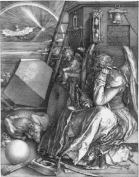
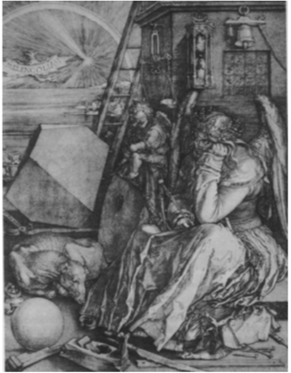

```{r setup, include=FALSE}
knitr::opts_chunk$set(echo = TRUE, comment = NA)
```

# Valores singulares de una matriz

## Valores singulares de una matriz

Sabemos que cualquier matriz real simétrica $A$ se puede descomponer en la forma $$A = PDP^t$$ donde $D$ es una matriz diagonal y $P$ es una matriz ortogonal.

Ahora veremos que una matriz real cualquiera $A$ no necesariamente cuadrada, se puede descomponer en la forma 
$$A = U\Sigma V^t$$ donde $\Sigma$ es diagonal y $U,V$ ortogonales (no precisamente una inversa de la otra)

## Valores singulares de una matriz

Se considera el e.v. $\mathbb{R}^k$ con un producto escalar.

Recordemos que si $x,y\in\mathbb{R}^k$, entonces $$\langle x,y\rangle = X^t Y$$ donde $X,Y$ son las matrices columna de las coordenadas de $x$ e $y$, respectivamente, en una base ortonormal

## Valores singulares de una matriz

<l class = "definition">Matriz positiva.</l> Diremos que una matriz simétrica $A$ es positiva si verifica $$\langle Ax,x\rangle\ge 0\quad\forall x\in E$$

<l class = "observ">Observación.</l> $Ax$ indica el vector imagen de $x$ mediante el endomorfismo asociado a la matriz $A$ en una base. Si la base fijada resulta ser ortonormal, entonces la condición de positividad anterior se puede escribir del siguiente modo: $$(AX)^tX = X^tAX\ge 0$$

## Valores singulares de una matriz

<l class = "prop">Proposición.</l> Sea $A\in\mathcal{M}_{m\times n}(\mathbb{R})$, entonces las matrices $A^tA$ y $AA^t$ son simétricas, positivas y tienen el mismo rango que $A$

## Valores singulares de una matriz{.dem}

**Demostración**

En primer lugar, veámoslo para $A^tA\in\mathcal{M}_{n}(\mathbb{R})$.

Fijamos bases ortonormales en $\mathbb{R}^m$ y $\mathbb{R}^n$. La simetría es clara:

$$(A^tA)^t = A^t(A^t)^t = A^tA$$

Veamos ahora que es positiva: $$X^t(A^tA)X = (AX)^t(AX) = \langle Ax,Ax\rangle\ge 0$$

Finalmente, veamos que $\text{rg}(A^tA) = \text{rg}(A)$. En efecto, si $\omega$ es el endomorfismo autoadjunto de $\mathbb{R}^n$ asociado a la matriz $A^tA$, entonces $$\text{rg}(A^tA) = n-\dim(\ker(\omega))$$ $$\text{rg}(A) = n-\dim(\ker (f))$$ donde $f$ es la aplicación lineal asociada a $A$.

## Valores singulares de una matriz{.dem}

Basta ver pues que $\ker(\omega) = \ker(f)$. Si $f(x) = 0$, entonces $AX = 0$ implica que $A^tAX = 0$ y, en definitiva $\omega(x) = 0$. Recíprocamente, si $\omega(x) = 0$, entonces $A^tA = 0$ y, con esto $X^tA^tAX = 0$, el cual podemos escribir como $$(AX)^tAX = \langle Ax,Ax\rangle = 0$$ Finalmente, esto implica que $Ax = 0$, o sea que $f(x) =0$.

Para el caso $AA^t\in\mathcal{M}_m(\mathbb{R})$ la demostración es análoga.

## Valores singulares de una matriz

<l class = "prop">Proposición.</l> Los valores propios de $A^tA$ (y de $AA^t$) son no negativos

<div class = "dem">
**Demostración**

Sea $\lambda$ un vap de $A^tA$, la matriz asociada al endomorfismo $\omega$. Sea $x\ne 0$ su valor propio asociado, es decir, tal que $$A^tAx = \lambda x$$

Sabemos que $A^tA$ es positiva, con lo cual
$$\langle (A^tAx),x\rangle = \langle \lambda x,x\rangle = \lambda\langle x,x\rangle \ge 0$$

Por tanto, $\lambda\ge 0$ ya que $\langle x,x\rangle >0$.

Lo mismo ocurre con $AA^t$
</div>

## Valores singulares de una matriz

<l class = "prop">Proposición.</l> Los valores propios no nulos de $A^tA$ y $AA^t$ son los mismos.

<div class = "dem">
**Demostración**

Sea $\lambda>0$ un vap de $A^tA$. Existe $x\ne 0$ tal que $A^tAx = \lambda x$ de donde $AA^tAx = A(\lambda x) = \lambda Ax$. Por lo tanto, $\lambda$ es vap de $AA^t$ con vep $Ax$.

Recíprocamente, sea $\lambda>0$ vap de $AA^t$, existe $x\ne 0$ tal que $AA^tx = \lambda x$ de donde $A^tAA^tx = A^t\lambda x = \lambda A^tx$. Por tanto, $\lambda$ es vap de $A^tA$ con vep asociado $A^tx$
</div>

## Valores singulares de una matriz

<l class = "prop">Proposición.</l> Sea $f: \mathbb{R}^n\longrightarrow \mathbb{R}^m$ una aplicación lineal con $\text{rg}(f)= r$. Entonces existe una base ortonormal $\{e_1,\dots,e_n\}$ de $\mathbb{R}^n$, una base ortonormal $\{v_1,\dots,v_m\}$ de $\mathbb{R}^m$ y escalares $\alpha_1\ge\cdots\ge\alpha_r>0$ tales que $$f(e_i) = \lambda_iv_i\quad i = 1,\dots,r$$ $$f(e_i) = 0\quad \text{si }i = r+1,\dots,n$$

## Valores singulares de una matriz{.dem}

**Demostración**

Fijamos bases ortonormales en $\mathbb{R}^n$ y $\mathbb{R}^m$.

Sea $A$ la matriz de $f$ y sea $\varphi$ el endomorfismo de $\mathbb{R}^n$ asociado a la matriz $A^tA$. Como sabemos, $\varphi$ es autoadjunto ya que $A^tA$ es simétrica y tiene rango $r$. Por tanto, existe una base ortonormal de $E$ formada por veps: $\{v_1,\dots,v_n\}$ tales que $\varphi(v_i) = \lambda_iv_i$ con $i = 1,\dots,n$

La base se puede escoger de forma que $\lambda_1\ge\cdots\ge\lambda_r >0$ y $\lambda_i = 0$ para $i = r+1,\dots,n$. Definimos pues $$u_i = \frac{f(v_i)}{\sigma_i}$$ donde $\sigma_i = \sqrt{\lambda_i}$ para $i = 1,\dots,r$

Se puede ver que $\{u_1,\dots,u_r\}$ es un conjunto ortonormal de $\mathbb{R}^m$ y, en consecuencia, LI:

$$\langle u_i,u_j\rangle = \left\langle \frac{f(v_i)}{\sigma_i},\frac{v_j}{\sigma_j}\right\rangle = \frac{1}{\sigma_i\sigma_j}(Av_i)^t(Av_j) = \frac{1}{\sigma_i\sigma_j}v_i^tA^tAv_j = \frac{1}{\sigma_i\sigma_j}v_i\lambda_jv_j = 0$$ ya que $\{v_1,\dots,v_n\}$ es un conjunto ortogonal.

## Valores singulares de una matriz{.dem}

Si consideramos ahora $S = \langle u_1,\dots,u_r\rangle$, podemos escoger una base ortonormal $\{u_{r+1},\dots,u_m\}$ del ortogonal de $S$ y así tenemos que $$\{u_1,\dots,u_r,u_{r+1},u_m\}$$ es una base ortonormal de $\mathbb{R}^m$ con las propiedades deseadas

## Valores singulares de una matriz

<l class = "definition">Valores singulares de la aplicación lineal.</l> Los números reales $\sigma_1\ge\dots\ge\sigma_r>0$ y $\sigma_{r+1} =\cdots =\sigma_m = 0$ son los valores singulares de la aplicación lineal $f$ (o de $A$)

## Valores singulares de una matriz

<l class = "prop">Corolario. Descomposición de una matriz en valores singulares. </l> Una matriz real cualquiera $A$ de orden $m\times n$ y de rango $r$ se puede descomponer en la forma $$A = U\Sigma V^t$$ donde $\Sigma$ es diagonal de rango $r$ y $U,V$ son ortogonales

## Valores singulares de una matriz{.dem}

**Demostración**

Fijadas bases ortonormales en $\mathbb{R}^n$ y $\mathbb{R}^m$, sea $f:\mathbb{R}^n\longrightarrow \mathbb{R}^m$ lineal con matriz asociada $A$.

Por la proposición anterior, existen bases ortonormales de $\mathbb{R}^n$ y $\mathbb{R}^m$ tales que la matriz de $f$ en estas bases es $\Sigma = \text{diag}(\sigma_1,\dots,\sigma_r,0,\dots,0)$. Podemos escribir entonces $$\Sigma = U^tAV$$ o también $$A = U\Sigma V^t$$ donde $U,V$ son ortogonales (no precisamente inversas una de la otra). Claramente, $\text{rg}(\Sigma) = r$

## Valores singulares de una matriz

<l class = "prop">Corolario. Descomposición polar de una matriz.</l> Sea $A\in\mathcal{M}_n(\mathbb{K})$. Existe una matriz hermítica $P\in\mathcal{M}_n(\mathbb{K})$ con vaps no negativos y una matriz ortogonal $Q\in\mathcal{M}_n(\mathbb{K})$ tales que $A = PQ$

## Valores singulares de una matriz{.dem}

**Demostración**

Si $A$ es una matriz cuadrada, entonces en su descomposición en valores singulares las matrices $U,\Sigma, V\in\mathcal{M}_n(\mathbb{K})$. En este caso tenemos que

$$A = U\Sigma V^t = U\Sigma (U^tU)V^t = (U\Sigma U^t)(UV^t) = PQ$$

Veamos que $P = U\Sigma U^t$ es hermítica: $$P^t = (U\Sigma U^t)^t = U\Sigma^t U^t = U\Sigma U^t = P$$ ya que $\Sigma$ es simétrica. Además, como que $U,V$ son unitarias, entonces $$Q^{-1} = (UV^t)^{-1} = (V^t)^{-1}U^{-1} = VU^t = Q^t$$

## Valores singulares de una matriz

<l class = "prop">Corolario. Descomposición polar de un endomorfismo.</l> Sea $f:\mathbb{R}^n\longrightarrow \mathbb{R}^m$ un automorfismo. Existen $g,h:\mathbb{R}^n\longrightarrow\mathbb{R}^n$ lineales con $g$ autoadjunto y positivo y $h$ ortogonal (conserva el producto escalar) tales que $f = gh$

## Valores singulares de una matriz{.dem}

**Demostración**

Existen bases ortonormales $\{e_1,\dots,e_n\}$ y $\{v_1,\dots,v_n\}$ de $\mathbb{R}^n$ y escalares $\sigma_1\ge\cdots\ge\sigma_n>0$ tales que $$f(e_i) = \sigma_iv_i\quad i = 1,\dots,n$$

Definimos $h$ del siguiente modo: $$h(e_i) = v_i\quad i = 1,\dots,n$$ y también $g$ tal que $$g(v_i) = \sigma_iv_i\quad i = 1,\dots,n$$

Las aplicaciones construidas $g,h$ satisfacen las condiciones del enunciado.

## Valores singulares de una matriz

<l class = "prop">Proposición.</l> Si $r$ es el número de valores singulares diferentes de cero de $A$, entonces $\text{rg}(A) = r$

<l class = "div">
**Demostración**

Este resultado es consecuencia de que el rango de una matriz no varía si la multiplicamos por matrices invertibles, como lo son $U,V$
</div>

## Valores singulares de una matriz

<l class = "prop">Proposición.</l> Si $A = U\Sigma V^t$ es un SVD de $A$, $\text{rg}(A) = r$, $U = [u_1\ u_2\ \cdots\ u_m]$, $V =[v_1\ v_2\ \cdots\ v_n]$, entonces $\text{Im}(A) = \langle u_1,\dots,u_r\rangle$ y $\ker(A) = \langle v_{r+1},\dots,v_n\rangle$ 

## Valores singulares de una matriz{.dem}

**Demostración**

Como que $U,V$ son matrices invertibles, entonces $$\text{Im}(AV) = \text{Im}(A)\qquad \ker(U^tA) = \ker(A)$$

Pero como que $\text{Im}(AV) = \text{Im}(U\Sigma) = \langle\sigma_1u_1,\sigma_ru_r\rangle = \langle u_1,\dots,u_r\rangle$

Por otro lado, como que $\{v_1,\dots,v_n\}$ es una base ortonormal de $\mathbb{K}^n$, si $x\in\mathbb{K}^n$, entonces $$x = \alpha_1v_1+\cdots+\alpha_nv_n = V\alpha$$ con $\alpha = (\alpha_1,\dots,\alpha_n)$. Así

$$x\in\ker(A)\Leftrightarrow Ax = 0\Leftrightarrow AV\alpha = 0\Leftrightarrow U^tAV\alpha =0\Leftrightarrow \Sigma\alpha =0$$$$\Leftrightarrow \sigma_i\alpha_i =0,\quad 1\le i\le r\Leftrightarrow x = \alpha_{r+1}v_{r+1}+\cdots+\alpha_nv_n$$

Entonces, $\ker(A) = \langle v_{r+1},\dots,v_n\rangle$

## Valores singulares de una matriz

<l class = "prop">Proposición.</l> Si $A = U\Sigma V^t$ es la SVD de la matriz $A\in\mathcal{M}_n(\mathbb{K})$ tal que $\text{rg}(A)=r$, $U = [u_1\ u_2\ \cdots\ u_m]$, $V =[v_1\ v_2\ \cdots\ v_n]$, entonces $\text{Im}(A) = \langle u_1,\dots,u_r\rangle$, entonces $$A = \sigma_1u_1v_1^t+\sigma_2u_2v_2^t+\cdots+\sigma_ru_rv_r^t$$

# Cálculo de la Descomposición en Valores Singulares

## Cálculo de la Descomposición en Valores Singulares

Sea $A\in\mathcal{M}_{p\times m}(\mathbb{K})$ con $\text{rg}(A)=r$. 

Como hemos visto, el cálculo de la descomposición en valores singulares se basa en la diagonalización de la matriz $A^tA$ y la podemos hacer en las siguientes etapas:

1. Los vectores $v_1,\dots,v_r$ se obtienen calculando las bases ortonormales de los subespacios propios asociados a los valores propios no nulos de $A^tA$, ordenados de mayor a menor

## Cálculo de la Descomposición en Valores Singulares

<ol start = 2>

<li> Denotamos  $U = \begin{pmatrix}u_1&|&\cdots&|&u_p\end{pmatrix}$ y $V = \begin{pmatrix}v_1&|&\cdots&|&v_r\end{pmatrix}$. Como que $A = U\Sigma V^t$, entonces $AV = U\Sigma$ y, por lo tanto, $Av_i = \sigma_iu_i$ $\forall i=1,\dots,r$. En consecuencia, las $r$ primeras filas de $U$ se obtienen directamente de las de $v$ haciendo uso de $$u_i = \frac{1}{\sigma_i}Av_i\quad i = 1,\dots,r$$

</ol>

## Cálculo de la Descomposición en Valores Singulares

<ol start = 3>

<li> Ya tenemos la descomposición, que será de la forma 
$$A = \begin{pmatrix}u_1&|&\cdots&|&u_p\end{pmatrix}\begin{pmatrix}
\sigma_1 & 0 & \cdots & 0\\
0 & \sigma_2 & \cdots & 0\\
\vdots & \vdots & \ddots & \vdots\\
0 & 0 & \cdots & \sigma_r
\end{pmatrix}\begin{pmatrix}
v_1^t\\
v_2^t\\
\vdots\\
v_r^t\end{pmatrix}$$ $$=\sigma_1u_1v_1^t+\sigma_2u_2v_2^t+\cdots+\sigma_ru_rv_r^t$$
</ol>

# Interpretación geométrica de los Valores Singulares

## Interpretación geométrica de los Valores Singulares

Ya para finalizar, queremos dar una interpretación geométrica de qué son los valores singulares de una matriz o, equivalentemente, de una aplicación lineal.

Para resolver esta cuestión, debemos contestar primeramente a la pregunta de cuál es la imagen de la circunferencia unidad para una aplicación lineal.

## Interpretación geométrica de los Valores Singulares

Antes de contestar esta última pregunta, pensemos en como se transforma un segmento recto para una aplicación lineal.

Solo hay dos posibilidades:

- en otro segmento recto
- en un punto

Este último caso lo podemos pensar como que es un segmento degenerado que ha colapsado en un punto.

## Interpretación geométrica de los Valores Singulares

Por lo tanto, si esto ocurre, la imagen para una aplicación lineal de un polígono de $n$ lados solamente tendrá 3 posibilidades:

- otro polígono de $n$ lados
- un polígono colapsado, que sería un segmento
- el caso más degenerado, un punto

En consecuencia, la imagen de un polígono regular es otro polígono regular

## Interpretación geométrica de los Valores Singulares

Ahora ya sí podemos contestar a la pregunta inicial relacionada con la circunferencia.

Podemos pensar la circunferencia como un paso al límite de un polígono de $n$ lados, con lo cual la imagen de la circunferencia unidad para una aplicación lineal es una elipse centrada en el origen de coordenadas

Esta elipse puede ser degenerada y derivar en un segmento o en un punto, pero al igual que en el caso del polígono de $n$ lados, solamente tiene estas 3 posibilidades

## Interpretación geométrica de los Valores Singulares

Evidentemente, este razonamiento llevado a cabo en $\mathbb{R}^2$ lo podemos generalizar sin problema alguno a $\mathbb{R}^n$ y tendremos un resultado similar:

La imagen de la esfera unidad en un espacio de dimensión $n$ es una hiperelipse que puede estar degenerada, es decir, el número de semiejes puede ser menor a $n$ y habitar, por lo tanto, en un espacio de dimensión inferior

## Interpretación geométrica de los Valores Singulares

<l class = "definition">Valores singulares de $A$.</l> Son las longitudes de los semiejes de la hiperelipse en que se convierte la esfera unidad por $A$

Esta nueva definición de valores singulares de una matriz nos da su interpretación geométrica

## Interpretación geométrica de los Valores Singulares

Si volvemos a pensar de nuevo en el plano, observamos que una consecuencia de todo lo que se ha expuesto anteriormente es que las matrices que dejan invariante la circunferencia unidad son las matrices ortogonales.

Esto es así ya que si los vectores columna de la matriz $A$ son ortogonales, los semiejes de la elipse transformada también serán perpendiculares entre ellos y tendrán longitud 1. En consecuencia, la elipse será una circunferencia de radio 1.

## Interpretación geométrica de los Valores Singulares

El `Teorema de Descomposición en Valores Singulares` nos decía que cualquier matriz $A$ se puede descomponer de la forma $$A = U\Sigma V^t$$

Relacionándolo con la interpretación geométrica que hemos dado con anterioridad, resulta que la transformación ortogonal $V$ solo produce la rotación de la esfera de dimensión $n$, $\Sigma$ la deforma a una hiperelipse y $U$ rota la hiperelipse

# Aplicaciones de la SVD

## Cálculo del rango aproximado de una matriz

El problema de calcular el rango de una matriz es delicado desde el punto de vista numérico ya que el condicionamiento de dicho problema es muy malo

Este mal condicionamiento nos conduce a replantearnos la cuestión del rango en términos de valores singulares de la matriz dada.

Este cambio de perspectiva se basa en que si tenemos la SVD para una matriz de orden $m\times n$ de rango $r$, entonces podemos escribir 

$$A = U\Sigma V^t = \sigma_1u_1v_1^t+\cdots +\sigma_ru_rv_r^t$$

Es decir, la matriz de rango $r$ se puede expresar como suma de $r$ matrices de rango 1.

## Cálculo del rango aproximado de una matriz

<l class = "prop">Proposición.</l> Si $p\le r$, definimos $A_p = \sigma_1u_1v_1^t+\cdots+\sigma_pu_pv_p^t$. Entonces, $A_p$ es la matriz de rango menor o igual a $p$ más cercana a $A$, es decir $$||A-A_p||\le ||A-B||$$ para cualquier matriz $B$ tal que $\text{rg}(B)\le p$

Además, $$||A-A_p|=\sigma_{p+1}$$


## Compresión de imágenes digitales

Una de las aplicaciones de la SVD es su utilización en la compresión de imágenes digitales de forma que puedan ser transmitidas de forma eficiente por medios electrónicos.

El problema que se considera en este caso es el de saber cuál es la cantidad mínima de información que se necesita transmitir para conseguir imágenes nítidas, sin que se pierdan las partes esenciales a la vez que se ahorra almacenaje.

## Compresión de imágenes digitales

Supongamos que una matriz $A\in\mathcal{M}_{m\times n}(\mathbb{K})$ representa los tonos de gris de una imagen con un tamaño de $m\times n$ píxeles. La imagen está en un rectángulo y se considera una rejilla de $m\times n$. 

Cada elemento de la rejilla (píxel) tendrá un número asociado indicando el valor del tono de gris, entre 0 y 255, de la imagen.

Así, una matriz $A\in\mathcal{M}_{m\times n}(\mathbb{K})$ tiene en cada lugar $(i,j)$ el valor de gris del píxel en la fila $i$ y columna $j$  en la correspondiente rejilla.

## Compresión de imágenes digitales

Supongamos que conocemos la descomposición en valores singulares de la matriz $A$, es decir

$$A = \sigma_1u_1v_1^t+\cdots+\sigma_ru_rv_r^t$$ siendo los valores singulares no nulos $\sigma_1\ge\sigma_2\ge\cdots\ge\sigma_r$

Los valores singulares más pequeños provienen de las partes de la imagen con menor interés. Esto se puede observar si se representa parcialmente $A_k = \sigma_1u_1v_1^t+\cdots+\sigma_ku_kv_k^t$ con $k\le r$. Entonces, como vimos en una proposición anterior, $A_k$ es una aproximación de $A$ que corresponde únicamente a los $k$ primeros valores singulares y los correspondientes vectores singulares. Se puede ver que se necesita considerar un $k<<r$ para rescatar la imagen nítida.

## Compresión de imágenes digitales

Vamos a ver un ejemplo concreto.

Consideremos el grabado llamado «Melancolía», pintado por el famoso pintor alemán Durero.

<div class = "center">



</div>

## Compresión de imágenes digitales

Como sabemos, esta imagen digital no es otra cosa que una matriz de píxeles. 

Supongamos por ejemplo que en nuestro ordenador la imagen ocupa un tamaño de $736\times 566$ píxeles. Si queremos enviar esta información no podremos hacerlo directamente sin comprimir, ya que el correo electrónico estándar, por ejemplo, no permite enviar archivos de tanto peso.

Con lo cual, necesitamos comprimir la imagen, pero no queremos perder mucha resolución

## Compresión de imágenes digitales

Tomamos $A$ la matriz de tamaño $736\times 566$ que contiene los datos necesarios para obtener la imagen.

Para hacernos a la idea, necesitamos $736\cdot 566 = 416576$ datos en coma flotante para conseguir esta imagen.

Siguiendo el `Teorema de Descomposición en Valores Singulares`, existen matrices $U,\Sigma, V$ tales que $$A = U\Sigma V^t;\qquad\Sigma = \begin{pmatrix}
\Sigma_{566}\\
0\end{pmatrix}$$

donde $\Sigma_{566} = \text{diag}(\sigma_1,\dots,\sigma_{566})$ con $\sigma_1\ge\sigma_2\ge\cdots\ge\sigma_{566}$ los valores singulares de $A$.

## Compresión de imágenes digitales

El número de filas especificadas como cero en $\Sigma$ es, por lo menos $$736-566 = `r 736-566`$$

Así que las últimas 179 columnas de $U$ no juegan ningún papel.

Denotamos como $U_1$ la submatriz de $U$ formada por las primeras $566$ columnas. Podemos entonces escribir $$A = U_1\Sigma V^t$$

## Compresión de imágenes digitales

Si $u_i$ representa la $i-$ésima columna de $U_1$ y $v_i^t$ la $i-$ésima fila de $V^t$, entonces sabemos que $$A = \sum_{i = 1}^{566}\sigma_iu_iv_i^t$$

Cada una de las matrices $\sigma_iu_iv_i^t$ es de tamaño $736\times 566$, pero solo se necesitan $736+566+1 = 1303$ datos para formarla: los 736 elementos de $u_i$, los 566 de $v_i^t$ y 1 $\sigma_i$.

A la matriz $\sigma_iu_iv_i^t$ se la conoce como el $i-$ésimo <l class = "definition">modo</l> de $A$.

## Compresión de imágenes digitales

Debemos notar que estos modos no están determinados de forma única por $A$. Lo que es más importante es que algunos de estos modos son más dominantes que otros a la hora de formar la matriz $A$.

Las matrices $u_iv_i^t$ son matrices de rango 1, de forma que determinan subespacios de dimensión 1, que podemos identificar con direcciones en $\mathbb{R}^{566}$. Además, como los vectores $u_i$ y $v_i$ son ortogonales, estas direcciones son mutuamente ortogonales.

El valor $\sigma_i$ nos proporciona la coordenada de $A$ en la dirección $u_iv_i^t$.

Si hay valores singulares mucho más grandes que otros, las direcciones de estos valores singulares son más determinantes en la formación de $A$ que los valores singulares menores.

## Compresión de imágenes digitales

Aproximando $A$ por la suma de sus primeros modos, conseguimos matrices que toman en consideración las direcciones fundamentales de $A$.

Las imágenes de estas matrices deben ser similares a las de $A$ a medida que el número de modos aumenta.

Sin embargo, con pocos modos se pueden conseguir resultados considerablemente buenos.

Observemos que, por ejemplo, 150 modos requieren (recordemos que cada modo necesitaba de 1303 datos) $150\times 1303 = 195450$  datos, lo que equivale a menos de la mitad de los datos necesarios para formar la matriz $A$ al completo.

## Compresión de imágenes digitales

<div class = "center">



</div>

## Compresión de imágenes digitales

Finalmente, con 100 modos la resolución es bastante buena, pero con 150 apenas se distingue la original de la copia.

## El problema de los mínimos cuadrados y la inversa de Moore-Penrose

El problema del ajuste de datos, en otras palabras, el de descubrir una función matemática que pueda explicar de la mehor forma posible el comportamiento de algún mecanismo o grupo de seres u objetos que puede ser medido, y de como conocemos algunos datos (con sus posibles errores de medición) es un problema clásico y ha supuesto un reto para la comunidad matemática des de su planteamiento por Gauss y Legendre allá por 1800

## El problema de los mínimos cuadrados y la inversa de Moore-Penrose

En lenguaje de Álgebra Lineal este problema consiste en encontrar la solución donde un sistema lineal $Ax = b$ siendo $A\in\mathcal{M}_{m\times n}(\mathbb{K})$ con $m\ge n$. 

Sabemos que el sistema tiene solución si, y solo si, $b\in\text{Im}(A)$ y esto normalmente no se cumple si $m$ es mucho más grande que $n$

Si $m>n$ diremos que el sistema está sobredeterminado. Si no existe ningún $x\in\mathbb{K}^{n\times 1}$ tal que $Ax = b$ podemos intentar buscar un $x$ de forma que el vector $f = Ax-b\in\mathbb{K}^m$ sea el más pequeño posible. 

## El problema de los mínimos cuadrados y la inversa de Moore-Penrose

El problema lineal de mínimos cuadrados consiste en encontrar $x$ para que el vector $r$ tenga la norma más pequeña posible.

Este problema puede no tener solución única y que entonces, de entre todos los vectores $x$ tales que $$||Ax-b||_2$$ tiene norma mínima, nos quedaremos con aquél tal que su norma 2 sea mínima.

## El problema de los mínimos cuadrados y la inversa de Moore-Penrose

<l class = "definition">Solución por mínimos cuadrados.</l> $x\in\mathbb{R}^n$ es una solución por mínimos cuadrados si $$||Ax-b||_2 = \inf\{||Az-b||,\ z\in\mathbb{R}^n \}$$

<l class = "definition">Solución óptima.</l> $x\in\mathbb{R}^n$ es una solución óptima del problema de mínimos cuadrados si es una solución por mínimos cuadrados y, además

$$||x||_2 = \inf\{||z||,\ z\text{ es solución por mínimos cuadrados}\}$$

## El problema de los mínimos cuadrados y la inversa de Moore-Penrose

<l class = "observ">Observación.</l> Para las definiciones anteriores se podrían utilizar otras normas que darían lugar a diferentes nociones de soluciones generalizadas.

## El problema de los mínimos cuadrados y la inversa de Moore-Penrose

<l class = "definition">Inversa generalizada de Moore-Penrose.</l> Sea $A\in\mathcal{M}_{m\times n}(\mathbb{K})$ y $A = U\Sigma V^t$ su SVD, con $\sigma_1\ge\cdots\ge\sigma_r$ sus valores singulares no nulos. La inversa generalizada de Moore-Penrose de $A$ es $$A^+ = V\Sigma^+U^t = V\begin{pmatrix}
\Sigma^{-1} & 0\\
0 & 0\end{pmatrix}U^t = V\begin{pmatrix}
\frac{1}{\sigma_1} & 0 & \cdots & 0 & 0\\
0 & \frac{1}{\sigma_2} & \cdots & 0 & 0\\
\vdots & \vdots & \ddots & \vdots & \vdots\\
0 & 0 & \cdots & \frac{1}{\sigma_r} & 0\\
0 & 0 & \cdots & 0 & 0\end{pmatrix}U^t
$$ 

## El problema de los mínimos cuadrados y la inversa de Moore-Penrose

<l class = "observ">Observación.</l> Podemos afirmar que la definición anterior depende de la elección de $U,V$ en la descomposición de $A$ en valores singulares y estas no son, por lo general, únicas.

Vamos a demostrar que, a pesar de esta arbitrariedad, la inversa de Moore-Penrose es única

## El problema de los mínimos cuadrados y la inversa de Moore-Penrose

<l class = "prop">Proposición.</l> Para cada $A\in\mathcal{M}_{m\times n}(\mathbb{K})$ existe una única inversa generalizada de Moore-Penrose

<div class = "dem">
**Demostración**

Sea $A = U\Sigma V^t$ la SVD de $A$ con $\sigma_1\ge\cdots\ge\sigma_r>0$ sus valores singulares. Por una proposición anterior, sabemos que $\text{Im}(A) = \langle u_1,\dots,u_r\rangle$, $\ker(A) = \text{Im}(A^t) = \langle v_1,\dots,v_r\rangle$, siendo bases ortonormales de estos subespacios.

Si escribimos ahora $V = [V_1\ V_2]$ donde $V_1\in\mathcal{n\times r}(\mathbb{K})$, $U = [U_1\ U_2]$ con $U_1\in\mathcal{m\times r}(\mathbb{K})$ y $\Sigma_r = \text{diag}(\sigma_1,\dots,\sigma_r)$, entonces $\Sigma_r^{-1} = \text{diag}(\frac{1}{\sigma_1},\dots,\frac{1}{\sigma_r})$ y $$A = U_1\Sigma_r V_1^t\qquad A^+ = V_2\Sigma_r^{-1}U_1^t$$
</div>

## El problema de los mínimos cuadrados y la inversa de Moore-Penrose{.dem}

Si hubiese otra SVD, como los valores singulares sí son únicos, existirían las matrices $\tilde{U}\in\mathcal{M}_{m}(\mathbb{K})$, $\tilde{V}\in\mathcal{M}_n(\mathbb{K})$ tales que $$A = \tilde{U}\Sigma\tilde{V}^t$$

Dividiendo $\tilde{U},\tilde{V}$ como hemos hecho anteriormente con $U,V$ tendremos $$A = \tilde{U}_1\Sigma_r\tilde{V}_1$$ con $\tilde{U}_1,\tilde{V}_1$ matrices tales que sus columnas son bases ortonormales de $\text{Im}(A),\text{Im}(A^t)$, respectivamente.

Por esta descomposición, la inveresa de Moore-Penrose será $$\tilde{A}^+ = \tilde{V}_1\Sigma_r^{-1}\tilde{U}_1$$

Nos falta ver que $A^+ = \tilde{A}^+$

## El problema de los mínimos cuadrados y la inversa de Moore-Penrose{.dem}

Por lo comentado anteriormente, existen matrices unitarias $P,Q\in\mathcal{M}_r(\mathbb{K})$ tales que $$\tilde{U}_1 = PU_1\qquad \tilde{V}_1 = QV_1$$

Por otro lado, como que $\tilde{U}_1\Sigma_r\tilde{V}_1^t = U_1\Sigma_rV_1^t$, entonces $U_1P\Sigma_rQ^tV_1^t = U_1\Sigma_rV_1$. Multiplicando la igualdad anterior por $U_1^t$ por la izquierda y por $V_1$ por la derecha, obtenemos

$$P\Sigma_rQ^t = \Sigma_r$$

Y como que $\Sigma_r$ es invertible (diagonal con todos sus elementos de la diagonal principal no nulos), entonces $$Q\Sigma_r^{-1}P^t = \Sigma_r^{-1}$$ y también $$V_1Q\Sigma_r^{-1}P^tU_1^t = V_1\Sigma_r^{-1}U_1^t$$

## El problema de los mínimos cuadrados y la inversa de Moore-Penrose{.dem}

Pero recordemos que $\tilde{V}_1 = QV_1$ Y $P^tU_1^t = (U_1P)^t = \tilde{U}_1^t$.

En definitiva, podemos concluir que $A^+ = \tilde{A}^+$

## El problema de los mínimos cuadrados y la inversa de Moore-Penrose

<l class = "prop">Proposición.</l> Sea $A\in\mathcal{M}_{m\times n}(\mathbb{K})$ y $A^+$ su inversa generalizada de Moore-Penrose. Entonces, para cada $b\in\mathbb{K}^m$, la solución óptima del problema de mínimos cuadrados es $x = A^+b$

## El problema de los mínimos cuadrados y la inversa de Moore-Penrose{.dem}

**Demostración**

Queremos minimizar $||b-Ax||_2$. Tenemos la siguiente cadena de igualdades

$$||b-Ax||_2^2 = ||U^t(b-Ax)||_2^2 = ||U^tb-U^tAx||_2^2 = ||U^tb-\Sigma V^tx||_2^2 =||c-\Sigma y||_2^2 $$

siendo $c = U^tb$ e $y = V^tx$. Continuando la cadena de igualdades

$$||b-Ax||_2^2 = \sum_{i = 1}^r|c_i-\sigma_iy_i|^2+\sum_{i = r+1}^m|c_i|^2$$

El mínimo de la suma anterior se obtiene cuando $y_i = \frac{c_i}{\sigma_i}$ y, en este caso, vale $$\sum_{i = r+1}^m|c_i|^2$$

## El problema de los mínimos cuadrados y la inversa de Moore-Penrose{.dem}

Cuando $r<n$, $y_{r+1},\dots,y_n$ no aparecen explícitamente en la expresión anterior y de todas las soluciones obtenidas, la que tiene norma mínima es aquella tal que $$y_{r+1} = \cdots = y_n = 0$$

Como que $x = Vy$ y $V$ es ortogonal

$$||x||_2 = ||y||_2$$ y la norma de $x$ será mínima si, y solo si, lo es la de $y$

Entonces, la solución del problema de mínimos cuadrados es $x = Vy$. Si denotamos $c = U^tb = \begin{pmatrix}\tilde{c}\\d\end{pmatrix}$, $y = \begin{pmatrix}\tilde{y}\\ 0\end{pmatrix}$, con $\tilde{c},\tilde{d}\in\mathbb{K}^r$, el vector $x$ viene dado por

$$x = Vy = V\begin{pmatrix}\tilde{y}\\ 0\end{pmatrix} =  V\begin{pmatrix}
\Sigma_r^{-1}\tilde{c}\\ 
0\end{pmatrix} = V\begin{pmatrix}
\Sigma_r^{-1} & 0\\ 
0 & 0\end{pmatrix}\begin{pmatrix}
\tilde{c}\\ 
d\end{pmatrix} = V\begin{pmatrix}
\Sigma_r^{-1} & 0\\ 
0 & 0\end{pmatrix}c = V\begin{pmatrix}
\Sigma_r^{-1} & 0\\ 
0 & 0\end{pmatrix}U^tb$$

deduciendo así nuestro resultado

