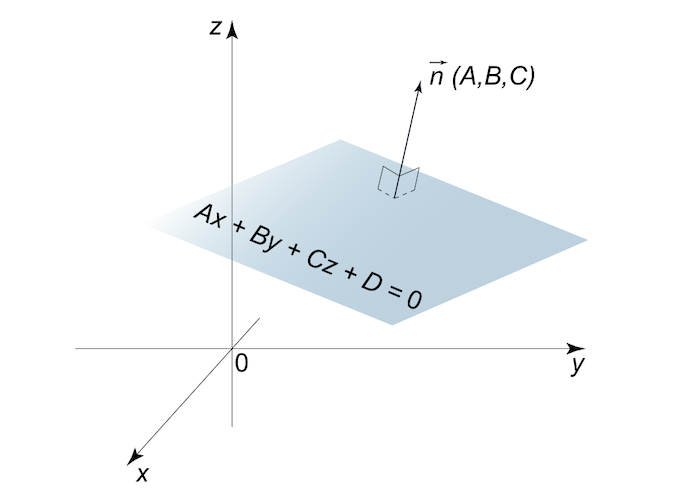

```{r setup, include=FALSE}
knitr::opts_chunk$set(echo = TRUE, comment = NA, engine.path = list(
  octave = '/Applications/Octave-4.4.1.app/Contents/Resources/usr/bin/octave'
))
library(reticulate)
library(matlib)
use_python("/anaconda3/bin/python3")
```

# Trabajando con `R`

## Trabajando con `R`

En esta sección veremos como

- Trabajar con sistemas compatibles determinados
- Representar ecuaciones de un sistema lineal
- Utilizar el Método de Gauss
- Trabajar con sistemas compatibles indeterminados
- Trabajar con sistemas incompatibles
- Resolver ecuaciones matriciales

y todas estas cosas con `R`.

# Sistemas compatibles determinados con `R`

## Sistemas compatibles determinados con `R`

Dado el sistema de ecuaciones lineales

$$\left\{\begin{matrix}a_{11}x_1+a_{12}x_2+\cdots+a_{1n}x_n & = & b_1\\
a_{21}x_1+a_{22}x_2+\cdots+a_{2n}x_n & = & b_2\\
\vdots & \  & \vdots\\
a_{m1}x_1+a_{m2}x_2+\cdots+a_{mn}x_n & = & b_m\\\end{matrix}\right.$$

Si lo pasamos a su forma matricial, $AX = b$, podremos resolverlo de forma sencilla con la función `solve(A,b)`, siempre que se trate de un sistema compatible determinado.

## Ejemplo 1

<div class = "example">
**Ejemplo 1**

Dado el siguiente sistema de ecuaciones lineales, calculemos su solución:

$$\left\{\begin{matrix}
x_1 &+& x_2 &+& 2x_3 &=& 9\\
2x_1 &+& 4x_2 &-& 3x_3 &=& 1\\
3x_1 &+& 6x_2 &-& 5x_3 &=& 0\end{matrix}\right.$$
</div>

Observemos que, en este caso, se trata de un sistema de 3 ecuaciones con 3 incógnitas. 

Lo pasamos a su forma matricial:

```{r}
A = rbind(c(1,1,2),c(2,4,-3),c(3,6,-5))
b = c(9,1,0)
AB = cbind(A,b)
```

## Ejemplo 1


Comprobamos que el rango de $A$ es igual al de la ampliada, para ver si el sistema es compatible


```{r}
qr(A)$rank==qr(AB)$rank
```


Ahora, comprobamos si es igual al número de incógnitas, para ver si es compatible determinado


```{r}
qr(A)$rank==3
```

## Ejemplo 1

Finalmente, una vez visto que se trata de un sistema compatible determinado por el Teorema de Rouché-Frobenius, resolvemos:

```{r}
solve(A,b)
```

En definitiva, la solución de nuestro sistema es 
$$x_1 = 1,\ x_2 = 2,\ x_3 = 3$$

Para comprobar que se trata de la solución correcta, solamente tenéis que sustituir la solución obtenida en cada una de las ecuaciones y ver que se cumplen todas y cada una de las igualdades. 


## Ejemplo 1

Otra forma de comprobar que la solución obtenida es la correcta, es realizando el siguiente producto de matrices y ver que es igual al vector de términos independientes

```{r}
solution = c(1,2,3)
A%*%solution
```

## Ejemplo 1

```{r}
A%*%solution == b
```

Con lo cual, efectivamente, el vector $(1,2,3)$ es solución de nuestro sistema. Además es la única, ya que recordemos que se trataba de un sistema compatible determinado.


## Sistemas compatibles determinados con `R`

Hay otra forma de resolver sistemas compatibles determinados. La librería `matlib` nos ofrece, aparte de la función `Solve`, muchas otras funciones que pueden sernos de utilidad a la hora de resolver sistemas de ecuaciones lineales. Sobre todo, los de 2 o 3 ecuaciones.

<l class ="important">Atención. </l> Para los usuarios de Mac, a la hora de utilizar `matlib`, tendréis que ir a [xquartz.org](https://www.xquartz.org) e instalar el paquete. Si no, no os funcionará todo lo relativo a esta librería

## Ejemplo 2

<div class = "example">
**Ejemplo 2**

Resolvamos esta vez un sistema de dos ecuaciones con dos incógnitas:

$$\left\{\begin{matrix}
2x_1 &+& 2x_2 &=& 1\\
-x_1 &+& x_2 &=& 2\end{matrix}\right.$$

</div>

Si lo expresamos en su forma matricial, obtenemos,

```{r}
A = rbind(c(2,2),c(-1,1))
b = c(1,2)
AB = cbind(A,b)
```

## Ejemplo 2

Una vez lo tenemos en forma matricial, podemos mostrarlo con la función `showEqn()`

```{r}
showEqn(A, b)
```

## Ejemplo 2

La librería `matlib` también nos permite calcular el rango de una matriz con la función `R()`

```{r}
R(A)
R(AB)
```

## Ejemplo 2

Además, mediante la función `all.equal()`, podemos comprobar si el sistema es compatible. Es decir, si los rangos de $A$ y la matriz ampliada $AB$ son iguales: 

```{r}
all.equal(R(A),R(AB))
```

Como en este caso el rango de la matriz de coeficientes y el de la ampliada coinciden entre sí y con el número de incógnitas, por el Teorema de Rouché-Frobenius podemos concluir que se trata de un sistema compatible determinado.

## Ejemplo 2

Finalmente, una vez visto que se trata de un sistema compatible determinado, resolvemos:

```{r}
Solve(A, b, fractions = TRUE)
```

<l class = "observ">Observación.</l> El parámetro `fractions` nos permite mostrar las soluciones no enteras en forma de fracción, siempre que esta exista. Su valor por defecto es `FALSE`

# Representación de sistemas con `R`

## Representación de sistemas con `R`

Otra cosa interesante que nos proporciona la librería `matlib` es el poder dibujar las ecuaciones de un sistema mediante las funciones `plotEqn()` o `plotEqn3d()`, en función de si tenemos 2 o 3 incógnitas.

## Ejemplo 2

En caso de tener un sistema de dos ecuaciones con dos incógnitas, como por ejemplo el del `Ejemplo 2`, recordemos

```{r, echo = F}
showEqn(A,b)
```

Su representación sería la que se muestra en la siguiente diapositiva

## Ejemplo 2

```{r, fig.height=4, fig.align='center'}
plotEqn(A,b)
```

## Ejemplo 2

La solución que anteriormente habíamos encontrado,

$$\left\{\begin{matrix}x_1 = -\frac{3}{4}\\x_2 = \frac{5}{4}\end{matrix}\right.$$

es el punto donde ambas rectas intersecan.

## Ejemplo 2

```{r, fig.height=3.5, fig.align='center'}
plotEqn(A,b)
points(-3/4,5/4, col = "turquoise1", pch = 19)
```


## Ejemplo 3

En caso de tener un sistema de tres ecuaciones y dos variables, como por ejemplo

<div class = "example">
**Ejemplo 3**

$$\left\{ \begin{matrix}4x&+&2y&=&3\\ x&-&2y&=&2\\ 3x&+&4y&=&1\end{matrix}\right.$$

</div>

## Ejemplo 3

Pasándolo a su forma matricial tenemos,

```{r}
A = rbind(c(4,2),c(1,-2),c(3,4))
b = c(3,2,1)
showEqn(A,b)
```

Y su representación gráfica se consigue, de nuevo, mediante la función `plotEqn()`, ya que volvemos a tener dos incógnitas.

## Ejemplo 3

```{r fig.height=3.5, fig.align='center'}
plotEqn(A,b)
```


## Ejemplo 3

Como de nuevo vuelve a haber un punto donde intersecan todas rectas, gráficamente podemos concluir que se trata de un sistema compatible determinado.

<div class = "exercise">
**Ejercicio 1**

- Comprobad que, efectivamente, se trata de un sistema compatible determinado haciendo uso del Teorema de Rouché-Frobenius
- Calculad su solución
</div>

## Ejemplo 1

Si, en cambio, tenemos un sistema de 3 ecuaciones con 3 incógnitas, como por ejemplo el sistema del `Ejemplo 1`

```{r}
A = rbind(c(1,1,2),c(2,4,-3),c(3,6,-5))
b = c(9,1,0)
showEqn(A,b)
```

Su representación gráfica se consigue haciendo uso de la función `plotEqn3d`, tal y como se muestra en la siguiente diapositiva.

## Ejemplo 1

```{r, eval = F}
plotEqn3d(A,b, xlim = c(-3,3), ylim = c(0,6))
```

<div class = "center">

</div>

<l class = "observ">Observación.</l> Esto solo es una imagen, pero el resultado de esta función es interactivo.

## Ejemplo 1

En el plot anterior, se puede observar que hay un punto negro. Ese punto, representa la única intersección de los 3 planos. En otras palabras, esa es la solución que habíamos obtenido anteriormente. 

Más concretamente, se trata del punto $P = (1,2,3)$

# Método de Gauss con `R`

## Método de Gauss con `R`

La librería `matlib` también nos ofrece la oportunidad de utilizar el Método de Gauss para resolver sistemas de ecuaciones lineales.

La función `echelon()` nos calucla la matriz escalonada reducida de cualquier matriz.

Si reducimos la matriz ampliada a una matriz escalonada reducida equivalente, podremos deducir fácilmente la solución del sistema (suponiendo que la haya).

## Ejemplo 1

<div class = "example">
**Ejemplo 1**

Recuperemos el sistema de 3 ecuaciones con 3 incógnitas:

$$\left\{\begin{matrix}
x_1 &+& x_2 &+& 2x_3 &=& 9\\
2x_1 &+& 4x_2 &-& 3x_3 &=& 1\\
3x_1 &+& 6x_2 &-& 5x_3 &=& 0\end{matrix}\right.$$

</div>

```{r}
A = rbind(c(1,1,2),c(2,4,-3),c(3,6,-5))
b = c(9,1,0)
AB = cbind(A,b)
```

## Ejemplo 1

Entonces, la función `echelon()` aplicada a la matriz ampliada del sistema nos devuelve

```{r}
echelon(AB)
```

De donde, claramente, podemos deducir que la solución es

$x_1 = 1,\ x_2 = 2$ y $x_3=3$

## Ejemplo 1

Esto se debe a que la primera columna de la matriz que obtenemos hace referencia a la primera variable; la segunda columna a la segunda variable; la tercera, a la variable $x_3$; y, la última, al vector de términos independientes (modificado debido a las operaciones realizadas con el Método de Gauss).

Por tanto, que en la primera fila haya un 1 en la primera columna y 0's en la segunda y tercera columnas, nos indica que la variable $x_1$ toma el valor que haya en la última columna de esa fila. Es decir, $x_1 = 1$.

Por otro lado, en la segunda fila hay un 1 en la segunda columna (y 0's en la primera y la tercera), lo cual nos informa de que en este caso es la variable $x_2$ la que tomará el valor que se encuentra en la última columna de esa misma fila, la cual corresponde al vector de términos independientes. En otras palabras, $x_2 = 2$.

Siguiendo el mismo razonamiento, llegamos a la conclusión de que $x_3 = 3$

## Método de Gauss con `R`

La función `echelon()` tiene el parámetro `verbose` que, igualado a `TRUE`, nos muestra las operaciones elementales llevadas a cabo para conseguir la matriz escalonada reducida. 

Merece la pena que lo comprobéis vosotros mismos en la consola, ya que en estas diapositivas no cabe toda esa información.

Además, la función `echelon()` también cuenta con el parámetro `fractions`, muy útil para no estar arrastrando decimales.

## Método de Gauss con `R`

```{r}
echelon(AB, verbose = TRUE, fractions = TRUE)
```

# Sistemas compatibles indeterminados con `R`

## Sistemas compatibles indeterminados con `R`

En caso de tener sistemas compatibles indeterminados, no podemos aplicar directamente la función `solve()`, ya que ésta solamente está pensada para sistemas compatibles determinados.

No obstante, con todas las funciones presentadas anteriormente, es fácil averiguar si el sistema con el que estamos trabajando es un sistema compatible indeterminado y, además, podemos resolverlo.

## Ejemplo 4

<div class = "example">
**Ejemplo 4**

Dado el siguiente sistema de ecuaciones lineales:

$$\left\{\begin{matrix}x&+&y&-&z&=& 2\\x&-&y&+&z&=&1\\3x&+&y&-&z&=&5\end{matrix}\right.$$
</div>

Vemos que se trata de un sistema de 3 ecuaciones con 3 incógnitas. Pasándolo a su forma matricial, obtenemos:

```{r}
A = matrix(c(1,1,-1,1,-1,1,3,1,-1), byrow = TRUE, nrow = 3, ncol = 3)
b = c(2,1,5)
AB = cbind(A,b)
```

## Ejemplo 4

Si comprobamos los rangos de la matriz de coeficientes $A$ y la matriz ampliada del sistema, obtenemos

```{r}
c(R(A),R(AB))
all.equal(R(A),R(AB))
```

Sin embargo, a pesar de que los rangos sean iguales, el número de incógnitas es 3. Por tanto, por el Teorema de Rouché-Frobenius, concluimos que se trata de un sistema compatible indeterminado.

## Ejemplo 4

La función `echelon()` puede también indicarnos que se trata de un sistema compatible indeterminado:

```{r}
echelon(AB)
```

En este caso, nos está indicando que la variable $x_3$ es libre. Es decir, puede tomar cualquier valor en $\mathbb{R}$


## Ejemplo 4

En caso de no verlo tan claro, la función `Solve()` lo muestra más claramente

```{r}
Solve(A,b, fractions = TRUE)
```

Vemos que $x_1 = \frac{3}{2}$, $x_3$ es libre y $x_2$ depende del valor que tome $x_3$.

Es decir, nuestra solución es de la forma

$$x_1 = \frac{3}{2},\ x_2 = \frac{1}{2}+x_3,\ x_3\in\mathbb{R}$$

Con lo cual, nuestro conjunto de soluciones para este sistema es infinito.

## Ejemplo 4

Existe otra opción, que es dibujar el sistema.

En este caso, al tener 3 variables, necesitamos utilizar `plotEqn3d()`

```{r, eval = F}
plotEqn3d(A,b, xlim = c(-10,10), ylim = c(-10,10), zlim = c(-10,10))
```

<div class = "center">

</div>

## Ejemplo 4

Gráficamente, podemos concluir que el conjunto de soluciones es infinito pues se trata de una recta: la interesección de los 3 planos.

De hecho, podemos representar nuestro conjunto de soluciones por

$$\left\{x\in \mathbb{R}^3 \ :\  x_1 = \frac{3}{2},\ x_2 = \frac{1}{2}+x_3,\ x_3\in\mathbb{R}\right\}$$
$$(x_1,x_2,x_3) = \left(\frac{3}{2}, \frac{1}{2}, 0\right) + \lambda (0,1,1)$$
# Sistemas incompatibles con `R`

## Ejemplo 5

Con todas las funciones presentadas anteriormente, es fácil averiguar si el sistema con el que estamos trabajando es un sistema incompatible. 

<div class = "example">
**Ejemplo 5**

Supongamos que nos dan el siguiente sistema de ecuaciones lineales:

$$\left\{\begin{matrix}x&+&y &=& 2\\x&-&y&=&1\\2x&+&y&=&3\end{matrix}\right.$$
</div>

Tenemos un sistema de 3 ecuaciones con dos incógnitas, donde

```{r}
A = cbind(c(1,1,2),c(1,-1,1))
b = c(2,1,3)
AB = cbind(A,b)
```


## Ejemplo 5

Si comprobamos los rangos de la matriz de coeficientes $A$ y la matriz ampliada del sistema, obtenemos

```{r}
c(R(A),R(AB))
all.equal(R(A),R(AB))
```


Entonces, como los rangos son diferentes, por el Teorema de Rouché-Frobenius, concluimos que se trata de un sistema incompatible


## Ejemplo 5

Mediante la función `echelon()`, también podemos ver fácilmente que se trata de un sistema incompatible

```{r}
echelon(AB)
```

Si no lo veis tan claro, `Solve()` lo muestra aún más explicitamente:

```{r}
Solve(A,b, fractions = TRUE)
```

## Ejemplo 5


Tanto con `echelon()` como con `Solve()`, lo que obtenemos son igualdades como $$0 = 1\\ 0 = \frac{1}{3}$$

las cuales claramente son falsas. Esto es lo que nos lleva a concluir que se trata de un sistema incompatible


## Ejemplo 5

Finalmente, si lo que queréis es una comprobación gráfica, la función `plotEqn()` es la que nos servirá en este caso:

```{r, fig.height=3.2, fig.align='center'}
plotEqn(A,b, xlim = c(0,2), ylim = c(0,1.5))
```

## Ejemplo 5

En el plot anterior, podemos ver que cada par de rectas tiene solución. Es decir, las rectas intersecan 2 a 2. 

No obstante, vemos que no existe punto en que las 3 rectas intersequen. 

Este es el motivo por el cual gráficamente podemos concluir que se trata de un sistema incompatible.

# Ecuaciones matriciales con `R`

## Ejemplo 6

Dada una ecuación matricial, si la tenemos de la siguiente forma $AX = B$, donde $A,B$ son matrices, entonces la podemos resolver haciendo uso de la función `solve(A,B)`

<div class = "example">
**Ejemplo 6**

Sea la ecuación matricial $$AX + 3B = (C+D)X+3D+10I_2$$ donde $$A =\begin{pmatrix}0 & 4\\2 & 1\end{pmatrix},\quad B =\begin{pmatrix}1 & -1\\ 2 & 3\end{pmatrix},\quad C =\begin{pmatrix}1 & 2\\ 3 & -2\end{pmatrix},\quad D =\begin{pmatrix}-2 & 1\\ -1 & 1\end{pmatrix},\quad I_2 =\begin{pmatrix}1 & 0\\ 0 & 1\end{pmatrix}$$

Pasando los términos multiplicados por $X$ a la izquierda y los que no a la derecha, obtenemos

$$AX-(C+D)X = 3D-3B+10I_2$$

Sacando factor común $X$ por la derecha en el primer término y factor común 3 en el segundo término, tenemos

$$(A-(C+D))X = 3(D-B)+10I_2$$
</div>

## Ejemplo 6

Nuestras matrices son:

```{r}
A = rbind(c(0,4),c(2,1))
B = rbind(c(1,-1),c(2,3))
C = rbind(c(1,2),c(3,-2))
D = rbind(c(-2,1),c(-1,1))
I = diag(1, nrow = 2, ncol = 2)
```

La matriz que multiplica a $X$, a la que llamaremos $M$, es

```{r}
M = A-(C+D)
```

mientras que la matriz del segundo miembro de la igualdad, $N$, es

```{r}
N = 3*(D-B)+10*I
```

## Ejemplo 6

Una vez calculadas $M$ y $N$, tenemos la ecuación matricial de la forma $MX = N$. Entonces, la podemos resolver realizando lo siguiente:

```{r}
X = solve(M,N)
X
```

Comprobamos nuestro resultado:

```{r}
A%*%X + 3*B == (C+D)%*%X+3*D+10*I
```


# Trabajando con `Python`

## Trabajando con `Python`

En esta sección veremos como

- Trabajar con sistemas compatibles determinados
- Representar ecuaciones de un sistema lineal
- Trabajar con sistemas compatibles indeterminados
- Trabajar con sistemas incompatibles

y todas estas cosas con `Python`.

# Sistemas compatibles determinados con `Python`

## Sistemas compatibles determinados con `Python`

Dado el sistema de ecuaciones lineales

$$\left\{\begin{matrix}a_{11}x_1+a_{12}x_2+\cdots+a_{1n}x_n & = & b_1\\
a_{21}x_1+a_{22}x_2+\cdots+a_{2n}x_n & = & b_2\\
\vdots & \  & \vdots\\
a_{m1}x_1+a_{m2}x_2+\cdots+a_{mn}x_n & = & b_m\\\end{matrix}\right.$$

Si lo pasamos a su forma matricial, $AX = b$, podremos resolverlo de forma sencilla con la función `numpy.linalg.solve(A,b)`, siempre que se trate de un sistema compatible determinado.

## Ejemplo 1

<div class = "example">
**Ejemplo 1**

Dado el siguiente sistema de ecuaciones lineales, calculemos su solución:

$$\left\{\begin{matrix}
x_1 &+& x_2 &+& 2x_3 &=& 9\\
2x_1 &+& 4x_2 &-& 3x_3 &=& 1\\
3x_1 &+& 6x_2 &-& 5x_3 &=& 0\end{matrix}\right.$$
</div>

Se trata de un sistema de 3 ecuaciones con 3 incógnitas. Pasándolo a su forma matricial,

```{python}
import numpy as np
A = np.array([[1,1,2],[2,4,-3],[3,6,-5]])
b = np.array([9,1,0])
AB = np.array([[1,1,2,9],[2,4,-3,1],[3,6,-5,0]])
```

## Ejemplo 1

Comprobamos que el rango de $A$ es igual al de la ampliada, para ver si el sistema es compatible

```{python}
np.linalg.matrix_rank(A) == np.linalg.matrix_rank(AB)
```

Ahora, comprobamos si es igual al número de incógnitas, para ver si es compatible determinado

```{python}
np.linalg.matrix_rank(A) == 3
```

## Ejemplo 1

Finalmente, resolvemos

```{python}
x = np.linalg.solve(A, b)
x
```

Es decir, nuestra única solución es $x = (1,2,3)$

## Ejemplo 1

Recordad que la comprobación la podemos hacer de 2 formas:

- Sustituyendo la solución en cada una de las ecuaciones y ver que se cumplen todas las igualdades
- Viendo que la multiplicación de la matriz de coeficientes por la solución da el vector de términos independientes 

El segundo caso en `Python` vendría dado por el siguiente bloque de código:

```{python}
A.dot(x)
```

donde podemos ver que al multiplicar $A$ por nuestra solución, obtenemos el vector de términos independientes $b = (9,1,0)$


## Sistemas compatibles determinados con `Python`

También podemos resolver sistemas compatibles determinados con la librería `sympy`

Además, lo podremos resolver de tres formas:

- Introduciendo la lista de ecuaciones
- Introduciendo la matriz ampliada
- Introduciendo el sistema

## Ejemplo 2

<div class = "example">
**Ejemplo 2**

Resolvamos esta vez un sistema de dos ecuaciones con dos incógnitas:

$$\left\{\begin{matrix}
2x_1 &+& 2x_2 &=& 1\\
-x_1 &+& x_2 &=& 2\end{matrix}\right.$$

</div>

```{python}
from sympy import *
from sympy.solvers.solveset import linsolve
x,y,z = symbols('x,y,z')
x1,x2,x3 = symbols('x1,x2,x3')
```

## Ejemplo 2

Si lo queremos resolver introduciendo la lista de ecuaciones, primero tenemos que transformarlas de modo que todas estén igualadas a 0. En nuestro caso, tendremos el siguiente sistema equivalente:

$$\left\{\begin{matrix}
2x_1 &+& 2x_2 &-&1&=& 0\\
-x_1 &+& x_2 &-&2&=&0\end{matrix}\right.$$

Por tanto, introducimos lo siguiente

```{python}
linsolve([2*x1 + 2*x2 - 1, -x1 + x2 - 2], (x1, x2))
```

## Ejemplo 2

Si lo queremos resolver introduciendo la matriz ampliada, 

```{python}
linsolve(Matrix(([2, 2, 1], [-1, 1, 2])), (x1, x2))
```

## Ejemplo 2

Si lo queremos hacer introduciendo el sistema,

```{python}
AB = Matrix(((2, 2, 1), (-1, 1, 2))) #Matriz ampliada
A = AB[:, :-1] #Todas las filas de todas las columnas menos la última
b = AB[:, -1]#Todas las filas de la última columna
system = A,b
linsolve(system, x1, x2)
```

# Representación de sistemas con `Python`

## Representación de sistemas con `Python`

Con la librería `matplotlib` podemos representar gráficamente nuestros sistemas de ecuaciones lineales tal cual hacíamos con `R`

```{python}
import matplotlib.pyplot as plt
```

<l class = "important"> ¡Atención!</l> Todo el código mostrado en este apartado se encuentra en un archivo de `Jupyter` llamado Tema 2, ya que `R` daba demasiados problemas para ejecutar los gráficos.

## Ejemplo 2

Dado el sistema de 2 ecuaciones lineales con 2 incógnitas visto en el `Ejemplo 2`,

$$\left\{\begin{matrix}2x_1 &+&2x_2&=&1\\
-x_1 &+&4x_2&=&2\end{matrix}\right.$$

Reescribiéndolo del siguiente modo, es decir, aislando la variable $x_2$

$$\left\{\begin{matrix}x_2&=&\frac{1}{2}-x_1\\
x_2&=&\frac{2+x_1}{4}\end{matrix}\right.$$

su representación gráfica viene dada por 

## Ejemplo 2

```{python, eval = F}
x1 = np.linspace(0, 10, 100)
plt.plot(x1, 1/2-x1, x1, (2+x1)/4)
```

<div class = "center">

</div>

## Ejemplo 2

Donde: 

- Damos 100 valores entre 0 y 10 a la variable $x_1$
- El eje horizontal representa la variable $x_1$
- El eje vertical representa la variable $x_2$
- Claramente se observa que el sistema es compatible determinado, ya que hay un único punto donde las dos rectas intersecan.
- El punto de intersección es la solución que hemos encontrado previamente: $\left(-\frac{3}{4},\frac{5}{4}\right)$

## Ejemplo 3

<div class = "example">
**Ejemplo 3**

$$\left\{\begin{matrix}4x &+&2y&=&3\\
x &-&2y&=&2\\
3x &+&4y&=&1\end{matrix}\right.$$
</div>

Si lo reescribimos de la forma:

$$\left\{\begin{matrix}y&=&\frac{3}{2}-2x\\
y&=&\frac{x}{2}-1\\
y &=& \frac{1-3x}{4}\end{matrix}\right.$$

El siguiente código genera el siguiente gráfico:

## Ejemplo 3

```{python, eval = F}
x = np.linspace(0, 10, 100)
plt.plot(x, 3/2-2*x, x, x/2-1, x, (1-3*x)/4)
```

<div class = "center">

</div>

## Ejemplo 3

Donde: 

- El eje horizontal representa la variable $x$
- El eje vertical representa la variable $y$
- Claramente se observa que el sistema es compatible determinado, ya que las 3 rectas intersecan en un mismo punto.

## Ejemplo 1

Si quisiésemos representar un sistema con 3 incógnitas, como por ejemplo el sistema del `Ejemplo 1`

$$\left\{\begin{matrix}x &+& y &+& 2z  &=&  9\\ 
2x &+& 4y &-& 3z  &=&  1\\ 
3x &+& 6y &-& 5z  &=&  0 \end{matrix}\right.$$

ya se complica un poco más la cosa. Además, al no ser interactivo, es muy difícil que nos sea útil.

## Ejemplo 1

El código necesario se muestra a lo largo de las siguientes diapositivas

```{python, eval = F}
from mpl_toolkits.mplot3d import Axes3D

point1  = np.array([0,0,9/2])
n1 = np.array([1,1,2])

point2  = np.array([0,0,-1/3])
n2 = np.array([2,4,-3])

point3  = np.array([0,0,0])
n3 = np.array([3,6,-5])
```

## Ejemplo 1

En el chunk anterior, lo único que se ha hecho ha sido declarar un punto que cumple cada ecuación y el vector normal del plano que forma dicha ecuación.

Es decir,

- `point1`=$\left(0,0,\frac{9}{2}\right)$ cumple la primera ecuación ya que

$$0 + 0 +2\cdot\frac{9}{2} = 9$$

- `point2`=$\left(0,0,-\frac{1}{3}\right)$ cumple la segunda ecuación ya que 

$$2\cdot 0+4\cdot 0-3\cdot\left(-\frac{1}{3}\right) = 1$$

- `point3`=$\left(0,0,0\right)$ cumple la tercera ecuación ya que

$$3\cdot 0+6\cdot 0-5\cdot 0 = 0$$

## Ejemplo 1

No necesariamente tienen por qué ser estos, también nos hubiese servido tomar

- `point1` = $(9,0,0)$
- `point2` = $\left(1/2,0,0\right)$
- `point3` = $(-2,1,0)$

<div class = "exercise">
**Ejercicio 2.** Comprobad que estos tres puntos cumplen sus respectivas ecuaciones e intentad encontrar un nuevo punto que cumpla cada una de las ecuaciones
</div>

## Ejemplo 1

Pasemos ahora a los vectores normales a un plano. No entraremos mucho en detalle de momento. Por tanto, una definición básica de lo que es un vector normal a un plano es la siguiente

<l class = "definition">Vector normal.</l> El vector $\vec{n} = (a,b,c)$ es normal a un plano si es perpendicular a éste.

Sin embargo, más que la definición, lo que nos interesa es que dada la ecuación general de un plano: $Ax+By+Cz+D =0$, el vector normal a este plano es $\vec{n} = (A, B, C)$

## Ejemplo 1

<div class = "center">

</div>

## Ejemplo 1

De ahí que los vectores normales a cada una de nuestras ecuaciones

$$\left\{\begin{matrix}x &+& y &+& 2z &-& &9& &=&  0\\ 
2x &+& 4y &-& 3*z  &-& &1& &=&  0\\ 
3x &+& 6y &-& 5z  &=&  0 \end{matrix}\right.$$

sean $$n_1 = (1,1,2),\quad n_2 = (2,4,-3)\quad n_3 = (3,6,-5)$$

## Ejemplo 1

```{python, eval = F}
D1 = -9
D2 = -1
D3 = 0
```

Aquí lo que hacemos es declarar los valores de $D$, los términos independientes, para cada una de las ecuaciones, los cuales, recordemos, vienen dados por la ecuación general del plano: $Ax+By+Cz+D = 0$

## Ejemplo 1

```{python, eval = F}
X, Y = np.meshgrid(range(30), range(30))
```

En este chunk, con la función `meshgrid` creamos una matriz de coordenadas para la futura representación gráfica

## Ejemplo 1

Ahora, nos interesa saber cómo se define $z$ en función de $x$ e $y$. Para ello, lo que hacemos es aislar la variable $z$ de cada una de nuestras ecuaciones. Hecho esto, el sistema nos queda reescrito de la siguiente forma:

$$\left\{\begin{matrix}z &=&  \frac{9-x-y}{2}\\ 
z &=&  \frac{2x+4y-1}{3}\\ 
z  &=&  \frac{3x+6y}{5} \end{matrix}\right.$$

Si os fijáis, $z$ al fin y al cabo es $$\frac{-Ax-By-D}{C}$$


## Ejemplo 1

Por tanto, declaramos las siguientes 3 variables en función de lo que acabamos de obtener

```{python, eval = F}
z1 = (-n1[0]*X - n1[1]*Y - D1)*1./n1[2]
z2 = (-n2[0]*X - n2[1]*Y - D2)*1./n2[2]
z3 = (-n3[0]*X - n3[1]*Y - D3)*1./n3[2]
```

## Ejemplo 1

Finalmente, creamos y dibujamos el correspondiente gráfico 3d

```{python, eval = F}
plot3d = plt.figure().gca(projection='3d')
plot3d.plot_surface(X,Y,z1, color='red')
plot3d.plot_surface(X,Y,z2, color='cyan')
plot3d.plot_surface(X,Y,z3, color='yellow')
plt.show()
```

que produce el siguiente resultado:

## Ejemplo 1

<div class = "center">

</div>

# Sistemas compatibles indeterminados con `Python`

## Sistemas compatibles indeterminados con `Python`

Para averiguar que estamos trabajando con sistemas compatibles indeterminados podemos hacer uso de la función `np.linalg.matrix_rank()` para trabajar con los rangos o representar gráficamente el sistema.

## Ejemplo 4

<div class = "example">
**Ejemplo 4**

Dado el siguiente sistema de ecuaciones lineales:

$$\left\{\begin{matrix}x&+&y&-&z&=& 2\\x&-&y&+&z&=&1\\3x&+&y&-&z&=&5\end{matrix}\right.$$

</div>

Definimos las matrices del sistema

```{python}
A = np.array([[1,1,-1],[1,-1,1],[3,1,-1]])
B = np.array([2,1,5])
AB = np.array([[1,1,-1,2],[1,-1,1,1],[3,1,-1,5]])
```

Calculemos los rangos de la matriz de coeficientes y la matriz ampliada para ver de qué tipo de sistema se trata:

## Ejemplo 4

```{python}
np.linalg.matrix_rank(A)
np.linalg.matrix_rank(A) == np.linalg.matrix_rank(AB)
```

Hemos visto que los rangos de $A$ y el de la matriz ampliada coinciden y son iguales a 2, pero hay 3 incógnitas. Por lo tanto, por el Teorema de Rouché-Frobenius se trata de un sistema compatible indeterminado.

## Ejemplo 4

Ahora, si queremos representar gráficamente el sistema, introducimos el siguiente código: 

```{python, eval = F}
point1  = np.array([0,0,-2])
n1 = np.array([1,1,-1])

point2  = np.array([0,0,1])
n2 = np.array([1,-1,1])

point3  = np.array([0,0,-5])
n3 = np.array([3,1,-1])
```

## Ejemplo 4

```{python, eval = F}
#Términos independientes
D1 = -2
D2 = -1
D3 = -5

# Creamos la matriz de coordenadas
X, Y = np.meshgrid(range(-20,20), range(30))
```

## Ejemplo 4

```{python, eval = F}
# Calculamos z en función de x e y
z1 = (-n1[0]*X - n1[1]*Y - D1)*1./n1[2]
z2 = (-n2[0]*X - n2[1]*Y - D2)*1./n2[2]
z3 = (-n3[0]*X - n3[1]*Y - D3)*1./n3[2]

#Creamos y dibujamos el plot
plot3d = plt.figure().gca(projection='3d')
plot3d.plot_surface(X,Y,z1, color='red')
plot3d.plot_surface(X,Y,z2, color='cyan')
plot3d.plot_surface(X,Y,z3, color='yellow')
plt.show()
```

## Ejemplo 4

Y obtenemos el siguiente gráfico:

<div class = "center">

</div>

## Ejemplo 4

El gráfico anterior no es tan útil como el que obteníamos con `R`, ya que éste al no ser interactivo puede que no nos dé la información de forma clara a la primera. 

Sin embargo, se puede deducir que la intersección de los 3 planos es una recta, lo que nos hace llegar a la conclusión de que el sistema es compatible indeterminado.


## Sistemas compatibles indeterminados con `Python`

Si queremos resolver un sistema compatible indeterminado, lo podemos hacer con la ayuda de la librería `sympy`

Además, lo podremos resolver de tres formas:

- Introduciendo la lista de ecuaciones
- Introduciendo la matriz ampliada
- Introduciendo el sistema

## Ejemplo 4

Recuperando el sistema del `Ejemplo 4`


$$\left\{\begin{matrix}x&+&y&-&z&=& 2\\x&-&y&+&z&=&1\\3x&+&y&-&z&=&5\end{matrix}\right.$$
</div>

Recordemos que se trata de un sistema de 3 ecuaciones con 3 incógnitas


## Ejemplo 4

Si lo queremos resolver introduciendo la lista de ecuaciones, habrá que modificar éstas para que todas estén igualadas a 0. Es decir, necesitamos considerar el sistema equivalente

$$\left\{\begin{matrix}x&+&y&-&z&-&2&=& 0\\x&-&y&+&z&-&1&=& 0\\3x&+&y&-&z&-&5&=& 0\end{matrix}\right.$$

```{python}
linsolve([x + y - z - 2, x - y + z - 1, 3*x + y - z - 5], (x, y, z))
```

## Ejemplo 4

Si lo queremos resolver introduciendo la matriz ampliada, 

```{python}
linsolve(Matrix(([1, 1, -1, 2], [1, -1, 1, 1], [3, 1, -1, 5])), (x, y, z))
```

## Ejemplo 4

Si lo queremos hacer introduciendo el sistema,

```{python}
AB = Matrix(((1, 1, -1, 2), (1, -1, 1, 1), (3, 1, -1, 5))) #Matriz ampliada
A = AB[:, :-1] #Todas las filas de todas las columnas menos la última
B = AB[:, -1]#Todas las filas de la última columna
system = A,B
linsolve(system, x, y, z)
```

## Ejemplo 4

Como podréis observar, en los 3 casos se nos muestra una solución en función de la última variable, entendiendo que esa variable libre puede tomar cualquier valor en $\mathbb{R}$. Eso hace que nuestra solución sea infinita.


# Sistemas incompatibles con `Python`

## Ejemplo 5

¿Qué pasa si intentamos resolver un sistema incompatible con `Python`?

<div class = "example">
**Ejemplo 5**

Supongamos que nos dan el siguiente sistema de ecuaciones lineales:

$$\left\{\begin{matrix}x&+&y &=& 2\\x&-&y&=&1\\2x&+&y&=&3\end{matrix}\right.$$
</div>

<div class = "exercise">
**Ejercicio 3.** 

- Comprobad utilizando rangos y el Teorema de Rouché-Frobenius que se trata de un sistema incompatible.
- Dibujad un plot donde se vean las 3 rectas. ¿Por qué se trata de un sistema incompatible?
</div>

## Ejemplo 5

Utilizando la misma función que para sistemas compatibles determinados o indeterminados con cualquiera de las 3 formas posibles obtendremos

```{python}
linsolve(Matrix(([1, 1, 2], [1, -1, 1], [2, 1, 3])), (x, y))
```

Es decir, que el conjunto de soluciones es el conjunto vacío, $\emptyset$. Esto se debe a que el sistema es incompatible y no tiene solución.

<div class = "exercise">**Ejercicio 4.** Probad de hallar la misma solución utilizando las otras 2 formas con esta misma función.</div>


# Trabajando con `Octave`

## Trabajando con `Octave`

En esta sección veremos como

- Trabajar con sistemas compatibles determinados
- Representar ecuaciones de un sistema lineal
- Utilizar el Método de Gauss
- Trabajar con sistemas compatibles indeterminados
- Trabajar con sistemas incompatibles
- Resolver ecuaciones matriciales

y todas estas cosas con `Octave`.

# Sistemas compatibles determinados con `Octave`

## Sistemas compatibles determinados con `Octave`

Dado el sistema de ecuaciones lineales

$$\left\{\begin{matrix}a_{11}x_1+a_{12}x_2+\cdots+a_{1n}x_n & = & b_1\\
a_{21}x_1+a_{22}x_2+\cdots+a_{2n}x_n & = & b_2\\
\vdots & \  & \vdots\\
a_{n1}x_1+a_{n2}x_2+\cdots+a_{nn}x_n & = & b_n\\\end{matrix}\right.$$

Si lo pasamos a su forma matricial, $AX = b$, podremos resolverlo de forma sencilla con la función `linsolve(A,b)` siempre que se trate de un sistema compatible determinado.


## Ejemplo 1

Dado el sistema de ecuaciones lineales, calculemos su solución:

<div class = "example">
**Ejemplo 1**


$$\left\{\begin{matrix}
x_1 &+& x_2 &+& 2x_3 &=& 9\\
2x_1 &+& 4x_2 &-& 3x_3 &=& 1\\
3x_1 &+& 6x_2 &-& 5x_3 &=& 0\end{matrix}\right.$$
</div>

Se trata de un sistema de 3 ecuaciones con 3 incógnitas

```{octave}
A = [1 1 2; 2 4 -3; 3 6 -5];
b = [9; 1; 0];
AB = [A b];
```

## Ejemplo 1

Comprobamos que el rango de $A$ es igual al de la ampliada, para ver si el sistema es compatible

```{octave}
A = [1 1 2; 2 4 -3; 3 6 -5]; b = [9; 1; 0]; AB = [A b];
rank(A)==rank(AB)
```

Ahora, comprobamos si es igual al número de incógnitas, para ver si es compatible determinado

```{octave}
A = [1 1 2; 2 4 -3; 3 6 -5]; 
rank(A) == 3
```

## Ejemplo 1

Acabamos de ver que, por el Teorema de Rouché-Frobenius, se trata de un sistema compatible determinado. Finalmente, pasemos a resolverlo:

```{octave}
A = [1 1 2; 2 4 -3; 3 6 -5]; b = [9; 1; 0];
x = linsolve(A,b)
```

<div class = "exercise">**Ejercicio 5.** Comprobad que la solución es correcta. </div>


# Representación de sistemas con `Octave`

## Ejemplo 2

Dado el sistema de 2 ecuaciones lineales con 2 incógnitas,

<div class = "example">

**Ejemplo 2**

$$\left\{\begin{matrix}2x &+&2y&=&1\\
-x &+&y&=&2\end{matrix}\right.$$

</div>

Necesitamos aislar la variable $y$ para poder representarlo gráficamente:

$$\left\{\begin{matrix}y&=&\frac{1-2x}{2}\\
y&=&2+x\end{matrix}\right.$$

## Ejemplo 2

Representamos gráficamente el sistema del siguiente modo:

```{octave, eval = F}
x = linspace(0,10,100);
y1 = (1-2*x)/2;
y2 = 2+x;
plot(x,y1,x,y2);
```

y con esto, ejecutándolo en `GNU Octave`, obtenemos

## Ejemplo 2

<div class = "center">

</div>

## Ejemplo 2

Donde la intersección entre las 2 rectas representa la única solución del sistema:

```{octave}
A = [2 2; -1 1]; b = [1; 2];
linsolve(A,b)
```


<div class = "exercise">**Ejercicio 6.** Probar que se trata de un sistema compatible determinado mediante el Teorema de Rouché-Frobenius.</div>

## Ejemplo 3

Dado el sistema de 3 ecuaciones lineales con 2 incógnitas,

<div class = "example">

**Ejemplo 3**

$$\left\{\begin{matrix}4x_1 &+&2x_2&=&3\\
x_1 &-&2x_2&=&2\\
3x_1 &+&4x_2&=&1\end{matrix}\right.$$
</div>

Reescribiéndolo del siguiente modo:

$$\left\{\begin{matrix}x_2&=&\frac{3-4x_1}{2}\\
x_2 &=& \frac{x_1-2}{2}\\ 
x_2&=&\frac{1-3x_1}{4}\end{matrix}\right.$$

su representación gráfica viene dada por 

## Ejemplo 3

```{octave}
x1 = linspace(-4,4,100);
x2a = (3-4*x1)/2;
x2b = (x1-2)/2;
x2c = (1-3*x1)/4;
plot(x1,x2a,x1,x2b,x1,x2c);
```

Ejecutando este código en `GNU Octave` obtenemos el siguiente gráfico:

## Ejemplo 3

<div class = "center">

</div>

## Ejemplo 1

Si nos diesen por ejemplo un sistema de 3 ecuaciones y lo quisiésemos representar, una de las formas de hacerlo es con la función `plot3` del siguiente modo:

Recuperemos el sistema del `Ejemplo 1`

$$\left\{\begin{matrix}
x &+& y &+& 2z &=& 9\\
2x &+& 4y &-& 3z &=& 1\\
3x &+& 6y &-& 5z &=& 0\end{matrix}\right.$$

y aislemos la variable $z$ de todas las ecuaciones:

$$\left\{\begin{matrix}
z &=& \frac{9-x-y}{2}\\
z &=& \frac{2x+4y-1}{3}\\
z &=& \frac{3x+6y}{5}\end{matrix}\right.$$

## Ejemplo 1

Introduciendo el siguiente código en `GNU Octave` obtenemos el plot que se muestra en la siguiente diapositiva

```{octave, eval = F}
%planos
[x,y] = meshgrid(0:0.1:3);
z = (9-x-y)/2;
hold on
mesh(x,y,z)
z = (2*x+4*y-1)/3;
mesh(x,y,z)
z = (3*x+6*y)/5;
mesh(x,y,z)
%Punto de interseccion
plot3(1,2,3,'ro','markersize',5,'markerfacecolor','r');
hold off
view(120,30)
```

## Ejemplo 1

<div class = "center">

</div>

# Método de Gauss con `Octave`

## Método de Gauss con `Octave`

Hay una función que nos proporciona `Octave` que lo que hace es calcular la matriz escalonada reducida de la matriz que introduzcamos por parámetro.

Esta función es `rref` y funciona del siguiente modo:

## Ejemplo 1

Si recuperamos el sistema del `Ejemplo 1`

$$\left\{\begin{matrix}
x &+& y &+& 2z &=& 9\\
2x &+& 4y &-& 3z &=& 1\\
3x &+& 6y &-& 5z &=& 0\end{matrix}\right.$$

la forma matricial del sistema viene dada por

```{octave}
A = [1 1 2; 2 4 -3; 3 6 -5];
b = [9; 1; 0];
AB = [A b];
```


## Ejemplo 1

Entonces, la función `rref` aplicada a la matriz ampliada nos devuelve

```{octave}
A = [1 1 2; 2 4 -3; 3 6 -5]; b = [9; 1; 0]; AB = [A b];
rref(AB)
```


# Sistemas compatibles indeterminados con `Octave` 

## Ejemplo 4

<div class = "example">
**Ejemplo 4**

Dado el siguiente sistema de ecuaciones lineales:

$$\left\{\begin{matrix}x&+&y&-&z&=& 2\\x&-&y&+&z&=&1\\3x&+&y&-&z&=&5\end{matrix}\right.$$
</div>

Se trata de un sistema de 3 ecuaciones con 3 incógnitas

## Ejemplo 4

Si lo pasamos a su forma matricial, tendremos

```{octave}
A = [1 1 -1; 1 -1 1; 3 1 -1];
b = [2; 1; 5];
AB = [A b];
```

Calculando ahora los rangos de la matriz de coeficientes y la matriz ampliada 

```{octave}
A = [1 1 -1; 1 -1 1; 3 1 -1]; b = [2; 1; 5]; AB = [A b];
rango = rank(A)
rank(A) == rank(AB)
```

## Ejemplo 4

Entonces, como los rangos son iguales pero difieren del número de incógnitas (el rango de ambas matrices es dos mientras que el número total de incógnitas es 3), por el Teorema de Rouché-Frobenius podemos concluir que se trata de un sistema compatible indeterminado.

Otra forma de verlo, sería haciendo uso de la función `rref`:

```{octave}
A = [1 1 -1; 1 -1 1; 3 1 -1]; b = [2; 1; 5]; AB = [A b];
rref(AB)
```

## Ejemplo 4

El anterior resultado nos indica que tenemos lo siguiente:

$$\begin{matrix}x &=&1.5\\ y-z &=& 0.5\\ z\in\mathbb{R}\end{matrix}$$

Con lo cual, tenemos un conjunto infinito de soluciones $$\{(x,y,z)\in\mathbb{R}^3\ :\ x = 1.5,\ y = 0.5+z,\ z\in\mathbb{R}\}$$

## Ejemplo 4

Otra opción sería representar gráficamente el sistema e intentar intuir de qué tipo se trata.

Para ello, recordemos que necesitamos el sistema en la forma siguiente:

$$\left\{\begin{matrix}z&=& x+y-2\\z&=&1-x+y\\z&=&3x+y-5\end{matrix}\right.$$

## Ejemplo 4

```{octave, eval = F}
%planos
[x,y] = meshgrid(0:0.1:3);
z = x+y-2;
hold on
mesh(x,y,z)
z = 1-x+y;
mesh(x,y,z)
z = 3*x+y-5;
mesh(x,y,z)
hold off
view(120,30)
```


## Ejemplo 4

<div class = "center">

</div>

# Sistemas incompatibles con `Octave` 

## Ejemplo 5

<div class = "example">
**Ejemplo 5**

Dado el sistema 

$$\left\{\begin{matrix}x_1&+&x_2&=&2\\ x_1&-&x_2&=&1\\2x_1&+&x_2&=&3\end{matrix}\right.$$

</div>

Pasémoslo a su forma matricial para ver de qué tipo de sistema se trata:

```{octave}
A = [1 1; 1 -1; 2 1]; b = [2; 1; 3]; AB = [A b];
```

## Ejemplo 5

Estudiando los rangos, vemos que el de la matriz de coeficientes y el de la matriz ampliada son diferentes

```{octave}
A = [1 1; 1 -1; 2 1]; b = [2; 1; 3]; AB = [A b];
rank(A) == rank(AB)
```

Por tanto, el Teorema de Rouché-Frobenius nos dice que el sistema de este ejemplo es incompatible

## Ejemplo 5

Por otro lado, también se puede ver gráficamente. Primero, reescribimos el sistema del siguiente modo, de forma que tengamos la variable $x_2$ aislada

$$\left\{\begin{matrix}x_2&=&2-x_1\\ x_2&=&x_1-1\\x_2&=&3-2x_1\end{matrix}\right.$$

```{octave, eval= F}
x1 = linspace(0,3,100);
x2a = 2-x1;
x2b = x1-1;
x2c = 3-2*x1;
plot(x1,x2a,x1,x2b,x1,x2c);
```

lo que produce el siguiente plot

## Ejemplo 5

<div class = "center">

</div>

## Ejemplo 5

Finalmente, si utilizásemos la función `rref()`, obtendríamos

```{octave}
A = [1 1; 1 -1; 2 1]; b = [2; 1; 3]; AB = [A b];
rref(AB)
```

donde vemos que la última fila lo que nos está diciendo es que $0=1$, lo cual es falso. Esto es lo que nos lleva a concluir que el sistema no tiene solución. Con lo cual, el sistema es incompatible.

# Ecuaciones matriciales con `Octave`

## Ejemplo 6

Dada una ecuación matricial, si la tenemos de la siguiente forma $AX = B$, donde $A,B$ son matrices, entonces la podemos resolver en la mayoría de los casos haciendo uso de la función `linsolve(A,B)`

<div class = "example">
**Ejemplo 6**

Sea la ecuación matricial $$AX + 3B = (C+D)X+3D+10I_2$$ donde $$A =\begin{pmatrix}0 & 4\\2 & 1\end{pmatrix},\quad B =\begin{pmatrix}1 & -1\\ 2 & 3\end{pmatrix},\quad C =\begin{pmatrix}1 & 2\\ 3 & -2\end{pmatrix},\quad D =\begin{pmatrix}-2 & 1\\ -1 & 1\end{pmatrix},\quad I_2 =\begin{pmatrix}1 & 0\\ 0 & 1\end{pmatrix}$$

Pasando los términos multiplicados por $X$ a la izquierda y los que no a la derecha, obtenemos

$$AX-(C+D)X = 3D-3B+10I_2$$

Sacando factor común $X$ por la derecha en el primer término y factor común 3 en el segundo término, tenemos

$$(A-(C+D))X = 3(D-B)+10I_2$$
</div>

## Ejemplo 6

Nuestras matrices son:

```{octave}
A = [0 4; 2 1]; 
B = [1 -1; 2 3]; 
C = [1 2; 3 -2];
D = [-2 1; -1 1]; 
I = [1 0; 0 1];
```

## Ejemplo 6

La matriz que multiplica a $X$, a la que llamaremos $M$ y la matriz $N$ son:

```{octave}
A = [0 4; 2 1]; B = [1 -1; 2 3]; C = [1 2; 3 -2];
D = [-2 1; -1 1]; I = [1 0; 0 1]; 
M = A-(C+D);
N = 3*(D-B)+10*I;
```

## Ejemplo 6

Una vez calculadas $M$ y $N$, tenemos la ecuación matricial de la forma $MX = N$. Entonces, la podemos resolver realizando lo siguiente:

```{octave}
A = [0 4; 2 1]; B = [1 -1; 2 3]; C = [1 2; 3 -2];
D = [-2 1; -1 1]; I = [1 0; 0 1]; 
M = A-(C+D); N = 3*(D-B)+10*I;
X = linsolve(M,N)
```

