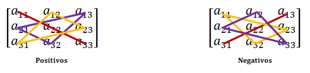

```{r setup, include=FALSE}
knitr::opts_chunk$set(echo = TRUE, comment = NA)
```

# Determinante de una matriz cuadrada

## Determinante de una matriz cuadrada

<l class = "definition">Determinante.</l> Dada una matriz cuadrada $A\in\mathcal{M}_n(\mathbb{K})$, llamaremos determinante de la matriz $A$ y lo denotaremos por $\det(A)$ o $|A|$ a un elemento del cuerpo $\mathbb{K}$ que se define por inducción del siguiente modo:

- si $n=1$, $A = (a_{11})$ y entonces $\det(A) = a_{11}$
- si $n>1$, $\det(A)=a_{11}\alpha_{11}-a_{12}\alpha_{12}+\cdots+(-1)^{n+1}a_{1n}\alpha_{1n}$

donde $\alpha_{1i}$ es el determinante de la matriz de orden $n-1$ que se obtiene en suprimir la primera fila y la columna $i$-ésima de la matriz $A$

## Determinante de una matriz cuadrada{.example}

**Ejemplo 1**

Dada la matriz cuadrada de orden 2, $$A = \begin{pmatrix}a_{11} & a_{12}\\a_{21} & a_{22}\end{pmatrix}$$ tenemos que $$\alpha_{11} = \det(a_{22}) = a_{22}$$ $$\alpha_{12} = \det(a_{21}) = a_{21}$$

Así pues, el determinante es $$\det(A) = a_{11}\alpha_{11}-a_{12}\alpha_{12} = a_{11}a_{22}-a_{12}a_{21}$$

## Ejemplo 2{.example}

**Ejemplo 2**

Dada la matriz cuadrada de orden 3, $$A = \begin{pmatrix}a_{11} & a_{12}&a_{13}\\a_{21}& a_{22} & a_{23}\\ a_{31} & a_{32} & a_{33}\end{pmatrix}$$

El determinante de $A$ es $$\det(A) = a_{11}\alpha_{11}-a_{12}\alpha_{12}+a_{13}\alpha_{13}$$

donde

$$\alpha_{11} = \begin{vmatrix}a_{22} & a_{23}\\a_{32}&a_{33}\end{vmatrix}\qquad \alpha_{12} = \begin{vmatrix}a_{21} & a_{23}\\a_{31} & a_{33}\end{vmatrix}\qquad \alpha_{13} = \begin{vmatrix}a_{21} & a_{22}\\a_{31} & a_{32}\end{vmatrix}$$

Con lo cual, $$\alpha_{11} = a_{22}a_{33}-a_{23}a_{32};\quad \alpha_{12} = a_{21}a_{33}-a_{23}a_{31};\quad \alpha_{13} = a_{21}a_{32}-a_{22}a_{31}$$

## Ejemplo 2{.example}

Así pues, 

$$\det(A) = a_{11}(a_{22}a_{33}-a_{23}a_{32})-a_{12}(a_{21}a_{33}-a_{23}a_{31})+a_{13}(a_{21}a_{32}-a_{22}a_{31})$$

Lo obtenido anteriormente es exactamente lo que se obtiene con la Regla de Sarrus

## Regla de Sarrus

<l class = "definition">Regla de Sarrus.</l> Es una regla pnemotécnica utilizada para calcular determiantes de matrices cuadradas de orden 3:

<div class = "center">

</div>

Básicamente lo que dice la imágen es:

$$\det(A) = a_{11}a_{22}a_{33}+a_{21}a_{32}a_{13}+a_{31}a_{12}a_{23}$$
$$-a_{13}a_{22}a_{31}-a_{23}a_{32}a_{11}-a_{33}a_{12}a_{21}$$

## Determinante de una matriz cuadrada

<l class = "prop">Propiedad.</l> $\forall n\ge1$, el determinante de la transpuesta de una matriz $A\in\mathcal{M}_n(\mathbb{K})$ coincide con el determinante de dicha matriz, $$\det(A^t) = \det(A)$$

<div class = "exercise">
**Ejercicio 1** 

- En primer lugar, probad que es cierto para los casos particulares $n = 2$ y $n = 3$
- Demostrad formalmente este resultado para el caso general
</div>

Debido a esto, tenemos las siguientes propiedades

# Propiedades de los determinantes

## Propiedades de los determinantes

Denotemos por $\det(u_1,\dots,u_i,\dots,u_n)$ el determinante de $A\in\mathcal{M}_n(\mathbb{K})$, la cual tiene por filas (o columnas) las matrices fila (o columna) $u_i,\ i = 1,2,\dots,n$

<l class = "prop">Propiedad.</l> $\det(u_1,\dots,\lambda u_i,\dots,u_n) = \lambda\det(u_1,\dots,u_i,\dots,u_n)$

<div class = "example">
**Ejemplo 3**

$$\begin{vmatrix}1&2&1\\4&4&2\\10&4&1\end{vmatrix} = 2\begin{vmatrix}1&\mathbf{1}&1\\4&\mathbf{2}&2\\10&\mathbf{2}&1\end{vmatrix} = 4\begin{vmatrix}1&1&1\\\mathbf{2}&\mathbf{1}&\mathbf{1}\\10&2&1\end{vmatrix}$$
</div>

## Propiedades de los determinantes

<l class = "prop">Propiedad.</l> $\det(u_1,\dots,u_i+u_i',\dots,u_n) = \det(u_1,\dots,u_i,\dots,u_n)+\det(u_1,\dots,u_i',\dots,u_n)$

<div class = "example">
**Ejemplo 4**
$$\begin{vmatrix}1&0+3&-1\\2&2+2&3\\0&3+1&5\end{vmatrix} = 
\begin{vmatrix}1&0&-1\\2&2&3\\0&3&5\end{vmatrix}+\begin{vmatrix}1&3&-1\\2&2&3\\0&1&5\end{vmatrix}$$
</div>

## Propiedades de los determinantes

<l class = "prop">Propiedad.</l> Si se intercambian dos filas o columnas, el determinante cambia de signo:  $\det(u_1,\dots,u_i,\dots,u_j,\dots,u_n) = -\det(u_1,\dots,u_j,\dots,u_i,\dots,u_n)$


<div class = "example">
**Ejemplo 5**

$$\begin{vmatrix}1 & 0 & -2\\2&3&0\\-1&1&0\end{vmatrix} = 
- \begin{vmatrix}-1 & 1 & 0\\2&3&0\\1&0&-2\end{vmatrix} = 
\begin{vmatrix}1 & -1 & 0\\3&2&0\\0&1&-2\end{vmatrix}$$
</div>

## Propiedades de los determinantes

<l class = "prop">Propiedad.</l> Si una matriz tiene dos filas o columnas iguales, su determinante es 0: $\det(u_1,\dots,u_i,\dots,u_i\dots,u_n)=0$

<div class = "exercise">
**Ejercicio 2**

Buscad vosotros mismos dos ejemplos cualesquiera, uno de orden 2 y otro de orden 3 y comprobad que, efectivamente, se cumple la propiedad enunciada
</div>

## Propiedades de los determinantes

<l class = "prop">Propiedad.</l> Si una matriz tiene dos filas o columnas proporcionales, su determinante es 0:
$\det(u_1,\dots,u_i,\dots,\lambda u_i\dots,u_n)=0$

<div class = "exercise">
**Ejercicio 3**

Buscad vosotros mismos dos ejemplos cualesquiera, uno de orden 2 y otro de orden 3 y comprobad que, efectivamente, se cumple la propiedad enunciada
</div>

## Propiedades de los determinantes

<l class = "prop">Propiedad.</l> Si una fila o columna es combinación lineal de las otras, el determinante es nulo:
 
 
Si $u_i =\sum_{k\ne i}a_ku_k$, entonces $\det(u_1,\dots,u_i,\dots,u_n)=0$

<div class = "example">
**Ejemplo 6**

$$\begin{vmatrix}1 & 2 & 3\\4 & 0 & 2\\ 5&2&5\end{vmatrix}=0$$

La última fila es el resultado de sumar las dos primeras.
</div>

## Propiedades de los determinantes

<l class = "prop">Propiedad.</l> El determinante no cambia si a una fila o columna se le suma una combinación lineal de las otras. $\det(u_1,\dots,u_i,\dots,u_n) = \det(u_1,\dots,u_i+\sum_{k\ne i}a_ku_k,\dots,u_n)$

<div class = "example">
**Ejemplo 7**

$$\begin{vmatrix}1 & 2 & 3\\4 & 0 & 2\\ 5&-1&0\end{vmatrix} = \begin{vmatrix}1 & 2 & 6\\4 & 0 & 6\\ 5&-1&4\end{vmatrix}$$

A la tercera columna le hemos sumado la primera y la segunda columnas.
</div>

# Adjuntos y menores complementarios

## Adjuntos y menores complementarios

Dada $A = (a_{ij})_{n\times n},\ n\ge2$. Sea $a_{ij}$ el elemento que ocupa la fila $i$ y la columna $j$ de la matriz $A$. Si suprimimos la fila $i$ y la columna $j$ de $A$ obtendremos una matriz cuadrada de orden $n-1$

<l class = "definition">Menor complementario.</l> El menor complementario de $a_{ij}$ es el determinante de la matriz de orden $n-1$ que designábamos como $\alpha_{ij}$

<l class = "definition">Adjunto. </l>El elemento $A_{ij} = (-1)^{i+j}\alpha_{ij}$ es el adjunto de $a_{ij}$

<l class = "definition">Matriz adjunta de $A$.</l> Matriz que tiene como coeficientes los adjuntos $A_{ij}$ de los elementos $a_{ij}$ de $A$. Se denota por $\text{Adj}(A)$

## Adjuntos y menores complementarios{.example}

**Ejemplo 8**

La matriz adjunta de $$A = \begin{pmatrix}1 & 0 & 5\\-1&3&2\\ 0 & -1 & 1\end{pmatrix}$$ es

$$\text{Adj}(A) = 
\begin{pmatrix}
\begin{vmatrix} 3 & 2\\ -1 & 1\end{vmatrix} & 
-\begin{vmatrix}-1 & 2\\ 0 & 1\end{vmatrix} & 
\begin{vmatrix}-1 & 3\\0 & -1\end{vmatrix}\\
-\begin{vmatrix}0 & 5\\ -1 & 1\end{vmatrix} & 
\begin{vmatrix}1 & 5\\ 0 & 1\end{vmatrix} & 
-\begin{vmatrix}1 & 0\\ 0 & -1\end{vmatrix}\\
\begin{vmatrix}0 & 5\\ 3 & 2\end{vmatrix} & 
-\begin{vmatrix}1 & 5\\-1 & 2\end{vmatrix} & 
\begin{vmatrix}1 & 0 \\ -1 & 3\end{vmatrix}\\
\end{pmatrix} = \begin{pmatrix}5 & 1 & 1\\ -5 & 1 & 1\\-15 & -7 & 3\end{pmatrix}$$

# Cálculo de determinantes

## Cálculo de determinantes

El determinante de una matriz cuadrada $A\in\mathcal{M}_n(\mathbb{K})$, $n\ge2$ se puede calcular desarrollando por los adjuntos de los elementos de cualquiera de sus filas o columnas:

<l class = "prop"> Proposición.</l> Sea $A = (a_{ij})$ una matriz cuadrada de orden $n$. Entonces se verifica

$$\det(A) = a_{i1}A_{i1}+a_{i2}A_{i2}+\cdots+a_{in}A_{in}$$

que es el desarrollo de un determinante por los adjuntos de los elementos de una fila; y también 

$$\det(A) = a_{1j}A_{1j}+a_{2j}A_{2j}+\cdots+a_{nj}A_{nj}$$

que es el desarrollo de un determinante por los adjuntos de los elementos de una columna

## Cálculo de determinantes{.example}

**Ejemplo 9**

El determinante

$$\det(A) = \begin{vmatrix}1 & -1 & 3\\4 & 0 & 2\\ 5&-1&0\end{vmatrix}$$

desarrollado por los elementos de la primera fila es

$$|A| = 1\begin{vmatrix}0 & 2\\-1&0\end{vmatrix}-(-1)\begin{vmatrix}4&2\\5&0\end{vmatrix}+3\begin{vmatrix}4 & 0\\5 & -1\end{vmatrix} = 1\cdot 2+1\cdot(-10)+3\cdot(-4) = -20$$

y desarrollado por los elementos de la segunda columna es

$$|A| = -(-1)\begin{vmatrix}4&2\\5&0\end{vmatrix}+0\begin{vmatrix}1&3\\5&0\end{vmatrix}-(-1)\begin{vmatrix}1&3\\4&2\end{vmatrix} = 1\cdot (-10)+0+1\cdot(-10) = -20$$

## Cálculo de determinantes

Aplicando este último desarrollo a las matrices triangulares, tenemos que el determinante de una de estas matrices es igual al producto de los elementos de la diagonal principal

<div class = "example">
**Ejemplo 10**

$$\det(A) = \begin{vmatrix}1 & 2 & 3 & 4\\
0 & 5 & 6 & 7\\
0 & 0 & 8 & 9\\
0 & 0 & 0 & 10\end{vmatrix} = 1\begin{vmatrix}5 & 6 & 7\\
0 & 8 & 9\\
0 & 0 & 10\end{vmatrix} = 5\begin{vmatrix}
8 & 9\\
0 & 10\end{vmatrix} = 40|10| = 400 $$

Lo que hemos hecho ha sido hacer un desarrollo por los adjuntos de la primera columna en cada paso 
</div>

## Ejemplo 11{.example}

**Ejemplo 11**

A continuación os presentamos el determinante de Vandermonde de orden 4

$$\begin{vmatrix}1 & 1 & 1 & 1\\
a & b & c & d\\
a^2 & b^2 & c^2 & d^2\\
a^3 & b^3 & c^3 & d^3\end{vmatrix}$$

Con todo lo que hemos visto hasta ahora, podemos resolverlo de forma sencilla:

En primer lugar, realizamos $f_4-af_3$

$$\begin{vmatrix}1 & 1 & 1 & 1\\
a & b & c & d\\
a^2 & b^2 & c^2 & d^2\\
a^3 & b^3 & c^3 & d^3\end{vmatrix} = \begin{vmatrix}1 & 1 & 1 & 1\\
a & b & c & d\\
a^2 & b^2 & c^2 & d^2\\
0 & b^3-ab^2 & c^3-ac^2 & d^3-ad^2\end{vmatrix}$$

## Ejemplo 11{.example}

A continuación, $f_3-af_2$

$$=\begin{vmatrix}1 & 1 & 1 & 1\\
a & b & c & d\\
0 & b^2-ab & c^2-ac & d^2-ad\\
0 & b^3-ab^2 & c^3-ac^2 & d^3-ad^2\end{vmatrix}$$
 
Ahora realizamos $f_2-af_1$ y obtenemos

$$=\begin{vmatrix}1 & 1 & 1 & 1\\
0 & b-a & c-a & d-a\\
0 & b^2-ab & c^2-ac & d^2-ad\\
0 & b^3-ab^2 & c^3-ac^2 & d^3-ad^2\end{vmatrix}
=\begin{vmatrix}1 & 1 & 1 & 1\\
0 & b-a & c-a & d-a\\
0 & b(b-a) & c(c-a) & d(d-a)\\
0 & b^2(b-a) & c^2(c-a) & d^2(d-a)\end{vmatrix}$$

El siguiente paso es desarrollar por la primera columna

$$ = 1\begin{vmatrix}b-a & c-a & d-a\\
b(b-a) & c(c-a) & d(d-a)\\
b^2(b-a) & c^2(c-a) & d^2(d-a)\end{vmatrix} = (b-a)(c-a)(d-a)\begin{vmatrix}1 & 1& 1\\b & c & d\\ b^2&c^2&d^2\end{vmatrix}$$

## Ejemplo 11{.example}

Hemos obtenido un determinante de Vandermonde de orden 3. Lo que implica seguir el mismo razonamiento anterior:

Empezamos realizando $f_3-bf_2$

$$(b-a)(c-a)(d-a)\begin{vmatrix}1 & 1& 1\\b & c & d\\ b^2&c^2&d^2\end{vmatrix} = (b-a)(c-a)(d-a)\begin{vmatrix}1 & 1& 1\\b & c & d\\ 0&c^2-bc&d^2-bd\end{vmatrix}$$

A continuación, $f_2-bf_1$

$$= (b-a)(c-a)(d-a)\begin{vmatrix}1 & 1& 1\\0 & c-b & d-b\\ 0&c^2-bc&d^2-bd\end{vmatrix}$$

Finalmente, desarrollando de nuevo por la primera columna y sacando factor común $(c-b)$ y $(d-b)$ de las dos últimas columnas obtenemos:

$$\det(A) = (b-a)(c-a)(d-a)(c-b)(d-b)\begin{vmatrix}1 & 1\\ c & d\end{vmatrix} = (b-a)(c-a)(d-a)(c-b)(d-b)(d-c)$$

# Aplicaciones en el cálculo de matrices y sistemas

## Aplicaciones en el cálculo de matrices y sistemas

Los determinantes sirven para facilitar el cálculo con matrices y en la resolución de sistemas

## Aplicaciones en el cálculo de matrices y sistemas

<l class = "prop">Teorema.</l> Sean $A$ y $B$ matrices cuadradas de orden $n$, $A,B\in\mathcal{M}_n(\mathbb{K})$. Entonces:

- $A$ es invertible si, y solo si, $\det(A)\ne 0$
- $\det(AB) = \det(A)\det(B)$
- si $\det(A)\ne 0$, entonces $\det(A^{-1}) = \frac{1}{\det(A)}$
- si $\det(A)\ne 0$, entonces $A^{-1} = \frac{(\text{Adj}(A))^t}{\det(A)}$

<l class = "observ">Observación.</l> La última propiedad nos da una nueva forma de calcular la matriz inversa de $A$.

## Ejemplo 12{.example}

**Ejemplo 12**

Calculemos la inversa de la matriz $$A = \begin{pmatrix}1 & 0 & -1\\ 0 & -3 & 5\\ 2 & -2 & 0\end{pmatrix}$$

En primer lugar, calculemos el determinante de $A$ y veamos si es nulo o no. Por la Regla de Sarrus,

$$\det(A) = 0 + 0 + 0 -(6-10+0) = 4\ne 0$$

Con lo cual, sabemos que $A$ es invertible. Procedamos a calcular su inversa. En primer lugar, calculemos la matriz adjunta:

$$A_{11} = \begin{vmatrix}-3 & 5\\-2 & 0\end{vmatrix} = 10\qquad A_{12} = -\begin{vmatrix}0 & 5\\2 & 0\end{vmatrix} = 10\qquad A_{13} = \begin{vmatrix}0 & -3\\2 & -2\end{vmatrix}=6$$
$$A_{21} = -\begin{vmatrix}0 & -1\\-2 & 0\end{vmatrix} = 2\qquad A_{22} = \begin{vmatrix}1 & -1\\ 2 & 0\end{vmatrix} = 2\qquad A_{23} = -\begin{vmatrix}1 & 0\\ 2 & -2\end{vmatrix} = 2$$
$$A_{31} = \begin{vmatrix}0 & -1\\-3 & 5\end{vmatrix} = -3\qquad A_{32} = -\begin{vmatrix}1 & -1\\0 & 5\end{vmatrix} = -5\qquad A_{33} = \begin{vmatrix}1 & 0\\0 & -3\end{vmatrix} = -3$$

## Ejemplo 12{.example}

Por tanto, $$\text{Adj}(A) = \begin{pmatrix}10 & 10 & 6\\
2 & 2 & 2\\
-3 & -5 & -3\end{pmatrix}$$

Ahora, su transpuesta es

$$(\text{Adj}(A))^t = \begin{pmatrix}10 & 2 & -3\\
10 & 2 & -5\\
6 & 2 & -3\end{pmatrix}$$

Finalmente,
$$A^{-1} = \frac{1}{\det(A)}(\text{Adj}(A))^t = \frac{1}{4}\begin{pmatrix}10 & 2 & -3\\
10 & 2 & -5\\
6 & 2 & -3\end{pmatrix} = \begin{pmatrix}\frac{5}{2} & \frac{1}{2} & -\frac{3}{4}\\
\frac{5}{2} & \frac{1}{2} & -\frac{5}{4}\\
\frac{3}{2} & \frac{1}{2} & -\frac{3}{4}\end{pmatrix}$$

## Aplicaciones en el cálculo de matrices y sistemas

Otra aplicación de los determinantes se encuntra en el cálculo del rango de una matriz:

Dada $A\in\mathcal{M}_{m\times n}(\mathbb{K})$ y sea $k<m,n$

<l class = "definition">Menor de orden $k$ de $A$.</l> Determinante de cualquier matriz cuadrada de orden $k$ obtenida suprimiendo $m-k$ filas y $n-k$ columnas de $A$

<l class = "definition">Orlar un menor de orden $k$.</l> Consiste en completarlo hasta un menor de orden $k+1$ de $A$ con otra fila y otra columna de la matriz $A$ dada.

## Aplicaciones en el cálculo de matrices y sistemas

Se pueden utilizar dichos menores para calcular el rango de una matriz $A$ cualquiera:

<l class = "prop">Teorema.</l> Sea $A\in\mathcal{M}_{m\times n}(\mathbb{K})$ y $k<m,n$. Entonces, si se puede encontrar un menor de orden $k$ no nulo y todos los de orden $k+1$ son 0, entonces $rg(A)= k$

En otras palabras, el rango de la matriz $A$ coincide con el orden del mayor menor no nulo obtenido a partir de $A$.

## Aplicaciones en el cálculo de matrices y sistemas

Otra forma de enunciar el `Teorema` anterior es la siguiente: 

<l class = "prop">Teorema.</l> Sea $A\in\mathcal{M}_{m\times n}(\mathbb{K})$ y $k<m,n$. Entonces, si se puede encontrar un menor de orden $k$ no nulo y todas las posibles maneras de orlar dicho menor dan menores de orden $k+1$ nulos, entonces $rg(A)= k$

## Aplicaciones en el cálculo de matrices y sistemas{.example}

**Ejemplo 13**

Calculemos el rango de la matriz $$A = \begin{pmatrix}4 & 3 & 2 & -1 & -2\\ 7 & 5  & 4 & -2 & 1\\ 2 & 1 & 1 & -1 & 8\end{pmatrix}$$

El mayor menor de la matriz $A$ es de orden 3. De hecho, esta matriz tiene ${5\choose 3} = 10$ menores de orden $3$ diferentes. Veamos si alguno de ellos es no nulo:

$$(c_1,c_2,c_3) = \begin{vmatrix}4 & 3 & 2\\ 7 & 5 & 4\\ 2 & 1 & 1\end{vmatrix} = 20 +14+24-(20+16+21) = 1\ne 0$$

Como este menor de orden 3 ya no es nulo, por el Teorema anterior concluimos que la matriz tiene rango 3.

## Aplicaciones en el cálculo de matrices y sistemas{.exercise}

**Ejercicio 4.** Calcular el rango de la matriz $$A = \begin{pmatrix} 0 & 1 & -1\\ 4 & -2 & -6\\
-1 & 1 & 1\\
2 & -2 & -2\end{pmatrix}$$


## Aplicaciones en el cálculo de matrices y sistemas

Otra aplicación muy útil de los determinantes es la de resolver sistemas de ecuaciones lineales.

Dado el sistema $AX = b$ en su expresión matricial, siendo éste un sistema de $n$ ecuaciones con $n$ incógnitas $x_1,\dots,x_n$. Sabemos que si $\det(A)\ne 0$ este sistema tiene solución única dada por $X = A^{-1}b$.

En estos casos, otra forma de encontrar esta solución única es a través de la <l class = "definition">Regla de Cramer</l>

## Aplicaciones en el cálculo de matrices y sistemas

<l class = "prop">Teorema. Método de Cramer.</l> Sea $AX = b$ la expresión matricial de un sistema de $n$ ecuaciones con $n$ incógnitas $x_1,\dots,x_n$ con $\det(A)\ne 0$. Sea $A_i,\ i=1,2,\dots,n$ la matriz que resulta de sustituir la columna $i$ de la matriz de coeficientes $A$ por el término independiente $b$. Entonces, la solución del sistema viene dada por $$x_i = \frac{|A_i|}{|A|},\ \forall i = 1,2,\dots,n$$

## Ejemplo 14{.example}

**Ejemplo 14**

Consideremos el sistema $AX = b$ dado por $$A = \begin{pmatrix}
1 & 1 & 1\\ -1 & 0 & 1\\ -1 & -1 & 0\end{pmatrix}\qquad X = \begin{pmatrix}x_1\\x_2\\x_3\end{pmatrix}\qquad b = \begin{pmatrix}1\\  0\\  -1\end{pmatrix}$$

Podemos comprobar fácilmente que 

$$\det(A) = \begin{vmatrix}
1 & 1 & 1\\ -1 & 0 & 1\\ -1 & -1 & 0\end{vmatrix} = 1\ne 0$$

Por tanto, tenemos un sistema de Cramer con solución única dada por 

$$x_1 = \frac{\begin{vmatrix}
1 & 1 & 1\\ 0 & 0 & 1\\ -1 & -1 & 0\end{vmatrix}}{|A|} = \frac{0}{1} = 0$$

## Ejemplo 14{.example}

$$x_2 = \frac{\begin{vmatrix}
1 & 1 & 1\\ -1 & 0 & 1\\ -1 & -1 & 0\end{vmatrix}}{|A|} = \frac{1}{1} = 1$$

$$x_3 = \frac{\begin{vmatrix}
1 & 1 & 1\\ -1 & 0 & 0\\ -1 & -1 & -1\end{vmatrix}}{|A|} = 0$$

Con lo cual, nuestra solución es $$X = \begin{pmatrix}0\\1\\0\end{pmatrix}$$

## Aplicaciones en el cálculo de matrices y sistemas{.exercise}

**Ejercicio 5**

Demostrar que el sistema $AX = b$ dado por

$$A = \begin{pmatrix}
1 & 1 & 1\\ -1 & 0 & 1\\ -1 & -1 & 0\end{pmatrix}\qquad X = \begin{pmatrix}x_1\\x_2\\x_3\end{pmatrix}\qquad b = \begin{pmatrix}\alpha\\  \beta\\  \gamma\end{pmatrix}$$

con $\alpha,\beta,\gamma\in\mathbb{R}$ tiene solución única y calcular dicha solución haciendo uso del Método de Cramer

## Aplicaciones en el cálculo de matrices y sistemas

La regla de Cramer también sirve en el caso de sistemas compatibles indeterminados.

Lo que se debe hacer en estos casos es encontrar un menor no nulo que nos dé el rango del sistema y la submatriz el sistema correspondiente a este menor es una matriz cuadrada invertible a la que se le puede aplicar el Método de Cramer.

Entonces, las ecuaciones no correspondientes a este menor las podemos eliminar, pues son prescindibles.

## Aplicaciones en el cálculo de matrices y sistemas

<l class = "definition">Incógnitas principales. </l>Las incógnitas involucradas en la submatriz

<l class = "definition">Incógnitas secundarias. </l>Las incógnitas que no son principales.

De este modo, el sistema con las incógnitas principales y solo las ecuaciones correspondientes al menor no nulo, tiene solución única dada por el Método de Cramer en función de las incógnitas secundarias.


## Ejemplo 15{.example}

**Ejemplo 15**

Consideremos el sistema $AX = b$ donde $$A = \begin{pmatrix}
12 & 6 & 8\\ 
4 & 2 & 4\\ 
-8 & -4 & -4
\end{pmatrix}\qquad
X = \begin{pmatrix}
x\\
y\\
z\end{pmatrix}\qquad
b = \begin{pmatrix}
1\\
2\\
1\end{pmatrix}$$

Es fácil comprobar que $$\det(A) = \begin{vmatrix}
12 & 6 & 8\\ 
4 & 2 & 4\\ 
-8 & -4 & -4
\end{vmatrix} = 0$$

ya que la primera columna es el doble de la segunda.

Por este motivo, consideremos el menor de orden 2 formado por las dos primeras filas y las dos últimas columnas:

$$\begin{vmatrix}
6 & 8\\2 & 4
\end{vmatrix} = 8\ne 0$$

## Ejemplo 15{.example}

Orlando este menor con la columna de los términos independientes, lo que obtenemos es $$\begin{vmatrix}
6 & 8 & 1\\2 & 4 & 2\\ -4 & -4 & 1
\end{vmatrix} = 0$$

Por lo tanto, concluimos que $rg(A) = 2$. Además, tenemos que el sistema es compatible indeterminado.

Así pues, las incógnitas principales serán $y,z$ porque recordemos que el menor de orden 2 no nulo está formado por las dos últimas columnas de $A$.

Por otro lado, la tercera ecuación, al no haberla considerado en el menor de orden 2, ya no nos es necesaria. Así, nuestro sistema lo podemos reescribir como

$$\left\{\begin{matrix}
12x&+&6y&+&8z&=&1\\
4x&+&2y&+&4z&=&2
\end{matrix}
\right.$$

## Ejemplo 15{.example}


o, equivalentemente, 

$$\left\{\begin{matrix}
6y&+&8z&=&1-12x\\
2y&+&4z&=&2-4x
\end{matrix}
\right.$$

que es un sistema de Cramer de $A'X' = b'$ con 

$$A' = \begin{pmatrix}
6 & 8\\
2 & 4
\end{pmatrix}\qquad X' = \begin{pmatrix}
y\\
z\end{pmatrix}\qquad b' = \begin{pmatrix}
1-12x\\
2-4x\end{pmatrix}$$

Y este sistema tiene solución única en función de $x$ dada por 

$$y = \frac{\begin{vmatrix}1-12x & 8\\
2-4x & 4\end{vmatrix}}{8} = \frac{-16x-12}{8} = -2x-\frac{3}{2}\qquad z = \frac{\begin{vmatrix}6 & 1-12x\\
2 & 2-4x\end{vmatrix}}{8} = \frac{10}{8}=\frac{5}{4}$$

De este modo, nuestra solución es $X = \begin{pmatrix}x\\ -2x-\frac{3}{2}\\ \frac{5}{4}\end{pmatrix}$ con $x\in\mathbb{R}$

## Aplicaciones en el cálculo de matrices y sistemas

A la hora de calcular el rango de una matriz, calcular la inversa de una matriz regular o de resolver un sistema de ecuaciones lineales podemos hacerlo de dos formas:

- A través de transformaciones lineales
- Utilizando determinantes

La primera tiene la ventaja de la implementación en ordenadores ya que requiere de muchas menos operaciones.

En cambio, los determinantes permiten más flexibilidad en las operaciones, la cual es de agradecer cuando el estudio a hacer depende de uno o más parámetros.

## Aplicaciones en el cálculo de matrices y sistemas{.exercise}

**Ejercicio 6**

Estudiar el siguiente sistema según los valores del parámetro $a\in\mathbb{R}$

$$\left\{\begin{matrix}ax &+&y&+&z&=&1\\
x &+&ay&+&z&=&1\\
x &+&y&+&az&=&1\\
\end{matrix}\right.$$