```{r setup, include=FALSE}
knitr::opts_chunk$set(echo = TRUE, comment = NA)
```

# Vectores

## Vectores

Los vectores tienen un papel fundamental no solo en matemáticas sino también en la física, la ingeniería e incluso otros campos científicos.

Los vectores en general tienen dos vertientes íntimamente ligadas: la algebraica y la geométrica

En primer lugar, veremos los vectores desde un punto de vista geométrico.

## Vectores

Sea $\mathbb{K}$ un cuerpo,

<l class = "definition">Punto en la recta $\mathbb{K}$.</l> Dados un origen y una unidad de longitud, cada punto de la recta viene definido por un, y solo un, escalar del cuerpo $\mathbb{K}$ y viceversa

<l class = "definition">Punto en el plano $\mathbb{K}^2$.</l> Dados un origen, dos ejes (rectas) y una unidad de longitud, un punto del plano es un par $(x,y)$ donde $x$ e $y$ son dos elementos del cuerpo $\mathbb{K}$

<l class = "definition">Punto en el espacio $\mathbb{K}^3$.</l> Dados un origen, 3 ejes (rectas) y una unidad de longitud, un punto del espacio es una terna $(x,y,z)$ donde $x,y$ y $z$ son tres elementos del cuerpo $\mathbb{K}$

## Vectores

<l class = "definition">Punto en $\mathbb{K}^n$.</l> Se define como una $n$-tupla de números:

$$X = (x_1,\dots,x_n)$$ donde $x_1,\dots,x_n\in\mathbb{K}$ y $n$ es la <l class = "definition">dimensión</l> del espacio $\mathbb{K}^n$

<l class = "definition">Coordenadas de un punto.</l> Son los valores $x_1,\dots,x_n\in\mathbb{K}$ del punto $X$

# Vectores fijos

## Vectores fijos

<l class = "definition">Vector fijo.</l> Es un par fijo de puntos $P$ y $Q$ que se denotará por $\vec{PQ}$.

<l class = "definition">Origen.</l> Punto $P$ del vector $\vec{PQ}$

<l class = "definition">Extremo.</l> Punto $Q$ del vector $\vec{PQ}$

## Vectores fijos

Normalmente los vectores en el plano o en el espacio de tres dimensiones se suelen representar mediante segmentos acabados en una punta de flecha en uno de sus dos extremos
 
## Vectores fijos

<l class = "definition">Componentes cartesianas de un vector $\vec{PQ}$ fijo.</l> Vectores que se obtienen al proyectar el vector $\vec{PQ}$ sobre los ejes de un sistema de coordenadas situado en el origen, $P$, de dicho vector

<div class = "center">
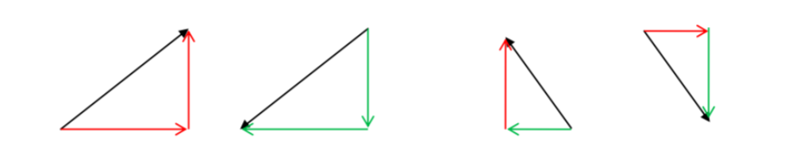
</div>

## Vectores fijos

Si denotamos $P = (p_x,p_y)$ y $Q = (q_x,q_y)$, entonces las componentes del vector $\vec{PQ}$ se obtienen restando las coordenadas del punto extremo $Q$ al punto de origen $P$

$$\vec{PQ} = (q_x-p_x,q_y-p_y)$$

## Vectores fijos

El valor absoluto de las componentes del vector coincide con la de los catetos del triángulo rectángulo formado y tal que el vector sea su hipotenusa:

<div class = "center">
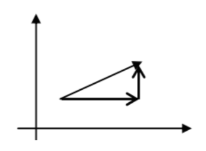
</div>

## Vectores fijos

<div class = "example">

**Ejemplo 1**

Consideremos el vector $\vec{AB}$ donde $A = (1,2)$ y $B = (5,4)$

Sus componentes serán 

$$\vec{AB} = (5-1,4-2) = (4,2)$$

En este caso, ambas componentes son positivas
</div>

<div class = "center">
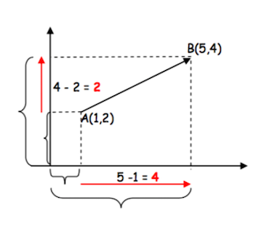
</div>

## Vectores fijos

<div class = "example">

**Ejemplo 2**

Consideremos el vector $\vec{AB}$ donde $A = (1,4)$ y $B = (5,2)$

Sus componentes serán 

$$\vec{AB} = (5-1,2-4) = (4,-2)$$

En este caso, su componente del eje horizontal será positiva, mientras que la componente del eje vertical será negativa
</div>

<div class = "center">
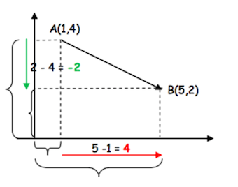
</div>

## Vectores fijos

<l class = "prop">Caracterización de un vector fijo (I).</l> En el contexto geométrico, las 4 características de un vector fijo son:

- **Origen.** Punto de aplicación donde empieza el vector
- **Módulo.** Longitud del segmento
- **Dirección.** Dirección de la recta a la cual pertenece el vector
- **Sentido.** Lo determina la punta de la flecha del vector

## Vectores fijos

<l class = "prop">Caracterización de un vector fijo (II).</l> Un vector fijo también queda completamente determinado por

- Sus componentes
- El punto origen

## Vectores fijos

<l class = "prop">Caracterización de un vector fijo (III).</l> Un vector fijo queda determinado si se conocen

- Las coordenadas del punto origen
- Las coordenadas del punto extremo

## Vectores fijos

<l class = "definition">Vectores equivalentes.</l> Diremos que dos vectores $\vec{AB}$ y $\vec{CD}$ son equivalentes si tienen las mismas componentes. Es decir, si $$(b_x-a_x,b_y-a_y) = (d_x-c_x,d_y-c_y)$$

## Vectores fijos

<div class = "example">
**Ejemplo 3**

Dados $A = (5,3),\ B = (1,4),\ C = (4,2),\ D = (0,3)$. Los vectores $\vec{AB}$ y $\vec{CD}$ son equivalentes a pesar de tener diferentes orígenes y extremos ya que

$$\vec{AB} = (1-5,4-3) = (-4,1)$$
$$\vec{CD} = (0-4,3-2) = (-4,1)$$
</div>

# Vectores libres

## Vectores libres

Como acabamos de ver, todos los vectores fijos equivalentes entre sí tienen las mismas componentes.

En este sentido, es posible establecer una relación de equivalencia correspondiente, el <l class = "definition">vector libre</l>.

Este representante define un conjunto infinito de vectores y los representa a todos ellos.

## Vectores libres

<l class = "definition">Vector libre.</l> Conjunto de todos los vectores fijos equivalentes entre sí.

Un vector libre no tiene un origen fijo, sino que se puede ubicar en cualquier punto del espacio.

Cada vector fijo es un representante del vector libre.

<div class = "center">
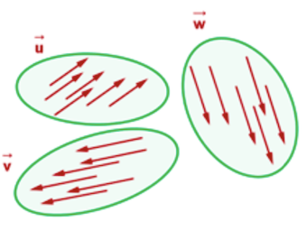
</div>

## Vectores libres

<l class = "definition">Vector fijo en el origen.</l> Es el representante del vector libre que tiene su punto origen en el origen de coordenadas

En este caso, las coordenadas del punto extremo coinciden numéricamente con las componentes del vector, ya que el punto de origen es $0 = (0,0)$

<div class = "center">
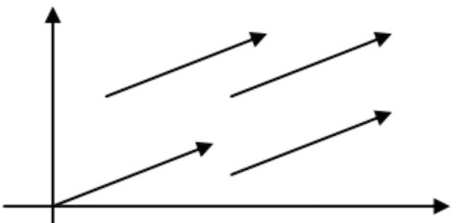
</div>

## Vectores libres

Por tanto, todo vector libre tiene un representante situado en el origen de coordenadas donde el punto extremo tiene las mismas coordenadas que las componentes del vector. Entonces, en este sentido podemos decir

<l class = "prop">Proposición.</l> Existe una correspondencia uno a uno entre los vectores libres y los puntos según el cual cada punto $P = (p_x,p_y)$ del plano se identifica con un vector $\vec{OP} = (p_x,p_y)$

## Vectores libres

<l class = "prop">Caracterización de un vector libre (I).</l> Para caracterizar un vector libre se necesita:

- <l class = "definition">Módulo.</l> Al igual que para los vectores fijos, viene dado por la longitud del segmento

- <l class= "definition">Dirección.</l> Viene dado por el ángulo que forma el vector con la dirección positiva del eje $OX$

- <l class= "definition">Sentido.</l> Viene dado por el ángulo que forma el vector con la dirección positiva del eje $OX$


## Vectores libres

<l class = "prop">Caracterización de un vector libre (II).</l> También se puede caracterizar un vector libre si se conocen las componentes

## Ejemplo 4

<div class = "example">
**Ejemplo 4**

Dado el vector $(7,-5)$, calculemos su módulo, dirección y sentido:

Empecemos por el módulo. Recordemos que el vector, cuyo origen hemos situado en el origen de coordenadas, forma un triángulo rectángulo junto con sus componentes:

</div>

<div class = "center">
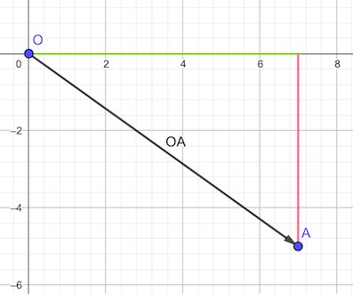
</div>

## Ejemplo 4{.example}

Como conocemos la longitud del segmento verde: 7 unidades; y también la del segmento rojo: 5 unidades, por el Teorema de pitágoras podemos hallar la longitud del segmento $OA$

$$|OA|^2 = 7^2+5^2\Rightarrow |OA| = \sqrt{74}$$

Con lo cual, el módulo del vector $(7,-5)$ es $\sqrt{74}$

Ahora nos interesa saber el ángulo que forma el vector $(7,-5)$ con el eje $OX$. Éste se consigue calculando lo siguiente:

Nosotros sabemos que, si denominamos $\alpha$ al ángulo que estamos buscando, entonces tenemos

$$\tan{(\alpha)} = -\frac{5}{7}$$

Con lo cual, $\alpha = \arctan{(-\frac{5}{7})} = -0.6202495$ radianes, lo que equivale, haciendo la respectiva conversión, a 

$$-0.6202495\ rad\cdot\frac{360º}{2\pi\ rad} = -35.53768º$$

O, equivalentemente, $360º-35.53768º = 324.4623º$

## Ejemplo 4

<div class = "center">
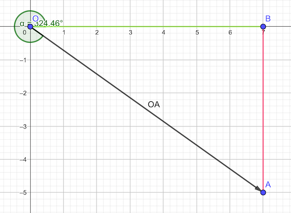
</div>

# Operaciones con vectores

## Operaciones con vectores

<l class = "definition">Suma de vectores.</l> Dados $\vec{u} = (u_1,\dots,u_n)$ y $\vec{v} = (v_1,\dots,v_n)$, su suma es

$$\vec{w} = \vec{u}+\vec{v} = (u_1+v_1,u_2+v_2,\dots,u_n+v_n)$$

## Operaciones con vectores

Geométricamente es el vector formado por la diagonal del paralelogramo que tiene los dos vectores sumandos como lados y origen el mismo que ambos:

<div class = "center">


</div>

## Operaciones con vectores

O bien, el vector que une el origen del primer sumando con el extremo del último, habiendo colocado cada origen de los vectores sumandos sobre el extremo del vector sumando precedente

<div class = "center">
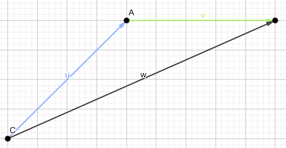
</div>

## Operaciones con vectores

Si se tuviesen que sumar más de dos vectores, resulta más útil la segunda forma que hemos mostrado,

Basta con colocar cada origen de los vectores sumandos sobre el extremo del vector sumando precedente

<div class = "center">
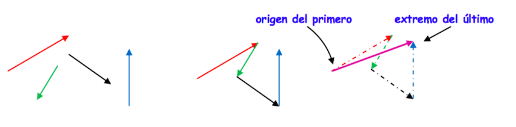
</div>

## Operaciones con vectores

<l class = "definition">Resta de vectores.</l> Dados $\vec{u} = (u_1,\dots,u_n)$ y $\vec{v} = (v_1,\dots,v_n)$, su resta es

$$\vec{w} = \vec{u}-\vec{v} = (u_1-v_1,u_2-v_2,\dots,u_n-v_n)$$

## Operaciones con vectores

Geométricamente, se realiza la suma entre el vector minuendo y el opuesto del sustraendo

<div class = "center">
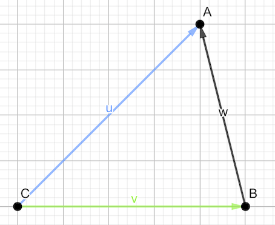
</div>

## Operaciones con vectores

<l class = "observ">Observación.</l> Al realizar la resta $\vec{u}-\vec{v}$ se busca un vector $\vec{w}$ tal que si se le suma al sustraendo ha de dar el minuendo.

En definitiva,

$$\vec{u}-\vec{v} = \vec{w}\Leftrightarrow \vec{v}+\vec{w} = \vec{u}$$

## Operaciones con vectores

Si se tiene un vector $\vec{AB}$ obtenido a partir de los puntos $A$ y $B$ y se dibujan los vectores $\vec{OA}$ y $\vec{OB}$

Entonces se puede ver como $\vec{AB},\ \vec{OA},\ \vec{OB}$ forman un triángulo vectorial que cumple las relaciones siguientes:

$$\vec{OA}+\vec{AB}-\vec{OB} = \vec{0}\Leftrightarrow \vec{AB} = \vec{OB}-\vec{OA}$$
<div class = "center">
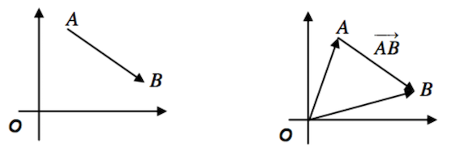
</div>

## Operaciones con vectores

<l class = "definition">Producto por escalar.</l> Dados $\vec{u} = (u_1,\dots,u_n)\in\mathbb{K}^n$ y $\lambda\in\mathbb{K}$, su producto es

$$\lambda\vec{u} = (\lambda u_1,\lambda u_2,\dots,\lambda u_n)$$

<div class = "center">
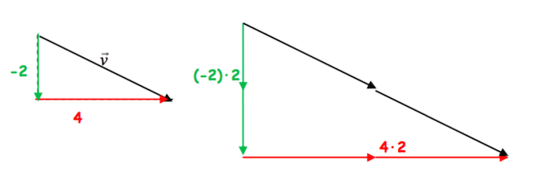
</div>


## Operaciones con vectores

El resultado de multiplicar un escalar $\lambda \ne 0$ por un vector $\vec{u}$ es otro vector $\vec{v}$ de la misma dirección que $\vec{u}$, de sentido igual o contrario dependiendo del signo del escalar (positivo o negativo, respectivamente) y de módulo igual a $\lambda$ veces el de $\vec{u}$

<div class = "center">
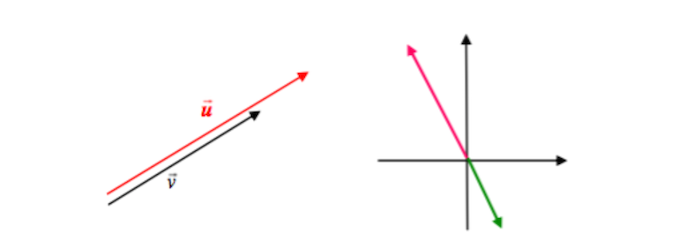
</div>

## Operaciones con vectores

<l class = "definition">Vectores paralelos.</l> Dos vectores $\vec{u} = (u_1,\dots,u_n)$ y $\vec{v}=(v_1,\dots,v_n)$ son paralelos (o proporcionales) si existe un valor $\lambda\ne0$ tal que $\vec{u} = \lambda\vec{v}$

Serán del mismo sentido si $\lambda>0$ y de sentidos opuestos si $\lambda<0$

## Operaciones con vectores

<l class = "definition">Combinación lineal de vectores. </l>Dados $V = \{\vec{v}_1, \vec{v}_2,\dots,\vec{v}_k\}$ un conjunto de vectores de $\mathbb{K}^n$ y $\alpha_1,\alpha_2,\dots,\alpha_k\in\mathbb{K}$ se define la combinación lineal de los vectores de $V$ como el vector $\vec{w}$ tal que

$$\vec{w} = \sum_{i=1}^k\alpha_i\vec{v}_i = \alpha_1\vec{v}_1+\cdots+\alpha_k\vec{v}_k$$

## Operaciones con vectores

La combinación lineal de vectores no es una operación nueva, sino que reune en un mismo lugar la suma de vectores y el porducto por escalares.

Para poder hacer combinaciones lineales de vectores, es necesario que todos ellos tengan el mismo número de componentes y el resultado será otro vector de estas mismas características.

## Ejemplo 5{.example}

**Ejemplo 5**

¿Es el vector $(2,3)$ combinación lineal de $(3,1)$ y $(-6,-2)$?

En otras palabras, ¿existen escalares $a,b\in\mathbb{R}$ tales que $(2,3) = a(3,1)+b(-6,-2)$?

Si lo pensamos de otra forma, lo anterior equivale a probar si existe solución al sistema de dos ecuaciones y dos incógnitas siguiente

$$\left\{\begin{matrix}3a&-&6b &=& 2\\a&-&2b&=&3\end{matrix}\right.$$

Veamos de qué tipo de sistema se trata haciendo uso del Teorema de Rouché-Frobenius

## Ejemplo 5{.example}

En primer lugar, $\det(A) = \begin{vmatrix}3&-6\\1&-2\end{vmatrix} = 0$

Sin embargo, si sustituimos la segunda columna por el vector de términos independientes, tenemos

$$\begin{vmatrix}3 & 2\\1 & 3 \end{vmatrix} = 7\ne 0$$

Con lo cual, acabamos de ver que $rg(A) = 1$ mientras que $rg(A|B) = 2$. Por tanto, el sistema es incompatible, lo que nos lleva a concluir que no, $(2,3)$ no es combinación lineal de $(3,1)$ y $(-6,-2)$

# Propiedades de las operaciones con vectores

## Propiedades de las operaciones con vectores

Al definir las operaciones de suma y producto por un escalar, conviene tener presentes las diferencias y similitudes entre ambos

## Propiedades de las operaciones con vectores

<l class = "definition">Ley de composición interna.</l> La suma de vectores se denomina ley de composición interna ya que opera entre elementos de un conjunto dado, $\mathbb{K}^n$ y el resultado es otro elemento de este conjunto

$$\begin{matrix}f:\mathbb{K}^n\times \mathbb{K}^n&\longrightarrow& \mathbb{K}^n\\ (\vec{u},\vec{v})&\mapsto&\vec{u}+\vec{v}\end{matrix}$$

## Propiedades de las operaciones con vectores

<l class = "definition">Ley de composición externa.</l> El producto de un escalar por un vector tiene como operandos conjuntos diferentes: escalares por un lado y vectores por el otro. El resultado cae del lado de los vectores y la operación se denomina ley de composición externa:

$$\begin{matrix}f:\mathbb{K}\times \mathbb{K}^n&\longrightarrow& \mathbb{K}^n\\ (\lambda,\vec{u})&\mapsto&\lambda\vec{u}\end{matrix}$$

## Propiedades de las operaciones con vectores

<l class = "prop">Propiedades de la suma de vectores.</l> Sean $\vec{u},\vec{v},\vec{w}\in\mathbb{K}^n$

- Ley asociativa: $$(\vec{u}+\vec{v})+\vec{w} = \vec{u}+(\vec{v}+\vec{w})$$
- Ley conmutativa: $$\vec{u}+\vec{v} = \vec{v}+\vec{u}$$
- Elemento neutro de la suma: $$\vec{u}+\vec{0} = \vec{0}+\vec{u} = \vec{u}$$
- Vector opuesto: $$\vec{u}+(-\vec{u}) = (-\vec{u})+\vec{u} = 0$$

## Propiedades de las operaciones con vectores

<l class = "prop">Propiedades del producto por un escalar.</l> Sean $\vec{u},\vec{v}\in\mathbb{K}^n$ y $\alpha,\beta\in\mathbb{K}$

- Ley distributiva del producto por un escalar para la suma de vectores: $$\alpha(\vec{u}+\vec{v}) = \alpha\vec{u}+\alpha\vec{v}$$
- Ley distributiva del producto de un vector por la suma de escalares: $$(\alpha+\beta)\vec{u} = \alpha\vec{u}+\beta\vec{u}$$
- Ley asociativa del producto entre escalares y vectores: $$(\alpha\beta)\vec{u} = \alpha(\beta\vec{u}) = \beta(\alpha\vec{u})$$
- Elemento unidad: $$1\vec{u} = \vec{u}$$

# Estructura euclidiana de $\mathbb{R}^n$

## Producto escalar

<l class = "definition">Producto escalar.</l> Sean $\vec{u} = (u_1,\dots,u_n)$ y $\vec{v} = (v_1,\dots,v_n)$ dos vectores de $\mathbb{R}^n$. Se define el producto escalar $\vec{u}\cdot\vec{v}\text{ o } \langle\vec{u},\vec{v}\rangle$ como el número real

$$\langle\vec{u},\vec{v}\rangle = u_1v_1+u_2v_2+\cdots+u_nv_n$$

El producto escalar es la tercera operación básica entre vectores de $\mathbb{R}^n$.

Del producto escalar es de donde se derivan los conceptos métricos como la ortogonalidad, la norma, el ángulo y se abre camino a múltiples aplicaciones geométricas y físicas del álgebra lineal.

## Producto escalar{.example}

**Ejemplo 6**

Sean $\vec{u} = (2,3,0)$ y $\vec{v} = (-1,3,2)$ dos vectores de $\mathbb{R}^3$.

Su producto escalar será

$$\langle\vec{u},\vec{v}\rangle = 2\cdot(-1)+3\cdot3+0 = 7$$

## Producto escalar

<l class = "prop">Propiedades del producto escalar.</l>

- Conmutativa: $\langle\vec{u},\vec{v}\rangle = \langle\vec{v},\vec{u}\rangle$
- Distributiva respecto de la suma: $$\langle\vec{u},(\vec{v}+\vec{w})\rangle = \langle\vec{u},\vec{v}\rangle+\langle\vec{u},\vec{w}\rangle$$
- Asociativa y conmutativa entre escalares y vectores: $$\begin{matrix}\langle(\lambda\vec{u}),\vec{v}\rangle = \lambda\langle\vec{u},\vec{v}\rangle\\ \langle\vec{u},(\lambda\vec{v})\rangle = \lambda\langle\vec{u},\vec{v}\rangle\end{matrix}$$
- Si $\vec{u} = 0$, entonces $\langle\vec{u},\vec{u}\rangle = 0$
- Si $\vec{u}\ne 0$, entonces $\langle\vec{u},\vec{u}\rangle >0$

## Producto escalar{.exercise}

**Ejercicio 1**

- Dados $\vec{u} = (2,5,-1),\vec{v} = (-3,4,1),\vec{w} = (-1,0,5)\in\mathbb{R}^3$ y $\lambda = 2\in\mathbb{R}$, comprobar que se cumplen todas las propiedades vistas en la anterior diapositiva

- Dados ahora $\vec{u},\vec{v},\vec{w}\in\mathbb{R}^n$ y $\lambda\in\mathbb{R}$, demostrar formalmente todas las propiedades de la diapositiva anterior

## Norma

<l class = "definition">Norma.</l> Dado $\vec{u} = (u_1,u_2,\dots,u_n)\in\mathbb{R}^n$ su norma o longitud viene dada por

$$||\vec{u}|| = \sqrt{\langle\vec{u},\vec{u}\rangle} = \sqrt{{u}_1^2+{u}_2^2+\cdots+{u}_n^2}$$

## Norma

<l class = "prop">Propiedades de la norma.</l> 

- $||\vec{u}||>0,\ \forall\vec{u}\ne\vec{0}$
- $||\lambda\vec{u}|| = |\lambda|||\vec{u}||$
- Desigualdad triangular: $||\vec{u}+\vec{v}||\le ||\vec{u}||+||\vec{v}||$
- Teorema de Pitágoras: $||\vec{u}+\vec{v}||^2 = ||\vec{u}||^2+||\vec{v}||^2\Leftrightarrow \vec{u}\perp\vec{v}$
- Desigualdad de Cauchy-Schwarz: $|\langle\vec{u},\vec{v}\rangle|\le||\vec{u}||\cdot||\vec{v}||$


## Norma

<l class = "definition">Vector unitario.</l> Un vector $\vec{e}$ es unitario si tiene norma 1. Es decir, si 
$$||\vec{e}|| = 1$$

## Distancia entre dos puntos

<l class = "definition">Distancia entre dos puntos.</l> Dados dos puntos $A$ y $B$, se define la distancia entre ambos como $\text{d}(A,B) = ||\vec{AB}|| = \sqrt{\langle\vec{AB},\vec{AB}\rangle}$

## Distancia entre dos puntos

<l class = "prop">Teorema.</l> Dados dos vectores $\vec{u}$ y $\vec{v}$ y $\alpha$ el ángulo que forman ambos, entonces se cumple que 

$$\langle\vec{u},\vec{v}\rangle = ||\vec{u}||\cdot||\vec{v}||\cdot \cos(\alpha)$$

<div class = "center">
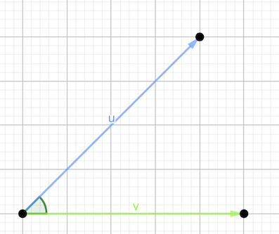
</div>

## Distancia entre dos puntos

<l class = "prop">Teorema del coseno.</l> En un triángulo $\triangle{ABC}$ cualquiera y siendo $\alpha,\beta,\gamma$ los ángulos y $a,b,c$ los lados opuestos a los ángulos anteriores, entonces:

$$a^2 = b^2+c^2-2bc\cos{\alpha}$$

<div class = "center">
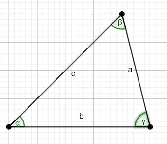
</div>

## Distancia entre dos puntos

A continuación demostraremos el Teorema que nos da la igualdad

<div class = "box">

$$ \langle\vec{u},\vec{v}\rangle= ||\vec{u}||\cdot||\vec{v}||\cdot \cos(\alpha)$$

</div>

\vspace{2cm}

<div class = "dem">
**Demostración**

Consideremos el vector $\vec{u}-\vec{v}$. Éste, junto con los vectores $\vec{u}$ y $\vec{v}$ formarán un triángulo.

Aplicando $||\vec{w}||^2 = \langle\vec{w},\vec{w}\rangle$ al vector $\vec{u}-\vec{v}$, resulta que:

$$||\vec{u}-\vec{v}||^2 = \langle\vec{u}-\vec{v},\vec{u}-\vec{v}\rangle = \langle\vec{u},\vec{u}\rangle+\langle\vec{v},\vec{v}\rangle-2\langle\vec{u},\vec{v}\rangle = ||\vec{u}||^2+||\vec{v}||^2-2\langle\vec{u},\vec{v}\rangle$$

Por otro lado, aplicando el Teorema del coseno al triángulo antes mencionado, tenemos

$$||\vec{u}-\vec{v}||^2 = ||\vec{u}||^2+||\vec{v}||^2-2||\vec{u}||\cdot||\vec{v}||\cdot\cos{(\alpha)}$$

Comparando ambas expresiones, obtenemos que $$\langle\vec{u},\vec{v}\rangle = ||\vec{u}||\cdot||\vec{v}||\cdot\cos{(\alpha)}$$

</div>

## Ángulo entre dos vectores

<l class = "definition">Ángulo entre dos vectores.</l> Se define el ángulo que forman dos vectores como el valor real $\alpha$ tal que 

$$\cos(\alpha) = \frac{\langle\vec{u},\vec{v}\rangle}{||\vec{u}||\cdot||\vec{v}||}$$

## Ángulo entre dos vectores

<l class = "definition">Vectores ortogonales.</l> Dos vectoresson ortogonales si su producto escalar es 0:

$$\vec{u}\perp\vec{v}\Leftrightarrow \langle\vec{u},\vec{v}\rangle= 0\Leftrightarrow \alpha =\frac{\pi}{2}$$

## Ángulo entre dos vectores

<l class = "definition">Vectores ortonormales.</l> Dos vectores son ortonormales si son ortogonales y la norma de ambos es 1

<div class = "exercise">
**Ejercicio 2**

Encontrar el valor de $a$ para el cual $(a,0,-1,3)$ sea perpendicular a $(1,7,a-1,2a+3)$
</div>

## Desigualdad de Cauchy-Schwarz

Tal y como vimos anteriormente, una de las propiedades de la norma  es que el producto escalar en valor absoluto de dos vectores es menor o igual al producto de sus normas

<div class = "box">
$$|\langle\vec{u},\vec{v}\rangle|\le||\vec{u}||\cdot||\vec{v}||$$
</div>

\vspace{2cm}

<div class = "dem">
**Demostración**

A partir de la igualdad $$\cos(\alpha) = \frac{\langle\vec{u},\vec{v}\rangle}{||\vec{u}||\cdot||\vec{v}||}$$

y teniendo en cuenta que el valor absoluto del coseno para cualquier ángulo es siempre menor o igual a 1, obtenemos

$$|\cos(\alpha)| = \left|\frac{\langle\vec{u},\vec{v}\rangle}{||\vec{u}||\cdot||\vec{v}||}\right|\le 1\Leftrightarrow |\langle\vec{u},\vec{v}\rangle|\le||\vec{u}||\cdot||\vec{v}||$$
</div>


## Proyección Ortogonal

<l class = "definition">Proyección ortogonal.</l> La proyección ortogonal de un vector $\vec{v}$ sobre otro vector $\vec{u}$ es un vector paralelo a $\vec{u}$ tal que sumado a otro perpendicular a $\vec{u}$ dará $\vec{v}$

<div class = "center">
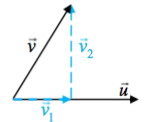
</div>

## Proyección Ortogonal

<div class = "dem">
**Cálculo de la proyección ortogonal**

Se trata de obtener $P_{\vec{v}}(\vec{u}) = \vec{v}_1$ conociendo los vectores $\vec{u}$ o $\vec{v}$

- Se descompone el vector $\vec{v} = \vec{v}_1+\vec{v}_2$ donde $\vec{v}_1||\vec{u}$ y $\vec{v}_2\perp\vec{u}$ son sus componentes
- $\vec{v}_1 = \lambda\vec{u}$ por paralelismo
- $\vec{v}= \lambda\vec{u}+\vec{v}_2\Rightarrow\vec{v}_2 = \vec{v}-\lambda\vec{u}$
- $\langle\vec{v}_2,\vec{u}\rangle = 0\Rightarrow\langle(\vec{v}-\lambda\vec{u}),\vec{u}\rangle = 0$ por ortogonalidad
- Ahora, $$\lambda = \frac{\langle\vec{v},\vec{u}\rangle}{\langle\vec{u},\vec{u}\rangle} =\frac{\langle\vec{u},\vec{v}\rangle}{||\vec{u}||^2} $$

Por lo tanto, $$P_{\vec{v}}(\vec{u}) = \vec{v}_1= \lambda\vec{u} = \frac{\langle\vec{u},\vec{v}\rangle}{||\vec{u}||^2}\vec{u} $$
</div>

## Proyección Ortogonal{.example}

**Ejemplo 7**

Calcular la proyección ortogonal del vector $\vec{v} = (1,2)$ sobre $\vec{u} = (3,1)$

Por el resultado anterior, 

$$P_{\vec{v}}(\vec{u}) =  \frac{\langle\vec{u},\vec{v}\rangle}{||\vec{u}||^2}\vec{u} $$

En primer lugar, calculemos

$$\langle\vec{u},\vec{v}\rangle = \langle(1,2),(3,1)\rangle = 5$$

Por otro lado,

$$||\vec{u}||^2 = 10$$

Con lo cual, 

$$P_{\vec{v}}(\vec{u}) = \frac{5}{10}\vec{u} = \frac{1}{2}(3,1)$$

# Producto vectorial y producto mixto

## Producto vectorial

<l class = "definition">Producto vectorial.</l> Sean $\vec{u} = (u_1,u_2,u_3)$ y $\vec{v} = (v_1,v_2,v_3)$ dos vectores de $\mathbb{R}^3$.El producto vectorial de $\vec{u}$ y $\vec{v}$ se define como el vector

$$\vec{u}\wedge\vec{v} = (u_2v_3-u_3v_2,u_3v_1-u_1v_3,u_1v_2-u_2v_1)$$

## Producto vectorial

<l class = "prop">Propiedades del producto vectorial.</l> Si se multiplica escalarmente,

$$\langle\vec{u},(\vec{u}\wedge\vec{v})\rangle = 0$$
$$\langle\vec{v},(\vec{u}\wedge\vec{v})\rangle = 0$$

Donde se deduce que tanto $\vec{u}$ como $\vec{v}$ son ortogonales a su producto vectorial

## Producto vectorial

<l class = "prop">Propiedades del producto vectorial.</l>
Geométricamente, el producto vectorial, $\vec{u}\wedge\vec{v}$, representa el área del paralelogramo determinado por los dos vectores $\vec{u}$ y $\vec{v}$

$$||\vec{u}\wedge\vec{v}|| = ||\vec{u}||\cdot h = ||\vec{u}||\cdot||\vec{v}||\cdot\sin(\alpha)$$

<div class = "center">

</div>

## Producto vectorial

<l class = "prop">Producto vectorial como determinante.</l>

$$\vec{u}\wedge\vec{v} = (u_2v_3-u_3v_2,u_3v_1-u_1v_3,u_1v_2-u_2v_1)$$ 
$$\vec{u}\wedge\vec{v} = (u_2v_3-u_3v_2)\vec{i}+(u_3v_1-u_1v_3)\vec{j}+(u_1v_2-u_2v_1)\vec{k}$$

$$\vec{u}\wedge\vec{v} = \begin{vmatrix}
\vec{i} & \vec{j}& \vec{k}\\
u_1 & u_2 & u_3\\
v_1 & v_2 & v_3\end{vmatrix}$$

## Producto vectorial

<l class = "prop">Propiedades del producto vectorial.</l>

- Propiedad anticonmutativa: $\vec{u}\wedge\vec{v} = -\vec{v}\wedge\vec{u}$
- Propiedad distributiva
$$\vec{u}\wedge(\vec{v}+\vec{w}) = \vec{u}\wedge\vec{v}+\vec{u}\wedge\vec{w}\\ (\vec{v}+\vec{w})\wedge\vec{u} = \vec{v}\wedge\vec{u}+\vec{w}\wedge\vec{u}$$
- Propiedad asociativa de vectores y escalares $$\alpha(\vec{u}\wedge\vec{v}) = (\alpha\vec{u})\wedge\vec{v}=\vec{u}\wedge\alpha\vec{v}$$
- $\vec{u}\wedge\vec{0}=\vec{0}\wedge\vec{u} = \vec{0}$
- $\vec{u}\wedge\vec{u} = 0$

## Producto mixto

<l class = "definition">Producto mixto.</l> Sean $\vec{u} = (u_1,u_2,u_3), \vec{v} =(v_1,v_2,v_3)$ y $\vec{w} = (w_1,w_2,w_3)$ tres vectores de $\mathbb{R}^3$ distintos del 0. Entonces, el producto mixto de $\vec{u},\vec{v}$ y $\vec{w}$ se define como el vector

$$\{\vec{u},\vec{v},\vec{w}\} = \langle\vec{u},\vec{v}\wedge\vec{w}\rangle = \begin{vmatrix}
u_1 & u_2 & u_3\\
v_1 & v_2 & v_3\\
w_1 & w_2 & w_3\end{vmatrix}$$

## Producto mixto

<l class = "definition">Vectores coplanarios.</l> Si $\{\vec{u},\vec{v},\vec{w}\} = 0$

Esto ocurre porque si el determinante mostrado anteriormente vale 0, entonces tenemos que una de las filas es combinación lineal de las otras dos.

## Producto mixto

<l class = "prop">Propiedades del producto mixto.</l>

- $\{\vec{u},\vec{v},\vec{w}\} = u_1v_2w_3-u_1v_3w_2+u_2v_3w_1-u_2v_1w_3+u_3v_1w_2-u_3v_2w_1$
- $\{\vec{u},\vec{v},\vec{w}\} = \{\vec{v},\vec{w},\vec{u}\} = \{\vec{w},\vec{u},\vec{v}\} = -\{\vec{v},\vec{u},\vec{w}\} = -\{\vec{u},\vec{w},\vec{v}\} = -\{\vec{w},\vec{v},\vec{u}\}$
- Si los tres vectores son coplanarios, entonces $\{\vec{u},\vec{v},\vec{w}\} = 0$
- Si $\{\vec{u},\vec{v},\vec{w}\} = 0$, entonces o algún vector es $\vec{0}$ o los res vectores son coplanarios

<div class = "center">
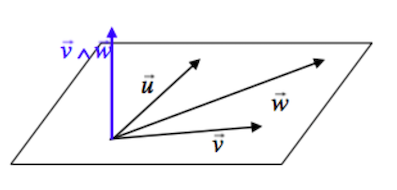
</div>

## Producto mixto

<l class = "prop">Propiedades del producto mixto.</l> Geométricamente, el producto mixto, $\{\vec{u},\vec{v},\vec{w}\}$, representa el volumen del paralelepípedo determinado por los tres vectores

<l class = "observ">Observación.</l> $\{\vec{u},\vec{v},\vec{w}\} = ||\vec{u}||\cdot||\vec{v}\wedge\vec{w}||\cdot\cos(\alpha)$ donde $||\vec{v}\wedge\vec{w}||$ es el área de la base y $||\vec{u}||\cos(\alpha)$ es la proyección escalar del vector $\vec{u}$ sobre la dirección perpendicular a la base, es decir, la altura

<div class = "center">
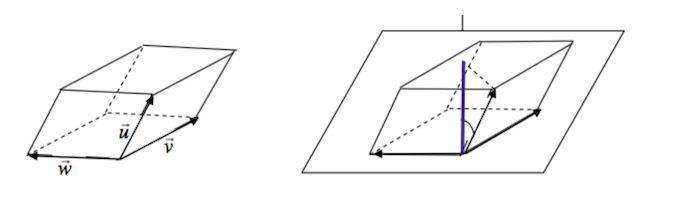
</div>