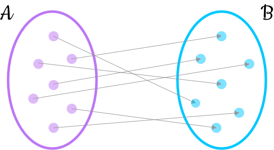
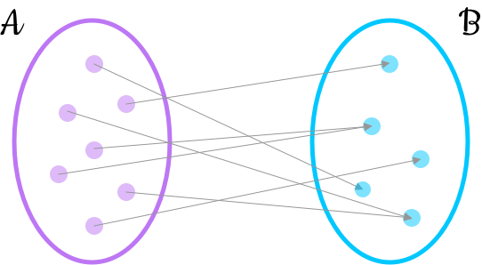
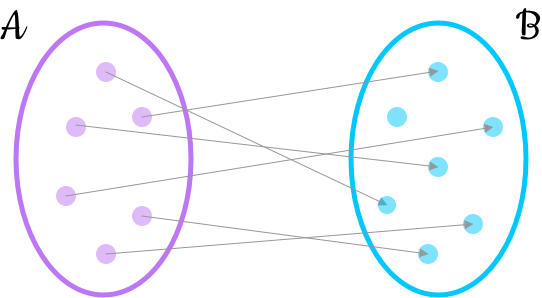
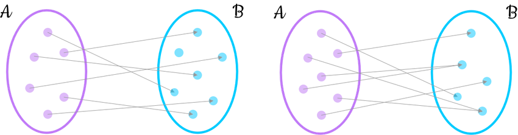
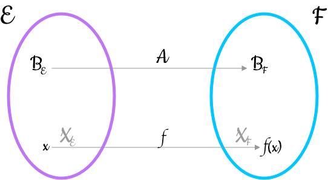
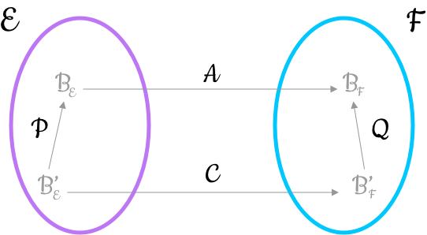

```{r setup, include=FALSE}
knitr::opts_chunk$set(echo = TRUE, comment = NA)
```

# Definiciones básicas

## Definiciones básicas

<l class = "definition">Aplicación entre 2 conjuntos.</l> Sean $A$ y $B$ dos conjuntos dados. Una aplicación de $A$ en $B$ es una correspondencia que a cada elemento $x\in A$ le asocia un, y solo un, elemento $y\in B$

<div class = "center">

</div>


## Definiciones básicas

<l class = "definition">Aplicación exhaustiva.</l> Sea $f:A\longrightarrow B$ una aplicación. Se dice que $f$ es exhaustiva si, y solo si, $f(A) = B$. Es decir, si todos los elementos de $B$ tienen una <l class ="definition">anti-imagen</l> o <l class = "definition">antecendente</l>:

$$\forall b\in B,\ \exists a\in A:\ f(a) = b$$


<div class = "center">

</div>

## Definiciones básicas

<l class = "definition">Aplicación inyectiva.</l> Sea $f:A\longrightarrow B$ una aplicación. Se dice que $f$ es inyectiva si distintos elementos de $A$ tienen distinta imagen.

$$x,y\in A,\ x\ne y\Rightarrow f(x)\ne f(y)$$

Esto es equivalente a decir que si dos elementos tienen la misma imgagen para $f$, entonces son el mismo

$$f(x) = f(y)\Rightarrow x = y$$

## Definiciones básicas

<div class = "center">

</div>

## Definiciones básicas

De la definición anterior, se deduce que en caso de tener una aplicación inyectiva, como máximo cada elemento de $B$ tendrá una anti-imagen. En otras palabras, la anti-imagen de un elemento de $B$ es o bien un elemento de $A$ o bien el conjunto vacío, $\emptyset$.

## Definiciones básicas

<div class = "center">


</div>


## Definiciones básicas

<l class = "definition">Aplicación biyectiva.</l> Sea $f:A\longrightarrow B$ una aplicación. Se dice que $f$ es biyectiva si es inyectiva y exhaustiva a la vez. Ello equivale a 

$$\forall b\in B,\ \exists! a\in A:\ f(a) = b$$

<div class = "center">

</div>

# Aplicaciones lineales

## La aplicación identidad

<l class = "definition">Aplicación identidad.</l> Es la aplicación $I$ que transforma cada vector de $E$ en sí mismo:

$$\begin{matrix}I:&E\longrightarrow E\\
&x\mapsto x
\end{matrix}$$

## La aplicación identidad

En primer lugar, estudiaremos si hay alguna relación entre la imagen de una suma de vectores, $I(x+y)$, y las imágenes de cada uno de los sumandos, $I(x),I(y)$

Por definición de la aplicación identidad:

$$I(x+y) = x+y$$

Por otro lado

$$\left.\begin{matrix}I(x) = x\\I(y) = y\end{matrix}\right\}\Rightarrow I(x)+I(y) = x+y$$

Con lo cual se cumple $$I(x+y) = x+y= I(x)+I(y)$$

## La aplicación identidad

<l class = "prop">Proposición.</l> Dada la aplicación identidad, la imagen de la suma es la suma de imágenes.


## La aplicación identidad

En segundo lugar, estudiaremos si existe alguna relación entre la imagen de un escalar por un vector $I(\lambda x)$ y la imagen del vector $I(x)$.

Por definición de aplicación identidad:

$$I(\lambda x) = \lambda x$$

Por lo tanto, existe la siguiente relación 

$$I(\lambda x) = \lambda x = \lambda I(x)$$

<l class = "prop">Proposición.</l> Dada la aplicación identidad, la imagen del producto de un escalar por un vector es el escalar por la imagen de dicho vector.

## Definición de aplicación lineal

<l class = "definition">Aplicación lineal.</l> Sean $E$ y $F$ dos $\mathbb{K}-$espacios vectoriales. Dada una aplicación $f$ tal que 


$$\begin{matrix}f:&E\longrightarrow F\\
&x\mapsto f(x)
\end{matrix}$$

diremos que es lineal si se verifica que

$$\forall \vec{x},\vec{y}\in E,\quad f(\vec{x}+\vec{y})= f(\vec{x})+f(\vec{y})$$
$$\forall \vec{x}\in E,\ \forall\lambda\in \mathbb{K},\quad f(\lambda\vec{x})= \lambda f(\vec{x})$$

## Definición de aplicación lineal

Las dos condiciones anteriores son equivalentes a una tercera:

$$\forall \lambda,\mu\in\mathbb{K},\ \vec{x},\vec{y}\in E,\quad f(\lambda\vec{x}+\mu\vec{y}) = \lambda f(\vec{x})+\mu f(\vec{y})$$

## Definición de aplicación lineal{.example}

**Ejemplo 1**

Nos piden si la siguiente aplicación, conocida como <l class = "definition">Primera proyección</l>, es lineao o no:

$$\begin{matrix}f:&\mathbb{K}^2\longrightarrow \mathbb{K}\\
&(x,y)\mapsto x
\end{matrix}$$

- Lineal para la suma $$f((x_1,y_1)+(x_2,y_2)) = f(x_1+x_2,y_1+y_2) = x_1+x_2$$ $$\left.\begin{matrix}f(x_1,y_1) = x_1\\f(x_2,y_2) = x_2\end{matrix}\right\}\Rightarrow f(x_1,y_1)+f(x_2,y_2) = x_1+x_2$$ Por lo tanto $$f(x_1,y_1)+f(x_2,y_2) = f((x_1,y_1)+(x_2,y_2))$$
- Lineal para el producto por escalar $$f(\lambda(x,y)) = f(\lambda x,\lambda y) = \lambda x = \lambda f(x,y)$$

## Imagen del vector nulo

<l class = "prop">Propiedad.</l> Dada una aplicación lineal $$\begin{matrix}f:&E\longrightarrow F\\
&x\mapsto f(x)
\end{matrix}$$

La imagen del vector nulo $\vec{0}_E$ de $E$ es el vector nulo $\vec{0}_F$ $$f(\vec{0}_E) = \vec{0}_F$$

## Imagen del vector nulo

<div class = "dem">
**Demostración**

El vector nulo $\vec{0}_E$ es el neutro de la suma de $E$, por tanto $$\forall\vec{x}\in E\Rightarrow \vec{x}+\vec{0}_E= \vec{x}$$

Como $\vec{x}+\vec{0}_E = \vec{x}$, entonces $f(\vec{x}+\vec{0}_E) = f(\vec{x})$

Como $f$ es lineal $f(\vec{x}+\vec{0}_E) = f(\vec{x})+f(\vec{0}_E)$

Entonces, por lo anterior se obtiene $$f(\vec{x})+f(\vec{0}_E) = f(\vec{x})$$

Donde, en efecto, $f(\vec{0}_E)$ es el elemento neutro de la suma de $F$

$$f(\vec{0}_E) = \vec{0}_F$$
</div>

## Imagen del vector opuesto

<l class = "prop">Propiedad.</l> Dada una aplicación lineal: 

$$\begin{matrix}f:&E\longrightarrow F\\
&x\mapsto f(x)
\end{matrix}$$

La imagen del vector opuesto es el opuesto de la imagen del original $$f(-\vec{x}) = -f(\vec{x})$$

## Imagen del vector opuesto

<div class = "dem">
**Demostración**

La suma de un vector y su opuesto es el elemento neutro
$$\forall\vec{x}\in E\Rightarrow \vec{x}+(-\vec{x}) = \vec{0}_E$$

Como $\vec{x} +(-\vec{x}) = \vec{0}_E$, entonces: $f(\vec{x}+(-\vec{x})) = f(\vec{0}_E)$

Como $f$ es lineal: $f(\vec{x}+(-\vec{x})) = f(\vec{x})+f(-\vec{x})$

Por lo anterior, tenemos $f(\vec{x})+f(-\vec{x}) = f(\vec{0}_E)$

Pero de la propiedad anterior, se sabe que $f(\vec{0}_E) = \vec{0}_F$ y, por tanto, $f(\vec{x})+f(-\vec{x}) = \vec{0}_F$. Donde, por la propiedad del elemento $f(-\vec{x})$ debe ser el opuesto de $f(\vec{x})$

$$f(-\vec{x}) = -f(\vec{x})$$
</div>

# Núcleo, imagen y rango de una aplicación lineal

## Núcleo

<l class= "definition">Núcleo.</l> Sea la aplicación lineal $$\begin{matrix}f:&E\longrightarrow F\\
&x\mapsto f(x)
\end{matrix}$$

Se denomina núcleo de $f$ y se denota como $\ker(f)$ o $\text{Nuc}(f)$ el conjunto de elementos de $E$ tales que su imagen coincide con el cero de $F$

$$\ker(f) = \{\vec{x}\in E:\ f(\vec{x}) = \vec{0}_F\}$$

## Núcleo

<l class = "prop">Teorema.</l> Sea la aplicación lineal $$\begin{matrix}f:&E\longrightarrow F\\
&x\mapsto f(x)
\end{matrix}$$

Entonces $\ker(f)$ es un subespacio vectorial de $E$

## Núcleo

<l class = "prop">Teorema.</l> Una aplicación lineal $f: E\longrightarrow F$ es inyectiva si, y solo si, el núcleo de $f$ es el formado solamente por el elemento neutro de $E$

$$f\ \text{ inyectiva}\Leftrightarrow \ker(f) = \{\vec{0}_E\}$$

## Núcleo

<l class = "prop">Teorema.</l> Sean $\vec{x}_1,\vec{x}_2,\dots,\vec{x}_n$ un conjunto de vectores linealmente independientes del espacio vectorial $E$ y $f: E\longrightarrow F$ una aplicación lineal inyectiva. Entonces,

$$f(\vec{x}_1),f(\vec{x}_2),\dots,f(\vec{x}_n)$$

Son vectores linealmente independientes pertenecientes a $F$

## Imagen

<l class = "definition">Imagen.</l> Sea la aplicación lineal $$\begin{matrix}f:&E\longrightarrow F\\
&x\mapsto f(x)
\end{matrix}$$

Se denomina imagen de $f$ y se denota por $\text{Im}(f)$ al conjunto de elementos de $F$ que tienen una anti-imagen para $f$

$$\text{Im}(f) = \{\vec{y}\in F:\ \exists\vec{x}\in E:\ f(\vec{x}) = \vec{y}\}$$

## Imagen

<l class = "prop">Teorema.</l> Dada la aplicación lineal $$\begin{matrix}f:&E\longrightarrow F\\
&x\mapsto f(x)
\end{matrix}$$

Entonces $\text{Im}(f)$ es un subespacio vectorial de $E$

## Imagen

<l class = "prop">Teorema.</l> Si $E$ es un espacio vectrorial de dimensión finita $n$ y se tiene la aplicación lineal $f:E\longrightarrow F$. Entonces, $\text{Im}(f)$ es de dimensión finita menor o igual que $n$

$$\dim(\text{Im}(f))\le n$$

## Núcleo e Imagen

<l class = "prop">Teorema.</l> Sean $E$ y $F$ $\mathbb{K}-$espacios vectoriales. Sea $f: E\longrightarrow F$ una aplicación lineal. Si la dimensión de $E$ es finita, entonces se puede asegurar

- $\dim(\ker(f)),\ \dim(\text{Im}(f))$ son finitos
- $\dim(E) = \dim(\ker(f))+\dim(\text{Im}(f))$

## Rango

<l class = "definition">Rango de una aplicación lineal.</l> Sea $f: E\longrightarrow F$ una aplicación lineal con $\dim(E)$. Se denomina rango de $f$ a la dimensión del subespacio vectorial imagen de $f$

$$\text{rg}(f) = \dim(\text{Im}(f))$$

# Clasificación de una aplicación lineal

## Clasificación de una aplicación lineal

Sea $f: E\longrightarrow F$ una aplicación lineal

<l class = "definition">Monomorfismo.</l> Si $f$ es inyectiva

<l class = "definition">Epimorfismo.</l> Si $f$ es exhaustiva

<l class = "definition">Isomorfismo.</l> Si $f$ es biyectiva

<l class = "definition">Endomorfismo.</l> Si $f$ va de un espacio al mismo. Es decir, si $f$ es tal que $$f: E\longrightarrow E$$

<l class = "definition">Automorfismo.</l> Si $f$ es un endomorfismo biyectivo

## Clasificación de una aplicación lineal

<l class = "prop">Teorema.</l> Sean $E$ y $F$ espacios vectoriales de dimensión finita sobre $\mathbb{K}$ y $f:E\longrightarrow F$ una aplicación lineal, entonces son equivalentes:

- $f$ es un isomorfismo
- $\dim(E) = \dim(F)$
- $\ker(f) = \{0_E\}$

# Matriz de una aplicación lineal

## Matriz de una aplicación lineal

Antes de entrar en definiciones formales, se deducirá la forma de estas matrices con un ejemplo

## Ejemplo 2

<div class = "example">
**Ejemplo 2**

Sea $f:\mathbb{R}^2\longrightarrow \mathbb{R}^3$ la aplicación lineal dada por

$$f(x,y) = (x+y,y-2x,x+y)$$

Nos piden lo siguiente:

1. Obtener las imágenes de los vectores de la base canónica $B_C$ de $\mathbb{R}^2$
2. Obtener las imágenes de los vectores de la base $B_E = \{(1,-1),(2,1)\}$ de $\mathbb{R}^2$
3. Obtener las imágenes de los vectores de la base canónica de $\mathbb{R}^2$ expresados en la base de $\mathbb{R}^3$ $$B_F = \{(1,-1,0),(1,0,-1),(1,1,1)\}$$
4. Obtener las imágenes de los vectores de la base $B_E$ de $\mathbb{R}^2$ expresados en la base $B_F$ de $\mathbb{R}^3$
</div>

## Ejemplo 2{.example}

**Solución 1**

Como la base canónica de $\mathbb{R}^2$ es $B_C = \{(1,0),(0,1)\}$, entonces,

$$f(1,0) = (1+0,0-2\cdot 1, 1+0) = (1,-2,1);\qquad f(0,1) = (1,1,1)$$

Si se colocan las coordenadas de $f(1,0)$ y $f(0,1)$ como columnas de una matriz, lo que se obtiene es 

$$\begin{pmatrix}
1 & 1\\
-2 & 1\\
1 & 1
\end{pmatrix}$$

Con lo cual

$$(f(1,0),f(0,1)) = ((1,0,0),(0,1,0),(0,0,1))\begin{pmatrix}
1 & 1\\
-2 & 1\\
1 & 1
\end{pmatrix}$$

Se calculan las imágenes de los vectores de la base canónica de $\mathbb{R}^2$ y estas imágenes vienen dadas en la base canónica de $\mathbb{R}^3$

## Ejemplo 2{.example}

**Solución 2**

Análogamente, dada la base $B_E = \{(1,-1),(2,1)\}$ $$f(1,-1) = (0,-3,0);\qquad f(2,1) = (3,-3,3)$$

De este modo, 
$$\begin{pmatrix}
0 & 3\\
-3 & -3\\
0 & 3
\end{pmatrix}$$

Y entonces,

$$(f(1,-1),f(2,1)) = ((1,0,0),(0,1,0),(0,0,1))\begin{pmatrix}
0 & 3\\
-3 & -3\\
0 & 3
\end{pmatrix}$$

Si se calculan las imágenes de los vectores de la base $B_E$ de $\mathbb{R}^2$, estas imágenes vienen dadas en la base canónica de $\mathbb{R}^3$

## Ejemplo 2{.example}

**Solución 3**

Dada la base canónica de $\mathbb{R}^2$, sabemos que 

$$f(1,0) = (1,-2,1);\qquad f(0,1) = (1,1,1)$$

Para pasar ahora de $B_C$ a la base $B_F$ de $\mathbb{R}^3$, se ha de hacer un cambio de base

$$B_C \xrightarrow{P} B_F$$
$$(1,-2,1)_C\xrightarrow{P}(\alpha,\beta,\gamma)_{B_F}$$
$$(1,1,1)_C\xrightarrow{P}(a,b,c)_{B_F}$$

Según la definición de matriz de cambio de base $P$, será la matriz las columnas de la cual son las coordenadas de los vectores de la base $B_C$ expresados en la base $B_F$

Se tiene justo lo contrario, es decir, tenemos las coordenadas de $B_F$ en $B_C$. Por lo tanto, se calculará esta matriz de cambio de base $Q$ tal que $B_F\xrightarrow{Q}B_C$ y la matriz $P$ será la inversa de $Q$

## Ejemplo 2{.example}

$$Q = P ^{-1} = \begin{pmatrix}
1 & 1 & 1\\
-1 & 0 & 1\\
0 & -1 & 1
\end{pmatrix}$$

Así pues, $$P = \frac{1}{3}\begin{pmatrix}
1 & -2 & 1\\
1 & 1 & -2\\
1 & 1 & 1
\end{pmatrix}$$

Con lo cual, $$(1,-2,1)_C\xrightarrow{P}(\alpha,\beta,\gamma)_{B_F}$$ $$P\begin{pmatrix}
1\\
-2\\
1\end{pmatrix}_C = \begin{pmatrix}
\alpha\\
\beta\\
\gamma
\end{pmatrix}_{B_F}$$
$$\frac{1}{3}\begin{pmatrix}
1 & -2 & 1\\
1 & 1 & -2\\
1 & 1 & 1
\end{pmatrix}\begin{pmatrix}
1\\
-2\\
1\end{pmatrix}_C = \frac{1}{3}\begin{pmatrix}
6\\
-3\\
0
\end{pmatrix} = \begin{pmatrix}
2\\
-1\\
0
\end{pmatrix} = \begin{pmatrix}
\alpha\\
\beta\\
\gamma
\end{pmatrix}_{B_F}$$

## Ejemplo 2{.example}

Con lo cual, $$(\alpha,\beta,\gamma) = (2,-1,0)$$

Por otro lado,

$$(1,1,1)_C\xrightarrow{P}(a,b,c)_{B_F}$$ 
$$\frac{1}{3}\begin{pmatrix}
1 & -2 & 1\\
1 & 1 & -2\\
1 & 1 & 1
\end{pmatrix}\begin{pmatrix}
1\\
1\\
1\end{pmatrix}_C = \frac{1}{3}\begin{pmatrix}
0\\
0\\
3
\end{pmatrix} = \begin{pmatrix}
0\\
0\\
1
\end{pmatrix} = \begin{pmatrix}
a\\
b\\
c
\end{pmatrix}_{B_F}$$

Con lo cual, $(a,b,c) = (0,0,1)$

Si ahora se colocan las coordenadas $f(1,0)$ y $f(0,1)$ como columnas de una matriz, obtenemos


$$\begin{pmatrix}
2 & 0\\
-1 & 0\\
0 & 1
\end{pmatrix}$$

## Ejemplo 2{.example}

Entonces,

$$(f(1,0),f(0,1)) = ((1,-1,0),(1,0,-1),(1,1,1))\begin{pmatrix}
2 & 0\\
-1 & 0\\
0 & 1
\end{pmatrix}$$

Se calculan las imágenes de los vectores de la base canónica $B_C$ de $\mathbb{R}^2$ y estas imágenes vienen dadas en la base $B_F$ de $\mathbb{R}^3$

## Ejemplo 2{.example}

**Solución 4**

Si se calcula la imagen de los vectores de la base $B_E$ para $f$,

$$f(1,-1) = (0,-3,0)_C\qquad f(2,1) = (3,-3,3)_C$$

Para ahora pasar de $B_C$ a $B_F$ de $\mathbb{R}^3$ ha de hacerse un cambio de base

$$B_C\xrightarrow{P} B_F$$
$$(0,-3,0)_C\xrightarrow{P}(\alpha,\beta,\gamma)_{B_F}$$
$$(3,-3,3)_C\xrightarrow{P}(a,b,c)_{B_F}$$

Si os fijáis, esta matriz de cambio de base la hemos calculado anteriormente. Por lo tanto

$$(\alpha,\beta,\gamma)_{B_F} = (2,-1,-1)$$
$$(a,b,c)_{B_F} = (4,-2,1)$$

## Ejemplo 2{.example}

Si se colocan las coordenadas de $f(1,-1)$y $f(2,1)$ como columnas de una matriz se obtiene

$$\begin{pmatrix}
2 & 4\\
-1 & -2\\
-1 & 1
\end{pmatrix}$$

Entonces,

$$(f(1,-1),f(2,1)) = ((1,-1,0),(1,0,-1),(1,1,1))\begin{pmatrix}
2 & 4\\
-1 & -2\\
-1 & 1
\end{pmatrix}$$

Se calculan las imágenes de los vectores de la base $B_E$ de $\mathbb{R}^2$ y estas imágenes vienen dadas en la base $B_F$ de $\mathbb{R}^3$

## Ejemplo 2{.example}

En todos los casos anteriores se han calculado las imágenes de los vectores de una base del espacio de origen y se han expresado en una cierta base del espacio de destino.

Estas matrices son las matrices asociadas a la aplicación lineal

## Definición

Sean $E$ y $F$ espacios vectoriales de dimensiones $p$ y $q$ respectivamente con $B_E = \{\vec{u}_1,\dots,\vec{u}_p\}$ una base de $E$, $B_F = \{\vec{v}_1,\dots,\vec{v}_q\}$ una base de $F$ y $f: E\longrightarrow F$ una aplicación lineal

<l class = "definition">Matriz de una aplicación lineal.</l> Se denomina matriz de $f$ respecto de las bases $B_E,B_F$ a aquella que tiene por columnas las coordenadas de los vectores  $$(f(\vec{u}_1),f(\vec{u}_2),\dots,f(\vec{u}_p))$$ en la base $B_F= \{\vec{v}_1,\dots,\vec{v}_q\}$

## Definición

Las imágenes de los vectores de la base $B_E$ en la base $B_F$ vienen dados por 

$$f(\vec{u}_1)\in F\Rightarrow f(\vec{u}_1) = a_{11}\vec{v}_1+a_{21}\vec{v}_2+\cdots+a_{q1}\vec{v}_q$$
$$f(\vec{u}_2)\in F\Rightarrow f(\vec{u}_2) = a_{12}\vec{v}_1+a_{22}\vec{v}_2+\cdots+a_{q2}\vec{v}_q$$
$$\vdots$$
$$f(\vec{u}_p)\in F\Rightarrow f(\vec{u}_p) = a_{1p}\vec{v}_1+a_{2p}\vec{v}_2+\cdots+a_{qp}\vec{v}_q$$

## Definición

Esta expresión en forma matricial sería

$$(f(\vec{u}_1),f(\vec{u}_2),\dots,f(\vec{u}_p)) = (\vec{v}_1,\vec{v}_2,\dots,\vec{v}_q)\begin{pmatrix}
a_{11} & a_{12} & \cdots & a_{1p}\\
a_{21} & a_{22} & \cdots & a_{2p}\\
\vdots & \vdots & \ddots & \vdots\\
a_{q1} & a_{q2} & \cdots & a_{qp} 
\end{pmatrix}$$

Donde la columna $i$ contiene las coordenadas del vector $f(\vec{u}_i)$ en la base $B_F$. 

La matriz $A$ será de orden $q\times p$ con $\dim(E) = p$ y $\dim(F) = q$

$$(f(\vec{u}_1),f(\vec{u}_2),\dots,f(\vec{u}_p)) = (\vec{v}_1,\vec{v}_2,\dots,\vec{v}_q)A$$

# Ecuación matricial de una aplicación lineal

## Ecuación matricial de una aplicación lineal

Sea $f: E\longrightarrow F$ una aplicación lineal, $A$ la matriz asociada a $f$ respecto de las dos bases $B_E$ y $B_F$ de $E$ y $F$ respectivamente.

Se va a hallar una relación entre las coordenadas en base $B_E$ de un vector $\vec{x}\in E$ y las coordenadas en la base $B_F$ del vector $f(\vec{x})\in F$

## Ejemplo 3{.example}

**Ejemplo 3**

Sea $f:\mathbb{R}^2\longrightarrow\mathbb{R}^3$ la aplicación lineal tal que su matriz asociada en base canónica de $\mathbb{R}^2$ y la base canónica de $\mathbb{R}^3$ es

$$\begin{pmatrix}
1 & 1\\
-2 & 1\\
1 & 1
\end{pmatrix}$$

Calcular las coordenadas del vector imagen de $\vec{c} = (2,-1)_C\in\mathbb{R}^2$ expresadas en la base canónica


Nosotros lo que tenemos es

$$(2,-1)_C = 2(1,0)+(-1)(0,1) = ((1,0),(0,1))\begin{pmatrix}
2\\
-1
\end{pmatrix}$$

Aplicando $f$ en los dos lados de la igualdad, como ambos miembros son iguales y $f$ es una aplicación (un mismo elemento de origen no puede tener dos imágenes diferentes), sus imágenes también serán iguales:

$$f((2,-1))_C = f( 2(1,0)+(-1)(0,1)) = 2f(1,0)+(-1)f(0,1)= (f(1,0),f(0,1))\begin{pmatrix}
2\\
-1
\end{pmatrix}$$

## Ejemplo 3{.example}

Por otro lado, por definición de la matriz asociada a $f$ respecto a dos bases $B_E$ y $B_F$, se sabe que

$$(f(1,0),f(0,1)) = ((1,0,0),(0,1,0),(0,0,1))\begin{pmatrix}
1 & 1\\
-2 & 1\\
1 & 1
\end{pmatrix}$$

Y sustituyendo esta expresión en la anterior, se tiene que 

$$f((2,-1))_C = ((1,0,0),(0,1,0),(0,0,1))\begin{pmatrix}
1 & 1\\
-2 & 1\\
1 & 1
\end{pmatrix}\begin{pmatrix}
2\\
-1
\end{pmatrix}$$

Ahora, si se denota por $Y_C$ las coordenadas del vector $f(2,-1)_C$ en la base canónica de $\mathbb{R}^3$, se puede escribir

$$Y_C = \begin{pmatrix}
1 & 1\\
-2 & 1\\
1 & 1
\end{pmatrix}\begin{pmatrix}
2\\
-1
\end{pmatrix} = \begin{pmatrix}
1\\
-5\\
1
\end{pmatrix}$$

## Construcción

Sea $f: E\longrightarrow F$ una aplicación lineal y $A$ la matriz asociada a $f$ respecto de $B_E$ y $B_F$. Sean

- $X_{B_E}$ las coordenadas en base $B_E$ del vector $\vec{x}\in E$
- $Y_{B_F}$ las coordenadas en base $B_F$ del vector $f(\vec{x})\in F$

$$f(B_E) = B_FA$$

Se puede demostrar que $$AX_{B_E} = Y_{B_F}$$

## Construcción{.center}



## Definición

<l class = "definition">Ecuación matricial de una aplicación lineal.</l> $AX_{B_E} = Y_{B_F}$ es la ecuación matricial de la aplicación lineal que relaciona las coordenadas de un vector $\vec{x}\in E$ en una base $B_E$ con las coordenadas $f(\vec{x})$ en una base $B_F$

## Definición

<l class = "prop">Teorema.</l> Sea $A\in\mathcal{M}_n(\mathbb{K})$ una matriz cuadrada de tamaño $n$. Son equivalentes

- $A$ es invertible
- Los vectores columna de la matriz $A$ son una base de $\mathbb{K}^n$
- La aplicación lineal definida por 
$$\begin{matrix}
f_A: & \mathbb{K}^n&\longrightarrow &\mathbb{K}^n\\
 & X & \mapsto & AX
\end{matrix}$$ es biyectiva

## Definición

<l class = "prop">Teorema.</l> Sea la aplicación lineal $f: E\longrightarrow F$

- $A$ la matriz de la aplicación lineal en las bases $B_E$ y $B_F$
- $C$ la matriz de la aplicación lineal en otras bases $B'_E$ y $B'_F$
- $P$ la matriz de cambio de base de $B'_E$ a $B_E$ ($B'_E\xrightarrow{P} B_E$)
- $Q$ la matriz de cambio de base de $B'_F$ a $B_F$ ($B'_F\xrightarrow{Q}B_F$)

Entonces $$Q^{-1}AP = C$$

## Definición{.center}



## Definición{.dem}

**Demostración**

La ecuación matricial de la aplicación lineal para $A,B_E,B_F$: $$AX_{B_E} = Y_{B_F}$$

La ecuación matricial de la aplicación lineal para $A,B'_E,B'_F$: $$AX_{B'_E} = Y_{B'_F}$$

La ecuación de cambio de base de $B'_E$ a $B_E$ : $$X_{B_E} = PX_{B'_E}$$

La ecuación de cambio de base de $B'_F$ a $B_F$ : $$Y_{B_F} = QY_{B'_F}$$

Por lo tanto, con la primera ecuación y la tercera

$$A(PX_{B'_E}) = Y_{B_F}$$

## Definición{.dem}

Además, por la última tenemos

$$A(PX_{B'_E}) = QY_{B'_F}$$

Multiplicando a ambos lados por $Q^{-1}$ por la izquierda y aplicando la propiedad asociativa del producto de matrices, se obtiene:

$$(Q^{-1}AP)X_{B'_E} = Y_{B'_F}$$

Que es la ecuación matricial de $f$ en $B'_E$ y $B'_F$. Con lo cual, $Q^{-1}AP$ será la matriz asociada a $f$ en estas bases:

$$Q^{-1}AP = C$$

## Definición

<l class = "prop">Corolario.</l> Sea la aplicación lineal $f: E\longrightarrow E$ y sean

- $A$ la matriz de la aplicación lineal en la base $B_E$
- $C$ la matriz de la aplicación lineal en la base $B'_E$
- $P$ la matriz de cambio de base de $B'_E$ a $B_E$

Entonces se cumple que $$P^{-1}AP = C$$


## Definición{.center}


