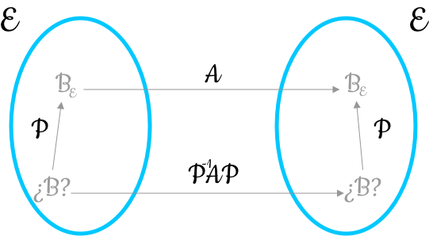

```{r setup, include=FALSE}
knitr::opts_chunk$set(echo = TRUE, comment = NA)
```

# Introducción

## Introducción

Antes de entrar matemáticamente en el tema de la diagonalización de matrices cuadradas, se expondrán algunas de las aplicaciones que tienen las matrices diagonales

Recordad que una matriz diagonal es una matriz cuadrada que tiene ceros en todos sus elementos fuera de su diagonal principal

## Introducción

La factorización de una matriz dada $A$ en función de otra matriz diagonal $D$ permite resolver problemas de análisis y estudio de los sistemas eléctricos, vibraciones, economía, etc. que suelen venir modelados por ecuaciones diferenciales y en derivadas parciales

En esta factorización juegan un papel muy importante unos escalares denominados <l class = "definition">valores propios</l> y unos tipos especiales de vectores denominados <l class = "definition">vectores propios</l>

## Introducción

Un tipo de aplicación de la diagonalización de matrices se encuentra en el análisis de la solución de un sistema dinámico a lo largo del tiempo.

Un sistema se caracteriza por el estado de un conjunto de $n$ variables que lo determinan. Este conjunto se puede expresar como un vector de $\mathbb{R}^n$ las componentes del cual expresan los valores de estas variables

$$(x_1,x_2,\dots,x_n)$$

Si el estado evoluciona a lo largo del tiempo modificando su valor a cada periodo (hora, día, mes...) es muy común que la relación entre los estados del sistema se presenten de forma recursiva:

## Introducción

- $X_{p+1} = AX_p$ donde $A$ es una matriz cuadrada de orden $n$
- $X_p$ representa el estado del sistema en el periodo $p$
- $X_{p+1}$ representa el estado del sistema en el periodo siguiente a $p$

Entonces basta con conocer el estado en el periodo inicial del sistema, $X_0$, para poder calcular el estado del sistema en cualquier periodo

## Introducción

En efecto, si se conoce el estado inicial $X_0$, se puede conocer:

$$X_1 = AX_0$$
$$X_2 = AX_1 = A(AX_0) = A^2X_0$$
$$\vdots$$
$$X_n = A^nX_0$$

Por tanto, para conocer el estado del sistema en el periodo $n$ es necesario el cálculo de la matriz $A^n$. Este cálculo, como ya se habrá imaginado, es bastante complicado y es dificil no equivocarse.

En cambio, se simplifica considerablemente en el caso de que $A$ sea diagonalizable

# Diagonalización

## Diagonalización

En este tema consideraremos $\mathbb{K}$-espacios vectoriales donde $\mathbb{K} = \mathbb{R},\mathbb{C}$ y $f\in\text{End}(E)$, es decir, $f$ es un endomorfismo de $E$ en sí mismo.

## Diagonalización

<l class = "definition">Matrices semejantes.</l> Dos matrices $A$ y $A'$ son semejantes si existe una matriz $P$ cuadrada invertible tal que $A' = P^{-1}AP$

## Diagonalización

Podemos pensar que todas las matrices semejantes constituyen las diversas representaciones analíticas de un mismo endomorfismo $f$ de un espacio vectorial $E$ de dimensión $n$ en diferentes bases de $E$

<div class= "center">

</div>

## Diagonalización

Así se plantea el problema de buscar la base de $E$ en la cual $f$ se presenta de la forma más sencilla posible.

Debido a las características tan buenas que presentan las matrices diagonales, se intenta encontrar una base de $E$ en la cual $f$ esté representada por una matriz diagonal, es decir, dada una matriz $A$ en una base cualquiera, se va a buscar una matriz diagonal semejante a ella.

Este proceso recibirá el nombre de <l class = "definition">diagonalizar la matriz</l> o  <l class = "definition">el endomorfismo</l>

## Diagonalización

<l class = "definition">Matriz diagonalizable.</l> Una matriz $A$ es diagonalizable si es semejante a una matriz $D$; es decir, si existe una matriz $P$ regular tal que $D  = P^{-1}AP$

No siempre es posible. Habrá que estudiar en qué condiciones existe una matriz así y respecto de qué base representará el endomorfismo.

## Diagonalización

<l class = "definition">Endomorfismo diagonalizable.</l> Diremos que un endomorfismo $f\in\text{End}(E)$ es diagonalizable si existe una base de $E$ formada por vectores propios de $f$.

En otras palabras, diagonalizar $f$ es encontrar tal base. En tal caso, si $B = \{v_1,\dots,v_n\}$ es la base que buscamos (base de veps asociados a los vaps $\lambda_1,\dots,\lambda_n$ no necesariamente diferentes), la matriz asociada a $f$ con respecto a esta base es la matriz diagonal $$A = \begin{pmatrix}\lambda_1 &\cdots &0\\
\vdots &\ddots&\vdots\\
0&\cdots&\lambda_n\end{pmatrix}$$

ya que $f(v_i) = \lambda_iv_i$ para todo $i = 1,\dots,n$

# Vectores y valores propios de una matriz

## Definiciones

La teoría que se verá a continuación está pensada para conseguir llegar a diagonalizar una matriz, pero no se ha de olvidar que esta matriz realmente representa un cierto endomorfismo en una determinada base.

## Definiciones

<l class = "definition">Vector propio (vep).</l> Dada una matriz cuadrada $A\in\mathcal{M}_n$ de orden $n$, los vectores columna de la cual pertenecen a un espacio vectorial $E$ de dimensión $n$, un elemento $\vec{x}\in E$ es un vector propio o autovector de $A$ si:

- $\vec{x}\ne 0$
- Existe un escalar $\lambda\in\mathbb{R}$ tal que verifica $A\vec{x} = \lambda \vec{x}$

Geométricamente, un vector propio $\vec{x}$ es aquel que tiene la misma dirección que el vector $A\vec{x}$ transformado por la matriz $A$

## Definiciones

<l class = "definition">Valor propio (vap).</l> El escalar $\lambda$ de la definición anterior se denomina valor propio asociado al vector propio $\vec{x}$. 

<l class = "definition">Conjunto de vectores propios asociados al valor propio $\lambda$.</l> Es el conjunto de todos los vectores que satisfacen la relación $A\vec{x} = \lambda\vec{x}$

## Cálculo de valores y vectores propios

Se parte de la ecuación matricial anterior

$$A\vec{x} = \lambda\vec{x}$$

que también se puede expresar como

$$A\vec{x}-\lambda\vec{x} = 0$$

O bien, $$(A-\lambda I)\vec{x} = 0$$

Esta ecuación representa un sistema homogéneo de $n$ ecuaciones y $n$ incógnitas, con matriz de coeficientes $A-\lambda I$

## Cálculo de valores y vectores propios

Si este sistema de ecuaciones de Cramer ($n$ ecuaciones, $n$ incógnitas, de rango $n$ con $\det(A-\lambda I)\ne 0$) es compatible determinado, su única solución será la solución trivial $\vec{x} = \vec{0}$

Si, en cambio, el sistema ha de tener soluciones diferentes de la solución trivial, entonces el determinante $\det(A-\lambda I)$ ha de ser 0. Es decir, existirán veps de la matriz $A$ únicamente en el caso de que $\det(A-\lambda I) = 0$

## Cálculo de valores y vectores propios

El resultado de desarrollar el determinante $\det(A-\lambda I)$ es un polinomio en la variable $\lambda$

<l class = "definition">Polinomio característico de $A$.</l> Es el polinomio de grado $n$ que surge en calcular el determinante $\det(A-\lambda I)$

<l class = "definition">Ecuación característica de $A$.</l> Se obtiene al igualar su polinomio característico a $0$: $$\det(A-\lambda I) = 0$$ Las $n$ soluciones de esta ecuación son los vaps de la matriz

## Cálculo de valores y vectores propios

Cuando la ecuación característica es de grado $n$, tiene exactamente $n$ soluciones, no necesariamente diferentes entre ellas.

Por tanto, es conveniente acompañar cada raíz del polinomio del número de veces que está repetida:

<l class = "definition">Multiplicidad algebraica de los valores propios.</l> Dado un valor propio $\lambda_i$ de una matriz $A$, se denomina multiplicidad algebraica de $\lambda_i$ al número de veces que aparece como solución de la ecuación característica.

## Cálculo de valores y vectores propios

Un resultado análogo al anterior, pero referido a endomorfismos es el siguiente:

<l class = "prop">Proposición.</l> Dado $\lambda\in\mathbb{K}$, $\lambda$ es el valor propio del endomorfismo $f$ si, y solo si, $\det(f-\lambda\cdot Id) = 0$, donde $Id$ representa la aplicación lineal identidad

<div class = "exercise">
**Ejercicio 1**

Demostrar formalmente esta Proposición.
</div>


## Cálculo de valores y vectores propios

Una vez se han calculado todos los vaps tocará el conjunto de vectores propios asociados a cada vap. Para ello se resolverá para cada valor propio $\lambda_i$ el sistema homogéneo siguiente

$$(A-\lambda_i I )\vec{x} = 0$$

## Subespacio propio asociado a un valor propio

Se puede demostrar que 

- Si $\vec{x},\vec{y}$ son dos vectores propios cualesquiera de la matriz $A$ asociados al mismo vap $\lambda$, entonces su suma $\vec{x}+\vec{y}$ también es un vector propio asociado al mismo valor propio $\lambda$
- Si $\vec{x}$ es un vep de la matriz $A$ asociada al vap $\lambda$, también lo es cualquier otro vector de la forma $\mu\vec{x}$ donde $\mu$ es un escalar no nulo

## Subespacio propio asociado a un valor propio

Tened en cuenta el teorema de caracterización de un subespacio (la suma de dos vectores del subconjunto pertenece al subconjunto y el producto de un escalar por un vector del subconjunto es también del subconjunto)


<l class = "definition">Subespacio propiop asociado a un vap.</l> Los conjuntos de los vectores propios asociados al mismo valor propio $\lambda$ junto con el vector $\vec{0}$ constituyen un subespacio vectorial de $E$ denominado subespacio propio asociado al valor propio $\lambda$, el cual denotaremos $H_{\lambda_i}$

<l class = "definition">Multiplicidad geométrica de un vap.</l> La multiplicidad geométrica de un vap $\lambda_i$ es la dimensión de su subespacio propio asociado.

## Propiedades de los valores y vectores propios

<l class = "prop">Propiedades.</l> 

- La suma de los $n$ valores propios de una matriz es igual a su traza
- Los valores propios de una matriz y de su transpuesta coinciden
- El producto de los $n$ valores propios de una matriz es igual a su determinante

## Propiedades de los valores y vectores propios

<l class = "prop">Propiedades.</l> 

- Dos matrices semejantes tienen la misma ecuación característica y por tanto los mismos vaps con la misma multiplicidad
- Una matriz triangular tiene como vaps los elementos de la diagonal principal
- A los vaps diferentes les corresponden veps linealmente independientes
- Un mismo vep no puede estar asociado a dos vaps diferentes

## Propiedades de los valores y vectores propios

<l class = "prop">Teorema.</l> La dimensión del subespacio propio $H_i$ asociado al valor propio $\lambda_i$ es mayor o igual que 1 y menor o igual a la multiplicidad algebraica $n_i$ del valor propio:

$$1\le \dim(H_i)\le n_i$$

## Propiedades de los valores y vectores propios

<l class = "prop">Corolario.</l> Si la multiplicidad algebraica del valor propio es 1 ($n_i = 1$), la dimensión del correspondiente subespacio propio (multiplicidad geométrica) será también 1

$$1\le \dim(H_i)\le n_i = 1\Rightarrow \dim(H_i) = 1$$

## Propiedades de los valores y vectores propios

<l class = "prop">Teorema.</l> Dados $\lambda_1,\lambda_2,\dots,\lambda_r$ vaps diferentes de la matriz $A\in\mathcal{M}_n(\mathbb{R})$ y $\vec{u}_1,\vec{u}_2,\dots,\vec{u}_r$ los vectores propios asociados a ella, entonces $\vec{u}_1,\vec{u}_2,\dots,\vec{u}_r$ son LI

<div class = "exercise">
**Ejercicio 2**

Demostrar formalmente este Teorema.
</div>


# Endomorfismos y Matrices diagonalizables

## Teorema de Diagonalización

<l class = "prop">Teorema de Diagonalización.</l> Un endomorfismo $f\in\text{End}(E)$ es diagonalizable si, y solo si, su polinomio característico descompone totalmente en factores lineales y la multiplicidad de cada uno de sus ceros coincide con la dimensión del respectivo subespacio propio asociado.

Dicho de otra forma, el polinomio característico debe ser de la forma

$$p(x) = \det(A-xI) = (x-\lambda_1)^{n_1}\cdots(x-\lambda_r)^{n_r}$$

con $n_1+\cdots+n_r = n$ y para cada $i = 1,\dots,r$, $n_i = \dim(H_{\lambda_i})$

## Teorema de Diagonalización

<l class = "prop">Teorema de Diagonalización (matrices).</l> La condición necesaria y suficiente para que una matriz $A$ sea diagonalizable es que para cada valor propio $\lambda_i$ su multiplicidad algebraica $n_i$ coincida con su multiplicidad geométrica $\dim(H_{\lambda_i})$

## Teorema de Diagonalización

De esta forma, si la matriz tiene vaps diferentes $\lambda_1,\lambda_2,\dots,\lambda_r$, uniendo las bases de todos los subespacios vectoriales propios $H_{\lambda_1},H_{\lambda_2},\dots,H_{\lambda_r}$ se obtiene una base de $E$

$$\{B_{H_{\lambda_1}},\dots,B_{H_{\lambda_r}}\} = B_E$$


## Teorema de Diagonalización

<l class = "prop">Corolario.</l> Si la matriz $A$ tiene $n$ vaps diferentes habrá $n$ veps LI. Entonces, $A$ será diagonalizable


## Cálculo de la matriz diagonal

En resumen, $A$ es diagonalizable si todos los vaps pertenecen a los números reales o complejos y:

- Todos ellos son diferentes o bien,
- son múltiples y las multiplicidades algebraicas y geométricas son iguales para todos ellos

Además, la matriz $D$ tiene como elementos de la diagonal principal los valores propios de la matriz $A$ y cumplen la igualdad

$$D = (VP)^{-1}A(VP)$$

donde la matriz $VP$ es la matriz que tiene por columnas los $n$ vectores propios LI de la matriz $A$

## Cálculo de la matriz diagonal{.dem}

**Procedimiento para diagonalizar una matriz $A$**

1. Encontrar el polinomio característico
2. Obtener las raíces de la ecuación característica, es decir, los vaps $\lambda_i$ y sus multiplicidades algebraicas $n_i$
3. Resolver para cada $\lambda_i$ el sistema $(A-\lambda_i I)\vec{x} = \vec{0}$ para encontrar los veps y los subespacios propios
4. Si $n_i = \dim(H_{\lambda_i})\ \forall \lambda_i$, entonces la matriz es diagonalizable
5. La matriz $D$ tiene como elementos de la diagonal principal los vaps de la matriz $A$ y $D = (VP)^{-1}A(VP)$ donde la matriz $VP$ es la matriz que tiene por columnas los $n$ veps LI de la matriz $A$ colocados siguiendo el mismo orden que los vaps en la matriz $D$

# Diagonalización ortogonal

## Diagonalización ortogonal

Las matrices reales simétricas son siempre diagonalizables. Es decir, tienen una base de vectores propios.

Y no solo eso, sino que siempre tienen una base de vectores propios ortonormales

## Diagonalización ortogonal

<l class = "definition">Matriz ortogonal.</l> Una matriz cuadrada $Q$ es ortogonal si se cumple que su inversa y su transpuesta coinciden:

$$Q^{-1} = Q^t$$

## Diagonalización ortogonal

<l class = "definition">Matriz ortogonalmente diagonalizable.</l> $A$ es una matriz ortogonalmente diagonalizable si existe una base de vectores propios ortonormales.

Esto equivale a decir que existe una matriz $Q$ ortogonal tal que

$$Q^tAQ$$ es una matriz diagonal formada por los valores propios de $A$

## Diagonalización ortogonal

<l class = "prop">Teorema.</l> Si $A$ es una matriz cuadrada real simétrica de orden $n$, entonces se verifica

1. Todos los vaps de la matriz son reales
2. Los veps asociados a los vaps diferentes son ortogonales
3. Tiene $n$ veps. Es decir, es diagonalizable
4. Tiene $n$ veps ortonormales. Es decir, $A$ es ortogonalmente diagonalizable