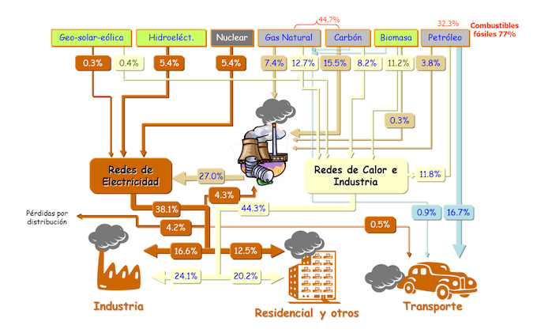

```{r setup, include=FALSE}
knitr::opts_chunk$set(echo = TRUE, comment = NA)
```

# Introducción

## Introducción

Empezaremos este tema mostrando diversos ejemplos que se pueden modelizar mediante técnicas de programación lineal.

El objetivo de la programación lineal es optimizar (maximizar o minimizar) una función lineal de $n$ variables sujetas a restricciones de igualdad o desigualdad, todas ellas también lineales.

## Introducción

La programación lineal se aplica a diversos campos, como por ejemplo

- Logística: problema del transporte
- Mezclas: problema de la dieta
- Producción- Asignación de tareas
- Finanzas
- Mercadotecnia


## Introducción

Cualquier problema de programación lineal consta de 4 componentes básicos

- El conjunto de datos del problema
- El conjunto de variables que intervienen en el problema, junto con sus dominios de definición, $D$
- El conjunto de restricciones del problema que definen el conjunto de soluciones admisibles, $R$
- La función a optimizar, $Z$

# El problema del transporte

## El problema del transporte

El problema del transporte se refiere al proceso de determinar el número de mercancías que se han de llevar desde cada uno de los orígenes a cada uno de los destinos posibles.

El objetivo suele ser minimizar el coste del transporte y las restricciones vienen dadas por las capacidades de producción de cada origen y las necesidades de cada destino

## Ejemplo 1{.example}

**Ejemplo 1**

Supóngase que un determinado producto se ha de llevar en cantidades $$u_1,u_2,\dots,u_m$$ desde $m$ puntos de origen y se ha de recibir en $n$ destinos en cantidades $v_1,v_2,\dots,v_n$

El problema consiste en determinar las cantidades $x_{ij}$ que se han de llevar del origen $i$ al destino $j$ para minimizar el coste del transporte


## Ejemplo 1{.example}

Los cuatro elementos principales del problema son:

1. Datos
2. Variables
3. Restricciones
4. Objetivo

Veámoslas una por una

## Ejemplo 1{.example}

1 - DATOS

- $m$: número de orígenes
- $n$: número de destinos
- $u_i$: cantidad de producto que se ha de llevar desde el origen $i$
- $v_j$: cantidad de producto que se ha de recibir en el destino $j$
- $c_{ij}$: coste de llevar una unidad de producto desde $i$ hasta $j$

## Ejemplo 1{.example}

2 - VARIABLES

- $x_{ij}$: cantidad de producto que se lleva desde $i$ hasta $j$ con

$$x_{ij}\ge 0\ \forall i =1,\dots, m,\ \forall j=1,\dots,n$$

A esto último se lo conoce como dominio de definición de variables. Es decir

$$D = \{x_{ij}: x_{ij}\ge 0\ \forall i =1,\dots, m,\ \forall j=1,\dots,n\}$$

## Ejemplo 1{.example}

3 - RESTRICCIONES

- La cantidad total del producto que surge de $i$ ($u_i$) ha de coincidir con la suma de las cantidades que surgen de $i$ a cada destino $j=1,\dots,n$ $$\sum_{j=1}^n x_{ij} = u_i$$
- La cantidad total de producto que recibe $j$ ($v_j$) ha de coindicir con la suma de cantidades que lleguen a $j$ desde todos los orígenes $i = 1,\dots,m$ $$\sum_{i = 1}^m x_{ij}=v_j$$

## Ejemplo 1{.example}

4 - OBJETIVO

- Minimizar el coste del envío

$$\min \sum_{i = 1}^m\sum_{j = 1}^nc_{ij}x_{ij}$$

## El problema del transporte

<div class = "center">

</div>

## Ejemplo 2

<div class = "example">
**Ejemplo 2**

Una compañía de ámbito nacional produce y distribuye una línea de neveras de alta eficiencia energética. 

La empresa tiene líneas de producción y montaje en dos ciudades, Pamplona y Calahorra, y tres cadenas de distribución localizadas en Madrid, Barcelona y Logroño. La oficina de Madrid presenta una demanda anual de 10000 neveras, la de Logroño 4000 y la de Barcelona 13000. 

La planta de Calahorra puede producir hasta 13000 neveras anuales y la de Pamplona 18000.

Los costes de transporte por unidad (en euros) son los mostrados en la siguiente tabla.

Se plantea un problema de programación lineal que minimiza los costes anuales de la compañía

</div>

<div class = "exercise">
**Ejercicio 1**

Enumera los cuatro elementos principales del problema. 
</div>

## Ejemplo 2

Origen / Destino | Madrid | Barcelona | Logroño |
----------------- | ------------------- | ------------------- | ------------------- | 
Pamplona | 3 | 1 | 5 |
Calahorra | 2 | 2 | 4 |

# El problema de la dieta

## El problema de la dieta

El problema de la dieta representa una de las primeras aplicaciones de la programación lineal que se utiliza en hospitales. 

Se usa para determinar la dieta de los pacientes que satisfacen unas especificaciones nutritivas mínimas de la forma más barata posible

Actualmente también se aplica en el sector de la ganadería con la misma idea: encontrar la combinación óptima de alimentos que consiguen una aportación nutritiva mínima suponiendo el menor coste posible.

## El problema de la dieta

<div class = "example">
**Ejemplo 3**

Un ganadero se quiere asegurar de que sus animales ingieren diariamente al menos 14 unidades de hierro, 12 de vitamina A y 18 de vitamina C

Un kilogramo de harina tiene un coste de 2€ y cuenta con 1 unidad de hierro, 1 de vitamina A y 3 de vitamina C. Un kilogramo de maíz tiene un coste de 3€ y contiene 2 unidades de hierro, 1 de vitamina A y 1 de vitamina C.

Determinad las posibles maneras de alimentar al ganado que satisfagan las necesidades mínimas alimenticias diarias con el mínimo coste posible
</div>

<div class = "exercise">
**Ejercicio 2**

Enumera los cuatro elementos principales del problema. 
</div>

# Producción

## Producción

<div class = "exercise">
**Ejercicio 3**

La tabla siguiente muestra todos los datos relativos a la producción, la demanda mensual y la composición de cada tipo de corbata.

Plantead un problema de programación lineal para determinar el plan de producción que maximiza los beneficios de la empresa

</div>

## Producción

<div class = "center">
Tipos | Precio venta | Demanda (mín-máx) | Metros necesarios | Composición |
--- | --- | --- | --- | --- |
Seda | 6.70 | 6000-7000 | 0.125 | 100% Seda | 
Poliester | 3.55 | 10000-14000 | 0.09 | 100% Poliester | 
Pol / Alg | 4.32 | 12000-17000 | 0.12 | 50% Pol, 50% Alg | 
Pol / Alg | 4.81 | 4000-9700 | 0.1 | 20% Pol, 80% Alg | 
</div>


## Producción
Coste y disponiblidad de los materiales
<div class = "center">
Material | Coste por metro | Metros disponibles/mes|
--- | --- | --- |
Seda | 21 | 800 |
Poliester | 6 | 3000 |
Algodón | 9 | 1600 |  
</div>

# Planificación de horarios

## Planificación de horarios

La planificación de horarios intenta dar respuesta efectiva a las necesidades de personal durante un periodo de tiempo concreto.

Sectores típicos donde se practica esta programación lineal para tomar decisiones sobre la planificación de horarios son las entidades bancarias, la educación y los grandes almacenes.

## Ejemplo 4

<div class = "example">
**Ejemplo 4**

Supongamos que una entidad bancaria necesita diariamente entre 10 y 20 cajeros en función de la hora del día. Las necesidades diarias se especifican en la siguiente tabla

</div>

## Ejemplo 4

<div class = "center">
Franja horaria | Número de cajeros |
--- | --- |
10:00 - 11:00 | 12 | 
11:00 - 12:00 | 15 | 
12:00 - 13:00 | 17 | 
13:00 - 14:00 | 20 | 
14:00 - 15:00 | 19 | 
15:00 - 16:00 | 18 |
16:00 - 17:00 | 13 | 
</div>

## Planificación de horarios

<div class = "example">
**Ejemplo 5**

La oficina tiene 12 trabajadores a jornada completa y dispone de personal suficiente para trabajar a media jornada. 

Un cajero que trabaja a media jornada debe estar operativo 4h al día y estar disponible para comenzar a trabajar a cualquier hora entre las 9:00 y las 13:00. Los trabajadores a jornada completa deben estar operativos desde las 9:00 hasta las 17:00 y tienen una hora libre para comer (la mitad come de 11:00 a 12:00 y la otra mitad de 12:00 a 13:00).

Las normas de la entidad limitan el número de horas realizadas por los trabajadores a tiempo parcial a, como mucho, el 50% de las horas diarias que se realicen. Nótese que se realizan 112 horas diarias. Estos trabajadores ganan 16€/día y los trabajadores a jornada completa 50€/día.

Plantead un problema de programación lineal que establezca un horario que minimiza los costes salariales del banco.

</div>

# Finanzas

## Ejemplo 6

<div class = "example">
**Ejemplo 6**

Un banco invierte en crédito al consumo, bonos corporativos, depósitos de oro y préstamos de la construcción. Actualmente dispone de cinco millones de euros para invertir y pretende, por un lado maximizar el interés esperado para los próximos seis meses y por el otro, cumplir con la diversificación propugnada por la Junta Directiva según se especifica en la tabla siguiente.

La Directiva también exige que como mínimo un 55% de los fondos se dediquen a depósitos de oro y préstamos a la construcción, mientras que el porcentaje dedicado a los créditos al consumidor no han de superar el 15% de los fondos.

Se plantea un problema de programación lineal que optimice el objetivo del banco

</div>

## Ejemplo 6

Tipos de inversión | Interés esperado (%) | Límite de inversión (millones de euros) |
--- | --- | --- |
Créditos al consumo | 7 | 1 |
Bonos corporativos | 11 | 2.5 |
Depósitos de oro | 19 | 1.5 |
Préstamos construcción | 15 | 1.8 |


# Mercadotecnia

## Mercadotecnia

La programación lineal se utiliza en el campo de la mercadotecnia y la publicidad como una herramienta que permite determinar cuál es la combinación lineal más efectiva de los medios para anunciar los productos de una empresa.

Muchas veces la empresa dispone de un presupuesto fijo para publicidad y el objetivo es distribuir este presupuesto entre diversas opciones: TV, radio, periódicos, revistas, Facebook, Google.... con el objetivo de que los productos de una empresa tengan la máxima difusión.

En otros casos, las restricciones vienen dadas por la disponibilidad de medios y de las políticas publicitarias de la empresa.

## Ejemplo 7

<div class = "example">
**Ejemplo 7**

Una cadena nacional de locales de ocio dispone de 8000 euros semanales para publicidad. Este dinero se ha de destinar a publicar anuncios en TV, periódicos y dos emisoras de radio.

El objetivo final es conseguir la mayor audiencia posible. La tabla siguiente recoge toda la información referente a la audiencia esperada por anuncio, el coste en euros de cada anuncio y el número máximo de anuncios semanales posibles en cada medio.

La empresa también exige la contratación de un mínimo de 5 anuncios por radio semanales y no se puede destinar a este medio más de 1800 euros por semana.

Plantead un problema de programación lineal que optimice el objetivo de la empresa

</div>


## Ejemplo 7


Medio | Audiencia | Coste (euros) | Número máximo |
--- | --- | --- | --- |
TV | 5000 | 800 | 12 |
Periódico | 8500 | 925 | 5 |
Radio 1 | 2400 | 290 | 25 |
Radio 2 | 2800 | 380 | 20 |

# Investigación de mercados

## Investigación de mercados

La programación lineal también se aplica al estudio de mercados.

Mediante el siguiente ejemplo se puede ver como la estadística puede emplear la programación lineal para el diseño de encuestas.


## Ejemplo 8

<div class = "example">

**Ejemplo 8**

Se va a realizar una encuesta para determinar la opinión de los ciudadanos de las Islas Baleares sobre la inmigración. La encuesta ha de satisfacer lo siguiente:

1. Entrevistar a un mínimo de 2300 familias baleares
2. En al menos 1000 familias entrevistadas, la persona de más edad no debe superar los 30 años
3. En al menos 600 familias entrevistadas, la edad de la mayor persona ha de estar comprendida entre los 31 y los 50 años, ambos incluidos
4. El porcentaje de familias entrevistadas que pertenecen a zonas con alta tasa de inmigración no ha de ser inferior al 15% del total

Todas las encuestas deben hacerse personalmente y ha de responder la persona de más edad de cada familia

La siguiente tabla indica el coste (en euros) de cada encuesta según la edad del encuestado y si pertenece o no a una zona con tasa elevada de inmigración

Plantead el problema de programación lineal que satisface todas las condiciones de la encuesta y minimiza su coste
</div>

## Ejemplo 8

Zona | <30 años | 31-50 años | >50 años |
--- | --- | --- | --- |
Baja inmigración | 6.9 | 7.3 | 6.1 |
Alta inmigración | 7.5 | 6.8 | 5.5 |

# Programación lineal

## Programación lineal

Ya se han visto en los ejemplos anteriores que la programación lineal se presenta en muchas aplicaciones en las cuales es necesaria la toma de decisiones

## Programación lineal

<l class = "definition">Problema de Programación Lineal (PPL).</l> La forma general de un problema PPL consiste en minimizar o maximizar una función

$$Z = f(x) = \sum_{j = 1}^n c_jx_j$$

bajo restricciones de la forma

$$\sum_{j = 1}^n a_{ij}x_j = b_i,\quad i=1,2,\dots,p-1$$
$$\sum_{j = 1}^n a_{ij}x_j \ge b_i,\quad i=p,p+1,\dots,q-1$$

## Programación lineal

$$\sum_{j = 1}^n a_{ij}x_j \le b_i,\quad i=q,q+1,\dots,m$$

donde $p,q,m$ son números enteros positivos tales que $1\le p\le q\le m$, donde normalmente $n\ge m$

## Programación lineal

<l class = "definition">Solución factible.</l> Un punto $x = (x_1,\dots,x_n)\in\mathbb{R}^n$ que satisface todas las restricciones del PPL se denomina solución factible.

<l class = "definition">Región factible.</l> El conjunto de todas las soluciones factibles, $R$

<l class = "definition">Solución óptima.</l> Un punto factible $\bar{x}$ tal que maximiza o minimiza la función $Z = f(x)$ del PPL. Es decir cuando cumple

$$f(\bar{x})\ge f(x)\qquad \text{o bien }\qquad f(\bar{x})\le f(x)$$

para cualquier otro punto factible $x$

## Programación lineal

El objetivo de los problemas de optimización es encontrar un óptimo global. En general, solo se encuentran locales.

Los PPL presentan propiedades que hacen posible encontrar el óptimo global

## Propiedades

1. Si la región factible está acotada, entonces el problema siempre tiene solución
2. El óptimo de un PPL es siempre un óptimo global.
3. Si $x$ e $y$ son soluciones de un PPL, entonces cualquiera que sea la combinación lineal convexa de ellos también es una solución óptima: $$\lambda x+(1-\lambda)y,\qquad \lambda\in[0,1]$$
4. La solución óptima alcanza siempre, al menos, un punto extremo de la región factible

# Ejemplos de PPL

## Ejemplos de PPL

Se verán a continuación una serie de ejemplos de PPL con solución única, solución múltiple, solución no acotada y solución infactible (sin solución)

## Ejemplo 9

<div class = "example">
**Ejemplo 9**

Maximícese la función $Z = 3x+y$ bajo las restricciones

$$\left\{\begin{matrix}-x+y\le 2\\
x+y\le 6\\
x\le 3\\
2x-y\le 4\\
-y\le 0\\
-x-y\le -1\\
-x\le 0\end{matrix}\right.$$

Representad gráficamente la región factible. Ésta será la intersección de todos los semiplanos que determinen cada una de las restricciones. 

</div>

## Ejemplo 9

<div class = "example">
Considerad las siguientes rectas:

$$r_1: -x+y = 2$$
$$r_2: x+y = 6$$
$$r_3: x = 3$$
$$r_4: 2x-y = 4$$
$$r_5: -y = 0\quad\Leftrightarrow\quad r_5:y=0$$
$$r_6: -x-y = -1\quad\Leftrightarrow\quad r_6:x+y=1$$
$$r_7: -x = 0\quad\Leftrightarrow\quad r_7:x=0$$

</div>

## Ejemplo 9

<div class = "example">
- La recta $r_1$ pasa por los puntos $(0,2)$ y $(-2,0)$
- La recta $r_2$ pasa por los puntos $(0,6)$ y $(6,0)$
- La recta $r_3$ es paralela al eje $y$
- La recta $r_4$ pasa por los puntos $(0,-4)$ y $(2,0)$
- La recta $r_5$ es paralela al eje $x$
- La recta $r_6$ pasa por los puntos $(0,1)$ y $(1,0)$
- La recta $r_7$ es paralela al eje $y$
</div>

## Ejemplo 9

<div class = "example">
Al representar gráficamente estas rectas, obtenemos las intersecciones siguientes

- $r_1\cap r_2 = \{(2,4)\}$
- $r_2\cap r_3 = \{(3,3)\}$
- $r_3\cap r_4 = \{(3,2)\}$
</div>

## Ejemplo 9

<div class = "center">

</div>

## Ejemplo 9

<div class = "example">
La región factible $R$ en este caso es un polígono cerrado. 

Las soluciones siempre se encuentran en los extremos de la región factible, por lo tanto se evaluará la función objetivo $Z = 3x+y$ en los vértices de $R$

- $Z(0,1) = 1$
- $Z(0,2) = 2$
- $Z(2,4) = 10$
- $Z(3,3) = 12$
- $Z(3,2) = 11$
- $Z(2,0) = 6$
- $Z(1,0) = 3$


Por lo tanto, el máximo se alcanza en el punto $\bar{x} = (3,3)$ y vale $Z(3,3)=12$
</div>

## Ejemplo 10

<div class = "example">
**Ejemplo 10**

Maximizad la función $Z = x+y$ bajo las siguientes restricciones

$$\left\{\begin{matrix}-x+y\le 2\\
x+y\le 6\\
x\le 3\\
2x-y\le 4\\
-y\le 0\\
-x-y\le -1\\
-x\le 0\end{matrix}\right.$$
</div>

## Ejemplo 10

<div class = "example">
Observad que las restricciones de nuestro PPL son exactamente las mismas que en el ejemplo anterior, el `Ejemplo 9`. Por lo tanto, la región factible será la misma.

Sin embargo, al evaluar la función objetivo en los vértices obtenemos que el máximo se alcanza en los puntos $(2,4)$ y $(3,3)$. De este modo, los puntos del segmento que une estos dos puntos son máximos globales de nuestro PPL. Este segmento estará sobre la recta $r_2$
</div>

## Ejemplo 11

<div class = "example">
**Ejemplo 11**

Maximizad la función $Z = 3x+y$ bajo las siguientes restricciones

$$\left\{\begin{matrix}-x+y\le 2\\
-y\le 0\\
-x-y\le -1\\
-x\le 0\end{matrix}\right.$$

En este caso se puede observar que la región factible no está acotada en la dirección de crecimiento de la función objetivo
</div>

## Ejemplo 11

<div class = "center">

</div>

## Ejemplo 12

<div class = "example">
**Ejemplo 12**

Minimizar la función $Z = 0.6x+y$ bajo las siguientes restricciones

$$\left\{\begin{matrix}10x+4y\ge 20\\
5x+5y\ge 20\\
2x+6y\ge 12\\
x\ge 0\\
y\ge 0\end{matrix}\right.$$

</div>

## Ejemplo 12

<div class = "example">
En este caso la región factible no está acotada, pero la función objetivo alcanza el mínimo en el punto $(3,1)$ y vale $Z = 2.8$
</div>

## Ejemplo 12

<div class = "center">

</div>

## Ejemplo 13

<div class = "example">
**Ejemplo 13**

Minimizad la función $Z = 2x-3y$ bajo las siguientes restricciones

$$\left\{\begin{matrix}x-2y\ge 4\\
2x-4y\le -6\\
x\ge 0\\
y\ge 0\end{matrix}\right.$$

En este caso, la región facitble es $R = \emptyset$, es decir, el problema no tiene solución
</div>

# Forma estándar de un PPL

## Forma estándar de un PPL

Para describir un PPL se necesita

- Un vector $c = (c_1,\dots,c_n)\in\mathbb{R}^n$, que serán los coeficientes de la función objetivo
- Un vector $b = (b_1\dots,b_m)\in\mathbb{R}^m$ con $b_i\ge 0$ para todo $i = 1\dots, m$, que será el vector de términos independientes
- Una matriz $A = (a_{ij})_{m\times n}$, que corresponderá a las restricciones

## Forma estándar de un PPL

Con estos elementos, el problema lineal asociado en forma estándar tiene la forma siguiente:

$$\min\{Z\} = cx\qquad \text{ o }\qquad \max\{Z\} = cx$$

bajo las restricciones $$Ax = b$$

donde $$x = \begin{pmatrix}x_1\\ \vdots\\ x_n\end{pmatrix}\quad b = \begin{pmatrix}b_1\\ \vdots\\ b_m\end{pmatrix}$$

con $x_j\ge 0$ para todo $j = 1,\dots,n$. Normalmente se tiene $n\ge m$

## Forma estándar de un PPL

<l class = "definition">PPL en forma estándar.</l> Si se cumplen:

- Es de minimización o de maximización
- Solo incluye restricciones de igualdad
- $b_i\ge 0$ para todo $i = 1,\dots,m$
- $x_j\ge 0$ para todo $j = 1,\dots,n$

## Transformación de un PPL a su forma estándar

Cualquier PPL se puede transformar a la forma estándar:

**PASO 1**: Transformar las variables en no negativas.

Las variables no restringidas en signo se pueden expresar como diferencia de dos variables no negativas. Se define

$$x_i^+ = \max\{0,x_i\}$$
$$x_i^- = \max\{0,-x_i\}$$

Se satisface que $x_i^+,\ x_i^-\ge 0$ y que $x_i = x_i^+-x_i^-$

## Transformación de un PPL a su forma estándar

**PASO 2**: Transformar las restricciones de desigualdad en igualdades

Las restricciones de desigualdad se pueden transformar en restricciones de igualdad equivalentes introduciendo nuevas variables denominadas <l class = "definition">variables compensatorias</l>. Si $a_{i1}x_1+\cdots+a_{in}x_n\le b_i$, entonces existe una variable $x_{n+1}\ge 0$ tal que

$$a_{i1}x_1+\cdots+a_{in}x_n+x_{n+1} = b_i$$

Si $a_{i1}x_1+\cdots+a_{in}x_n\ge b_i$, entonces existe una variable $x_{n+1}\ge 0$ tal que

$$a_{i1}x_1+\cdots+a_{in}x_n-x_{n+1} = b_i$$

## Transformación de un PPL a su forma estándar

**PASO 3**: Maximizar es lo mismo que minimizar

Si nos piden maximizar $Z=cx$, esto es equivalente a minimizar $Z = -cx$ si ambos problemas verifican el mismo conjunto de restricciones.

Por otro lado, si nos piden minimizar $Z=cx$, esto es equivalente a maximizar $Z = -cx$ siempre y cuando ambos problemas verifican el mismo conjunto de restricciones.


**PASO 4**: No negatividad de los términos independientes

Toda restricción con término independiente $b_i<0$ se puede transformar en otra con término independiente no negativo multiplicando toda la restricción por $-1$

## Ejemplo 14

<div class = "example">
**Ejemplo 14**

Encuentra el máximo de $Z = 2x_1-3x_2+5x_3$ bajo las restricciones siguientes

$$\left\{\begin{matrix}x_1+x_2\le 2\\
3x_1+x_2-x_3\ge 3\\
x_1,x_2,x_3\ge 0\end{matrix}\right.$$

</div>

## Ejemplo 14{.example}

Para resolverlo se escribirá en forma estándar de máximo. 

- Observa que todas las variables son no negativas. 
- Se tendrán que transformar las restricciones de desigualdad en igualdades, así que habrá que añadir variables compensatorias


## Ejemplo 14

<div class = "example">
En forma estándar será

$$\max Z = 2x_1-3x_2+5x_3+0\cdot x_4+0\cdot x_5$$

bajo las restricciones

$$\left\{\begin{matrix}x_1+x_2+x_4 = 2\\
3x_1+x_2-x_3-x_5 = 3\\
x_1,x_2,x_3,x_4,x_5\ge 0\end{matrix}\right.$$
</div>

## Ejemplo 14
<div class = "example">
Si quisiésemos el mismo problema en forma estándar de mínimo, lo que tendríamos sería

$$\min Z = -2x_1+3x_2-5x_3+0\cdot x_4+0\cdot x_5$$

bajo las restricciones

$$\left\{\begin{matrix}x_1+x_2+x_3 = 2\\
3x_1+x_2-x_3-x_5 = 3\\
x_1,x_2,x_3,x_4,x_5\ge 0\end{matrix}\right.$$

## Ejemplo 15

<div class = "example">
**Ejemplo 15**

Encuentra el máximo de $Z = 2x_1-3x_2+5x_3$ bajo las siguientes restricciones

$$\left\{\begin{matrix}x_1+x_2\le 2\\
3x_1+x_2-x_3\ge 3\\
x_1,x_2\ge 0\end{matrix}\right.$$

Observad que lo único que cambia con respecto al ejemplo anterior, el `Ejemplo 14`, es que la variable $x_3$ no está restringida en signo. Por tanto, debemos escribir $$x_3 = x_6-x_7$$

donde $x_6 = x_3^+$ y $x_7 = x_3^-$ y tal que $x_3^+,x_3^-\ge 0$.
</div>

## Ejemplo 15

<div class = "example">

De este modo, la forma estándar de este PPL sería

$$\max Z = 2x_1-3x_2+5(x_6-x_7)+0\cdot x_4+0\cdot x_5$$

bajo las siguientes restricciones

$$\left\{\begin{matrix}x_1+x_2+x_4 =0\\
3x_1+x_2-(x_6-x_7)-x_5 = 3\\
x_1,x_2,x_4,x_5,x_6,x_7\ge 0\end{matrix}\right.$$
</div>

## Ejemplo 16

<div class = "example">
**Ejemplo 16**

Hallad el máximo de $Z = 3x_1-x_3$ bajo las siguientes restricciones

$$\left\{\begin{matrix}x_1+x_2+x_3 = 1\\
x_1-x_2-x_3\le 1\\
x_1+x_3\ge -1\\
x_1\ge 0\end{matrix}\right.$$

Como todas las variables han de ser no negativas, 

$$x_2 = x_4-x_5\quad \text{ donde }\quad x_4 = x_2^+;\ x_5 = x_2^-$$
$$x_3 = x_6-x_7\quad \text{ donde }\quad x_6 = x_3^+;\ x_7 = x_3^-$$

donde $x_4,x_5,x_6,x_7\ge 0$

</div>

## Ejemplo 16

<div class = "example">

Notad también que el término independiente de la tercera restricción es negativo, con lo cual se multiplica por $-1$.

Con todo, el PPL inicial en su forma estándar será:

$$\max Z = 3x_1-x_6+x_7$$

bajo las restricciones

$$\left\{\begin{matrix}x_1+x_4-x_5+x_6-x_7 = 1\\
x_1-x_4+x_5-x_6+x_7 \le 1\\
-x_1-x_6+x_7 \le 1\\
x_1,x_4,x_5,x_6,x_7\ge 0\end{matrix}\right.$$
</div>

## Ejemplo 16
<div class = "example">

Ahora ya solo nos falta transformar las restricciones de desigualdad en restricciones de igualdad. Con lo cual nos queda

$$\left\{\begin{matrix}x_1+x_4-x_5+x_6-x_7 = 1\\
x_1-x_4+x_5-x_6+x_7+x_8 = 1\\
-x_1-x_6+x_7+x_9 = 1\\
x_1,x_4,x_5,x_6,x_7,x_8,x_9\ge 0\end{matrix}\right.$$
</div>

# Soluciones básicas de un PPL

## Soluciones básicas de un PPL

Supongamos que un PPL viene dado en su forma estándar


$$\min Z = cx$$ bajo las restricciones $Ax = b$, donde $$x = (x_1,x_2,\dots,x_n)\quad x_j\ge 0,\ \forall j = 1,\dots,n$$
$$b = (b_1,b_2,\dots,b_m)\quad b_i\ge 0,\ \forall i = 1,\dots,m$$
$$A = (a_{ij})_{m\times n}$$

## Soluciones básicas de un PPL

Se pueden suponer sin pérdida de generalidad que $\text{rg}(A) = m$ ya que $m\le n$ y que $Ax = b$ tiene solución.

En cualquier otro caso, o bien el sistema es equivalente a otro sistema compatible con menos ecuaciones o bien el sistema es incompatible.

## Soluciones básicas de un PPL

Sea $A$ la matriz definida anteriormente, entonces,

<l class = "definition">Matriz básica de $A$.</l> Toda matriz cuadrada de orden $m$, $M_b$, de rango $m$ extraída de $A$

<l class = "definition">Matriz básica factible de $A$.</l> Si es básica de $A$ y satisface $M_b^{-1}b\ge 0$

## Soluciones básicas de un PPL

Sea $x_b$ el vector de las variables asociadas a las columnas de $M_b$

<l class = "definition">Variables básicas.</l> Las pertenecientes al vector $x_b$

<l class = "definition">Variables no básicas.</l> El resto de las variables, las cuales pertenecen al vector $x_n$

Si se asigna el valor cero a las variables no básicas $x_n$, el sistema $Ax=b$ se puede escribir como 

$$\begin{pmatrix} M_b &|& x_n\end{pmatrix}\begin{pmatrix}x_b\\ 0\end{pmatrix} = b$$
Donde $M_bx_b = b$ y, como $M_b$ es invertible, $x_b = M_b^{-1}b$ es la <l class = "definition">solución básica asociada a $M_b$</l>.

Si además $M_b$ es una matriz básica factible, su solución básica es factible

## Ejemplo 17

<div class = "example">
**Ejemplo 17**

Encuentra las soluciones básicas de

$$\left\{\begin{matrix}
x_1 &+& 2x_2 &+& x_3&=&8\\
x_1 &+& 3x_2 &-& x_3&=&12\end{matrix}\right.$$

Se tiene que $$A = \begin{pmatrix}1 & 2 & 1\\ 1 & 3 & -1\end{pmatrix}\quad b = \begin{pmatrix} 8\\12\end{pmatrix}$$
</div>

## Ejemplo 17

<div class = "example">
Si se considera $$M_b = \begin{pmatrix} 1 & 2\\ 1 & 3\end{pmatrix}$$

Las variables básicas son $x_1,x_2$ y la variable no básica $x_3=0$, entonces:

$$x_b = M_b^{-1}b = \begin{pmatrix}3 & -2\\ -1 & 1\end{pmatrix}\begin{pmatrix}8\\ 12\end{pmatrix} = \begin{pmatrix}0 \\ 4\end{pmatrix}$$

De este modo, $(x_1,x_2) = (0,4)$ es una solución básica factible
</div>

## Ejemplo 17

<div class = "example">

Si se considera $$M_b = \begin{pmatrix} 1 & 1\\ 1 & -1\end{pmatrix}$$

Las variables básicas son $x_1,x_3$ y la variable no básica $x_2=0$, entonces:

$$x_b = M_b^{-1}b = \begin{pmatrix}\frac{1}{2} & \frac{1}{2}\\ \frac{1}{2} & -\frac{1}{2}\end{pmatrix}\begin{pmatrix}8\\ 12\end{pmatrix} = \begin{pmatrix}10 \\ -2\end{pmatrix}$$

En este caso se obtiene una solución básica no factible ya que $x_3<0$

</div>

## Ejemplo 17

<div class = "example">

Si se considera $$M_b = \begin{pmatrix} 2 & 1\\ 3 & -1\end{pmatrix}$$

Las variables básicas son $x_2,x_3$ y la variable no básica $x_1=0$, entonces:

$$x_b = M_b^{-1}b = \begin{pmatrix}\frac{1}{5} & \frac{1}{5}\\ \frac{3}{5} & -\frac{2}{5}\end{pmatrix}\begin{pmatrix}8\\ 12\end{pmatrix} = \begin{pmatrix}4 \\ 0\end{pmatrix}$$

De este modo, $(x_2,x_3) = (4,0)$ es una solución básica factible

</div>

## Ejemplo 17

<div class = "example">
El número de soluciones básicas factibles de un PPL acotado con un número finito de restricciones es siempre finito y a cada una le corresponde un punto extremo de la región factible
</div>

## Soluciones básicas de un PPL

<l class = "prop">Teorema.</l> Sea $$R = \{x = (x_1,x_2,\dots,x_n):\ Ax = b,\ x_j\ge 0, j = 1,\dots,n\}$$
donde $A = (a_{ij})_{m\times n}$ y $\text{rg}(A) = m$, entonces $x\in\mathbb{R}^n$ es un punto extremo de $R$ si, y solo si, $A$ se puede descomponer como $A = \begin{pmatrix}M_b &|& x_n\end{pmatrix}$ tal que

$$x = \begin{pmatrix}x_b \\ x_n\end{pmatrix}\begin{pmatrix}M_b^{-1}b\\ 0\end{pmatrix}$$

donde $M_b$ es una matriz de orden $m$ invertible, extraída de $A$ que satisface $M_b^{-1}b\ge 0$

## Soluciones básicas de un PPL

<l class = "observ">Observación.</l> Recordad que si $M_b$ es una matriz de orden $m$ invertible, es equivalente por filas a la matriz identidad $I_m$ o a cualquier otra matriz de orden $m$, las columnas de la cual son los vectores unitarios $$e_1 = (1,0,\dots,0),\ e_2 = (0,1,\dots,0),\dots,\ e_m = (0,0,\dots,1) $$

no necesariamente en este orden

## Soluciones básicas de un PPL

<l class = "prop">Propiedad fundamental de la programación lineal.</l> Si un PPL tiene una solución óptima, esta es una solución básica factible.

Por lo tanto, para hallar el óptimo de un PPL se encontrará el conjunto de soluciones factibles.

# El Método Símplex

## El Método Símplex

<l class = "definition">Método Símplex.</l> Se trata de un procedimiento algebraico (no geométrico) mediante el cual se pasa de una solución básica factible inicial (o cualquier otra) a una solución básica factible adyacente, mejorando, o al menos no empeorando, el valor de la función objetivo.

Existen muchas versiones del Método Símplex y todas pretenden lo mismo: encontrar la solución óptima de un PPL.

## El Método Símplex

Para encontrar este óptimo se emplean unas tablas. Se parte de una tabla inicial y se van transformando los valores de la tabla hasta llegar a la solución óptima.

Aquí aplicaremos el método revisado del símplex que incluye la función objetivo en las tablas. En el Método Símplex se toma como matriz básica factible inicial la matriz identidad o cualquier otra matriz básica factible obtenida a partir de la identidad haciendo intercambios de filas

## Ejemplo 18

<div class = "example">
**Ejemplo 18**

Encuentra el máximo de $Z = 40x_1 + 30x_2$ bajo las restricciones

$$\left\{\begin{matrix}x_1\le 16\\
x_2\le 8\\
x_1+2x_2\le 24\\
x_1,x_2\ge 0\end{matrix}\right.$$
</div>

## Ejemplo 18{.example}

Resolviéndolo gráficamente se obtiene la región factible con vértices $$(0,0), (16,0), (16,4), (8,8), (0,8)$$ y evaluando $Z$ en dichos vértices se obtiene que el máximo se alcanza en el punto $(16,4)$ y vale $Z_{\max} = 760$

## Ejemplo 18

<div class = "center">

</div>

## Ejemplo 18

<div class = "example">
Para aplicar el Método Símplex se deben hacer una serie de pasos:

**PASO 1**

Se debe escribir el problema en forma estándar de máximo, que será el mismo que denota el sistema:

$$\begin{matrix}
Z & -& 40x_1 & -& 30x_2 &+& 0\cdot x_3 &&+& 0\cdot x_4&+& 0\cdot x_5 & = & 0\\
& & x_1 & &  &+&  x_3 &&& && & = & 16\\
& &  & &  x_2&&  &+&x_4& && & = & 8\\
& & x_1 &+ &  2x_2&&  &&& &+&x_5 & = & 24\\
\end{matrix}$$

con $x_1,x_2,x_3,x_4,x_5\ge 0$

Ahora, podemos construir la siguiente tabla
</div>

## Ejemplo 18


 $\ $ | $Z$ | $x_1$ | $x_2$ | $x_3$ | $x_4$ | $x_5$ | Constantes |
---|---|---|---|---|---|---|---|
fila 1 | 1 | -40 | -30 | 0 | 0 | 0 | 0 |
fila 2 | 0 | 1 | 0 | 1 | 0 | 0 | 16 |
fila 3 | 0 | 0 | 1 | 0  | 1 | 0 | 8 |
fila 4 | 0 | 1 | 2 | 0 | 0 | 1 | 24 |

## Ejemplo 18

<div class = "example">
La matriz básica factible inicial (matriz identidad) corresponde a las variables básicas, en este caso las variables compensatorias $x_3,x_4,x_5$ y las variables no básicas son $x_1=x_2=0$

Teniendo en cuenta también la fila 1 de la tabla, se puede expresar el sistema

$$\begin{pmatrix}1 & 0 & 0 & 0\\
0 & 1 & 0 & 0\\
0 & 0 & 1 & 0\\
0 & 0 & 0 & 1\end{pmatrix}\begin{pmatrix}
Z\\ x_3\\ x_4\\ x_5\end{pmatrix} = \begin{pmatrix}
0\\ 16\\ 8\\ 24
\end{pmatrix}$$

Que  corresponde a $x_3 = 16,\ x_4 = 8,\ x_5 = 24,\ Z=0$, con $(x_1,x_2) = (0,0)$. Observad que $(0,0)$ es uno de los vértices de la región factible
</div>

## Ejemplo 18

<div class = "example">
**PASO 2**

- Se busca la columna que en la fila 1 tiene la entrada negativa con mayor valor absoluto, <l class = "definition">columna pivote</l>
- Se dividen las constantes por los valores positivos de la columna pivote y se elige el mínimo, la fila correspondiente a este mínimo será la <l class = "definition">fila pivote</l>
- El elemento que esté en la intersección de la fila y la columna pivotes debe corresponderse con la nueva variable básica. Notad que en nuestro caso la columna pivote es la segunda y la fila pivote es la segunda fila, ya que la entrada negativa con mayor valor absoluto es $-40$ (columna de $x_1$) y $\min\{\frac{16}{1},\frac{24}{1}\} = 16$ se encuentra en la segunda fila. En definitiva, el pivote es 1 y le corresponde la variable $x_1$.
- Se transforma la tabla inicial de forma que la columna pivote sea un vector unitario (todos los elementos de la columna han de ser nulos salvo el pivote que debe ser 1).
</div>

## Ejemplo 18

 $\ $ | $Z$ | $x_1$ | $x_2$ | $x_3$ | $x_4$ | $x_5$ | Constantes |
---|---|---|---|---|---|---|---|
fila 1 | 1 | 0 | -30 | 40 | 0 | 0 | 640 |
fila 2 | 0 | 1 | 0 | 1 | 0 | 0 | 16 |
fila 3 | 0 | 0 | 1 | 0  | 1 | 0 | 8 |
fila 4 | 0 | 0 | 2 | -1 | 0 | 1 | 8 |

## Ejemplo 18

<div class = "example">
De la tabla se puede extraer el sistema básico:

$$\begin{pmatrix}1 & 0 & 0 & 0\\
0 & 1 & 0 & 0\\
0 & 0 & 1 & 0\\
0 & 0 & 0 & 1\end{pmatrix}\begin{pmatrix}
Z\\ x_1\\ x_4\\ x_5\end{pmatrix} = \begin{pmatrix}
640\\ 16\\ 8\\ 8\end{pmatrix}$$

Lo que se corresponde con $x_1 = 16,\ x_4 = 8\ x_5 = 8$ y $Z = 640$, con $x_2 = x_3 = 0$.

Observad que de nuevo $(x_1,x_2)= (16,0)$ es otro vértice de la región factible

</div>

## Ejemplo 18

<div class = "example">
**PASO 3**

Como en la fila 1 todavía hay un número negativo, la solución se puede mejorar. Iterando el paso anterior, obtenemos

- La nueva variable básica es $x_2$.
- Si hacemos $\min\{\frac{8}{1},\frac{8}{2}\}$, se obtiene que el pivote está en la fila 4
- El pivote es 2, por tanto se divide la cuarta fila entre 2 para obtener así el pivote 1
- Finalmente, se hacen 0 el resto de elementos de la tercera columna, la columna pivote.

</div>

## Ejemplo 18

 $\ $ | $Z$ | $x_1$ | $x_2$ | $x_3$ | $x_4$ | $x_5$ | Constantes |
---|---|---|---|---|---|---|---|
fila 1 | 1 | 0 | 0 | 25 | 0 | 15 | 760 |
fila 2 | 0 | 1 | 0 | 1 | 0 | 0 | 16 |
fila 3 | 0 | 0 | 0 | $\frac{1}{2}$  | 1 | $-\frac{1}{2}$ | 4 |
fila 4 | 0 | 0 | 1 | $-\frac{1}{2}$ | 0 | $\frac{1}{2}$ | 4 |

## Ejemplo 18

<div class = "example">
De la tabla se puede extraer el sistema básico:

$$\begin{pmatrix}1 & 0 & 0 & 0\\
0 & 1 & 0 & 0\\
0 & 0 & 1 & 0\\
0 & 0 & 0 & 1\end{pmatrix}\begin{pmatrix}
Z\\ x_1\\ x_4\\ x_2\end{pmatrix} = \begin{pmatrix}
760\\ 16\\ 4\\ 4\end{pmatrix}$$

Lo que se corresponde con $x_1 = 16,\ x_2 = 4,\ x_4 = 4$ y $Z = 760$, con $x_3 = x_5 = 0$.

Observad que de nuevo $(x_1,x_2)= (16,4)$ es otro vértice de la región factible

Como en la fila 1 ya no quedan números negativos, tenemos que la solución no se puede mejorar

En conclusión, el máximo de $Z$ se toma en el punto $(x_1,x_2) = (16,4)$
</div>

## El Método Símplex en problemas de minimización

En problemas de minimización no se puede aplicar directamente el método que se ha descrito anteriormente. Veamos con un ejemplo cómo proceder en este caso:

## Ejemplo 19

<div class = "example">
**Ejemplo 19**

Encontrad el mínimo de $Z = x_1 + 4x_2$ bajo las siguientes restricciones

$$\left\{\begin{matrix}x_1+x_2\ge 8\\
3x_1+2x_2\ge 12\\
x_1,x_2\ge 0\end{matrix}\right.$$
</div>

<div class = "exercise">
**Ejercicio 4**

Resuelve este problema gráficamente
</div>

## Ejemplo 19{.example}

Si se escrible en forma estándar de mínimo, obtenemos

$$\min Z = x_1 +4x_2 +0\cdot x_3+0\cdot x_4$$

bajo las restricciones

$$\left\{\begin{matrix}x_1+x_2-x_3 =  8\\
3x_1+2x_2-x_4 = 12\\
x_1,x_2,x_3,x_4\ge 0\end{matrix}\right.$$

O lo que es lo mismo

$$\begin{pmatrix}1 & 2 & -1 & 0\\
3 & 2 & 0 & -1\end{pmatrix}\begin{pmatrix}
x_1\\ x_2\\ x_3\\ x_4\end{pmatrix}=\begin{pmatrix}8\\12\end{pmatrix}$$

con $x_1,x_2,x_3,x_4\ge 0$

## Ejemplo 19{.example}

Se puede observar que de la matriz de coeficientes no se puede extraer la matriz identidad como matriz básica factible inicial. En cambio, se podría extraer la matriz $$\begin{pmatrix}-1 & 0\\ 0 & -1\end{pmatrix}$$

que corresponden a las variables básicas $x_3,x_4$. La solución $x_3 = -8,\ x_4 = -12$, resulta ser una solución básica no factible.

Consecuentemente, se ha de buscar una manera de obtener una solución básica factible inicial. Esta se obtiene añadiendo una variable artificial no negativa a cada una de las restricciones. Estas variables artificiales aparecerán en la función objetivo con coeficientes considerablemente grandes con respecto a los coeficientes de las variables del problema dado

## Ejemplo 19{.example}

Una vez se añaden estas variables compensatorias y artificiales al problema de minimización, se aplicará el Método Símplex aplicando los pasos siguientes

- Se escribe la tabla inicial
- Se transforman las columnas de las variables artificiales en vectores unitarios
- Se busca el pivote: de entre todas las columnas de las variables se elige la columna con la entrada positiva mayor. Para determinar la fila pivote se hace lo mismo que en el caso de la maximización

## Ejemplo 19{.example}

Si se considera el problema de minimización dado en este ejemplo, una vez añadidas las variables artificiales se tiene:

$$\begin{matrix}
Z &-&x_1 & - & 4x_2 & +&0x_3& +&0x_4 & -&100v_1& -&100v_2&=&0\\
 &&x_1 & + & 2x_2 & -&x_3& & & +&v_1& &&=&8\\
 &&3x_1 & + & 2x_2 & &&-&x_4 & && +&v_2&=&12\end{matrix}$$

con $x_1,x_2,x_3,x_4,v_1,v_2\ge 0$

Si escribimos ahora la tabla inicial del problema, obtenemos:

## Ejemplo 19

 $\ $ | $Z$ | $x_1$ | $x_2$ | $x_3$ | $x_4$ | $v_1$ | $v_2$ | Constantes |
---|---|---|---|---|---|---|---|---|
fila 1 | 1 | -1 | -4 | 0 | 0 | -100 | -100 | 0 |
fila 2 | 0 | 1 | 2 | -1 | 0 | 1 | 0 | 8 |
fila 3 | 0 | 3 | 2 | 0 | -1  | 0 | 1 |  12 |

## Ejemplo 19{.example}

Si hacemos $f_1 +100f_2 +100_f3$ los vectores columna de las variables artificiales se transforman en unitarios y se obtiene la siguiente tabla

## Ejemplo 19

 $\ $ | $Z$ | $x_1$ | $x_2$ | $x_3$ | $x_4$ | $v_1$ | $v_2$ | Constantes |
---|---|---|---|---|---|---|---|---|
fila 1 |1| 399 | 396 | -100 | -100 | 0 | 0 | 2000 |
fila 2 | 0 | 1 | 2 | -1 | 0 | 1 | 0 | 8 |
fila 3 | 0 | 3 | 2 | 0 | -1  | 0 | 1 |  12 |

## Ejemplo 19{.example}

La columna pivote corresponde a la columna de la variable $x_1$ y la fila pivote es la tercera ya que $\min\{\frac{8}{1},\frac{12}{3}\} = 4$. A continuación, se divide $f_3$ entre 3 para obtener el pivote 1

## Ejemplo 19

 $\ $ | $Z$ | $x_1$ | $x_2$ | $x_3$ | $x_4$ | $v_1$ | $v_2$ | Constantes |
---|---|---|---|---|---|---|---|---|
fila 1 |1| 0 | 130 | -100 | 33 | 0 | -133 | 404 |
fila 2 | 0 | 0 | $\frac{4}{3}$ | -1 | $\frac{1}{3}$ | 1 | $-\frac{1}{3}$ | 4 |
fila 3 | 0 | 1 | $\frac{2}{3}$ | 0 | $-\frac{1}{3}$  | 0 | $\frac{1}{3}$ |  4 |

## Ejemplo 19{.example}

De este modo, se obtiene el sistema

$$\begin{pmatrix}
1 & 0 & 0\\
0 & 1 & 0\\
0 & 0 & 1\end{pmatrix}\begin{pmatrix}
Z\\ v_1\\ x_1
\end{pmatrix} = \begin{pmatrix}
404\\ 4\\ 4\end{pmatrix}$$

lo que corresponde a la solución $(x_1,x_2) = (4,0)$ con $Z = 404$ ya que $x_2 = x_3 = x_4 = v_2 = 0$ mientras que $v_1 = 4$.

Notad que en la solución aparece la variable artificial $v_1 = 4$, que no nos interesa. La solución no es óptima, ya que todavía quedan elementos positivos en la primera fila.

Ahora, la columna pivote corresponde a la variable $x_2$ y la fila pivote será la segunda fila

## Ejemplo 19

 $\ $ | $Z$ | $x_1$ | $x_2$ | $x_3$ | $x_4$ | $v_1$ | $v_2$ | Constantes |
---|---|---|---|---|---|---|---|---|
fila 1 |1| 0 | 0 | $-\frac{5}{2}$ | $\frac{1}{2}$ | $-\frac{195}{2}$ | $-\frac{201}{2}$ | 14 |
fila 2 | 0 | 0 | 1 | -$\frac{3}{4}$ | $\frac{1}{4}$ | $\frac{3}{4}$ | $-\frac{1}{4}$ | 3 |
fila 3 | 0 | 1 | 0 | $\frac{1}{2}$| $-\frac{1}{2}$  | $-\frac{1}{2}$ | $\frac{1}{2}$ |  2 |

## Ejemplo 19{.example}

La solución todavía no es óptima.

Se itera el proceso anterior y se obtiene que la columna pivote se corresponde a la variable $x_4$ y la fila pivote será la segunda, con pivote $\frac{1}{4}$. Por tanto, multiplicamos dicha fila por 4.

Notad que la fila 3 no puede ser pivote ya que hay un número negativo y, si dividiésemos el término independiente entre $-\frac{1}{2}$ este pasaría a ser negativo

## Ejemplo 19

 $\ $ | $Z$ | $x_1$ | $x_2$ | $x_3$ | $x_4$ | $v_1$ | $v_2$ | Constantes |
---|---|---|---|---|---|---|---|---|
fila 1 | 1 | 0 | -2 | -1 | 0 | -99 | -100 | 8 |
fila 2 | 0 | 0 | 4 | -3 |1 | 3 | -1 | 12 |
fila 3 | 0 | 1 | 2 | -1 | 0  | 1 | 0 |  8 |

## Ejemplo 19{.example}

De este modo, extraemos el sistema

$$\begin{pmatrix}
1 & 0 & 0\\
0 & 1 & 0\\
0 & 0 & 1\end{pmatrix}\begin{pmatrix}
Z\\ x_4\\ x_1
\end{pmatrix} = \begin{pmatrix}
8\\ 12\\ 8\end{pmatrix}$$

que corresponde a la solución $(x_1,x_2) = (8,0)$ con $x_4 = 8$, $x_3 = v_1 = v_2 = 0$ y $Z = 8$.

Por tanto, la solución óptima es $(x_1,x_2) = (8,0)$ y $Z_{\min} = 8$

# Observaciones finales

## Observaciones finales

Las variables artificiales no son exclusivas de programas de minimización.

En algunos programas de maximización también se pueden emplear beneficiosamente.

Cuando en el contexto de maximización una de las restricciones es de igualdad, no es necesario añadir una variable compensatoria. En este caso, hará falta un vector unitario en la tabla del símplex para poder tener la solución básica factible inicial que intervendrá en la función objetivo con coeficiente negativo para asegurar que no forma parte de la solución óptima

## Observaciones finales

Cuando en la tabla del símplex, dos o más cocientes comparten la característica de ser los menores, dos o más filas serán candidatas a ser la fila pivote. Se ha de adoptar un criterio, arbitrario, para decidir cuál será la fila pivote.

## Observaciones finales

A veces un paso del pivote no provoca una mejora de la solución y serán necesarios diversos pasos de pivote con mejora nula antes de que el proceso iterativo truque el círculo vicioso.


## Observaciones finales

Se ha dado una introducción al algoritmo del símplex. El proceso no es difícil, pero en programas lineales de dimensiones considerables la tarea de computar es larga y aburrida.

Afortunadamente, hay programas informáticos que desarrollan todo el proceso.